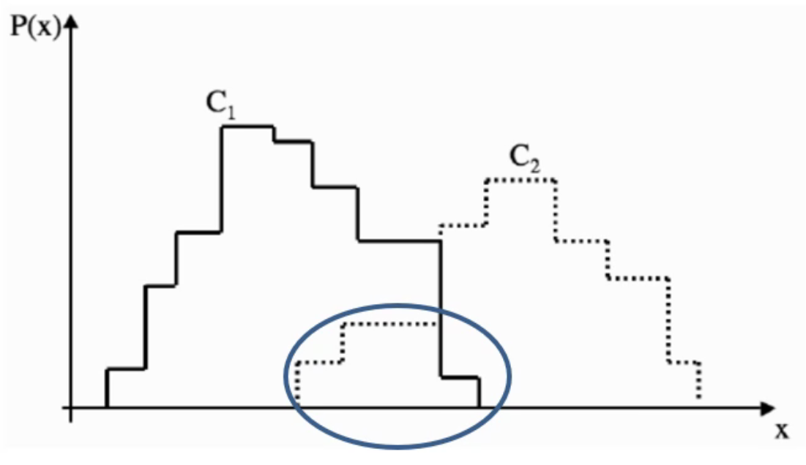

Notation-机器学习符号
---

# 1. 专业术语
1. 输入：$x_i$，一个输入向量是作为算法的一个输入给出的数据，记为$\bold{x}$
2. 权重：$w_{ij}$是节点i和j之间的加权连接，他们排列成矩阵$\bold{W}$
3. 输出：$y_i$，输入向量是$\bold{y}$，我们写成$\bold{y(x, W)}$来提醒自己输出取决于算法的输入和网络的当前权重集。
4. 目标：$t_i$，目标向量是$\bold{t}$，是监督学习所需的额外数据，提供了算法正在学习的正确答案。
5. 激活函数：对于神经网络，$g(·)$是一种数学函数，它描述神经元的激发作为加权输入的响应
6. 误差：$E$是一种根据输出$\bold{y}$和目标$\bold{t}$计算网络不准确性的函数。

# 2. 几个概念
1. 权重空间
2. 维数灾难：超球体
3. 贝叶斯法则：$P(C_i|X_j) = \frac{P(X_j | C_j)P(C_i)}{P(X_j)}$
4. 先验概率：查看每个类在训练集中出现的频率来估计先验概率，并且我们可以从训练集的特征值的直方图中获得类条件概率
   1. C1类是女性，C2类是男性
   2. 那么我们如何处理在交叉范围内的样本呢？

5. 后验概率：提供了选择哪一类作为输出的方法(选择具有最高后验概率的类)
6. 朴素贝叶斯分类：必须要求各部分之间是独立的。
7. 贝叶斯最优分类：将所有类的最终结果考虑在内，极大限度减少了错误分类的可能性，而不是最大化后验概率。