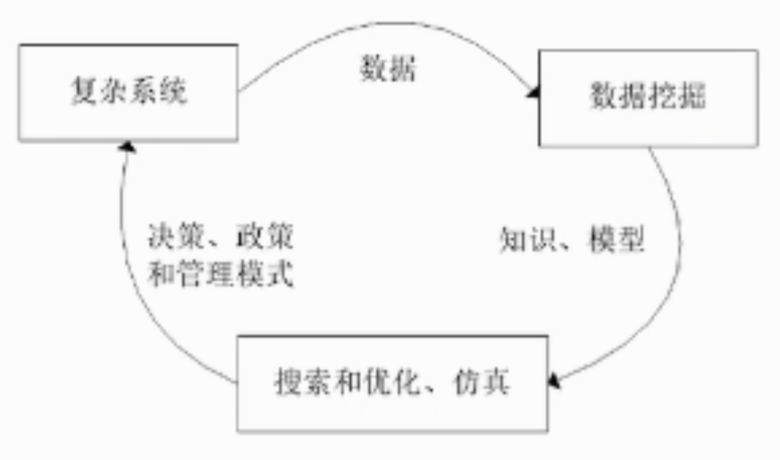

Pre-数据分析、数据挖掘和商业价值
---
1. 数据、数据仓库与决策

# 1. 引入:中央空调系统
1. 收集具体的信息:湿度、请求程度等。
2. 前端收集数据回传。
3. 后端处理数据响应。

# 2. 相关的几个故事

## 2.1. 故事一:沃尔玛购物车数据分析

### 2.1.1. 故事背景
1. 梳理2.45亿顾客每周生成的海量数据，沃尔玛的数据挖掘算法发现了一条奇怪的信息:在发布恶劣天气预警后，除了管道胶带、啤酒及瓶装水等应急用品以外，草莓酱馅饼需求量的增长幅度最大。
2. 在2004年飓风"弗朗西斯"将袭，沃尔玛超市的管理者下令用卡装载家乐氏快餐，运送至可能遭受飓风袭击的地区。结果这些快餐很快就被抢购一空。

### 2.1.2. 故事结论
1. 通过数据关联信息得到关联特征，利用关联特征完成分析。
2. 将原来隐藏在经验中的东西，通过数据分析的方式获取出来，做到自动化控制

## 2.2. 故事二:大数据预测犯罪:"邻近重复"

### 2.2.1. 故事背景
1. 西雅图历时14年收集的犯罪数据表明有一半的犯罪行为都集中在占该市4.5%的街道上;明尼阿波利斯市半数报警电话都来自占该市3.3%的街道。
2. 波士顿市多达66%的街道抢劫案都高度集中于占该市8%的街道。
3. 洛杉矶警局分析了80年来1300万起犯罪案件,通过算法预测成功将相关区域的犯罪率降低了36个百分点。

### 2.2.2. 故事结论
1. 大量的数据可视化之后可以改变人的行为。
2. 罪犯也会评估自己的行为的收益和损失。

## 2.3. 故事三:肿瘤解决方案

### 2.3.1. 故事描述
1. 在全美的癌症病人约有20%遭遇了误诊。
2. IBM Watson肿瘤解决方案是一个基于认知计算系统的方案，可以分析大量的数据，包括医学文献、病人健康记录和临床试验等，从而为癌症病人提供私人定制的、以症状为依据的治疗建议。
3. 每年发表癌症治疗文章70万篇之多，一个人平均每年阅读200篇文献，每名病人在一生中大约会产生1100TB的数据，相当于3亿本书的数据量，人脑是不可能处理这么庞大数据量。

### 2.3.2. 故事结论
1. 机器可以完成自动快速的大量文献阅读。
2. 贝叶斯公式。

# 3. 大数据产业地图
1. 基础架构: Hadoop, Streaming, NonSQL, Graph DBS等
2. 数据变换、集成、治理、监测
3. 数据源，健康数据、金融数据等
   1. 数据源的质量可能不高，都是分散进行存储的
   2. 数据需要保证安全
4. 大数据云计算平台(阿里，微软、亚马逊等)
5. 行业应用:数据分析、BI、可视化、图像识别等
6. 大数据教育培训、科研。
7. 云计算:阿里做的非常好，投入很多。
   1. 通过数据中心进行计算转化。
   2. 大规模的服务器如何进行管理使用

# 4. 大数据与小数据
1. 小数据时代:采集数据比较麻烦、成本相对比较高，吉尼斯啤酒故事(t-test，1908 by William Gosset)
2. 大数据时代:存储设备便宜、计算机技术发展迅速、网络发达、物联网等
3. 大数据的3V特点: Volume (大量)、Velocity(高速)、Variety(多样)

## 4.1. 大数据内涵
1. 数据挖掘(Data Mining)、机器学习(Machine Learning)、统计学习(Statistical Learning)、模式识别(Pattern Recognition)
2. 云计算(Cloud Computing)
3. 物联网(Internet of Things)：通过传感器集成到一起
4. 大数据(Big Data)
5. 商务智能(Business Intelligence/Analytics)
6. 管理决策(Management Science)

## 4.2. 大数据分析思维
1. 自下而上vs自上而下的认知
2. 数据驱动
3. 问题驱动

## 4.3. 大数据本质
1. 数据养殖(Data farming):数据采集、实验设计、数据清洗和打标签;
2. 数据建模(Data modeling):应用场景-分类问题，还是回归问题，模型评价标准:奥坎姆剃刀原则;
3. 预测:时间序列预测( Forecasting)、未知空间预测(Prediction)
4. $Y=f(X)，X(t+1)=f(X(t)， X(t-1)， X(t-1))$

### 4.3.1. 描述性分析
> 描述已经发生过的事情的一系列数量分析方法，比如数据查询、报表、描述性统计、数据可视化等;

### 4.3.2. 预测性分析
1. 根据历史数据建模，对未来的情况预报，或者搞清楚各因素之间的相互作用关系。
2. 宏观经济预警(根据之前的数据预测未来经济问题)

### 4.3.3. 指导性分析
> 通过数据分析找出最优解决方法