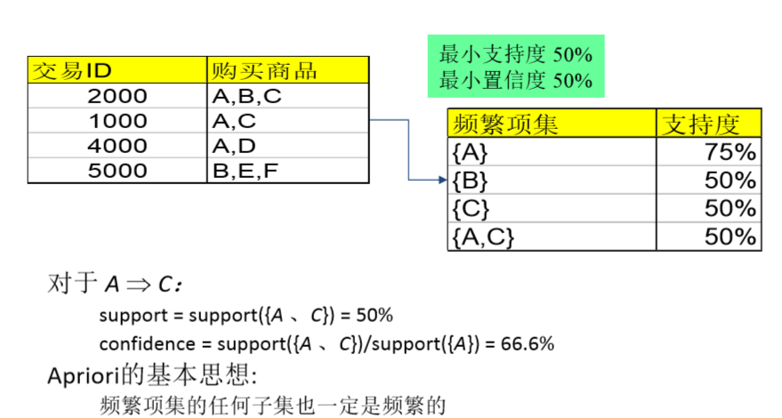
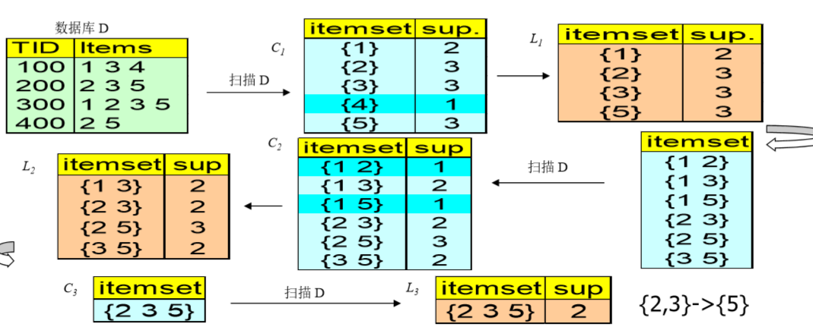
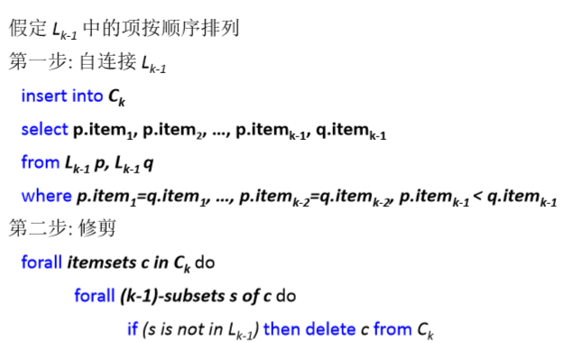
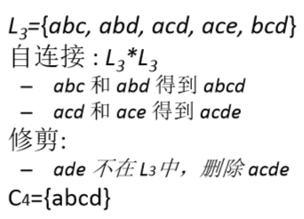

# 1. 关联规则挖掘:路线图
1. 布尔vs. 定量关联(基于处理数据的类型)
    + buys(x, "SQLServer")^buys(x, "DMBook") ——>buys(x, "DBMiner") [0.2%, 60%]
    + age(x, "30..39")^income(x, "42..48K") ——>buys(x, "PC") [1%, 75%]
2. 单维vs. 多关联(例子同上)
3. 单层vs. 多层分析
    + 哪个品牌的啤酒与那个牌子的尿布有关系?
4. 各种扩展
    + 相关性、因果分析
        + 关联并不一定意味着相关或因果
    + 添加约束
        + 如哪些"小东西"的销售促发了"大家伙"的买卖？

# 2. 关系规则挖掘例子


# 3. Apriori的基本思想
频繁项集的任何子集也是频繁的。
1. 有一个自己不是频繁项集，那么其超集也不是频繁项集

# 4. Aprior的基本步骤

## 4.1. Apriori算法例子


1. 首先算出所有项目的支持度/支持数
2. 根据最小支持度排除掉不满足支持度的项目
3. 项目集需要排序。
    + 然后我们根据相应规则来进行处理保证不重不漏。
    + 必须按照n个的排序的结果，如果前n-1个项目相同，那么可以进行相连。
    + 寻找到最后只剩下一个或者全包含情况解决
4. 将结果集合一拆为二
    + 然后我们将一个座位置信度来进行演算即可
    + 例题中结果是{2,3}->{5}

## 4.2. 如何生成候选集


生成候选集的例子
---


## 4.3. Python实现
1. Python的第三方库已经实现Apriori算法，可以使用pip3或pip安装，如`pip3 install apyori`, 安装完成之后即可直接调用，示例如下：
```py
from apyori import Apriori
transactions = [['bread', 'crisps'],
['milk', 'cheese'],
['bread', 'milk'],]# 项目集
results = list(Apriori(transactions))# 直接调用
```
2. 输出包含所有项集的集合，以及对应的支持度、置信度和提升度值，可以按照业务需 求进行筛选和过滤。

# 5. 分布式并行Apriori算法
1. 数据集比较大，单机不能运行

## 5.1. 第一阶段:生成局部的频繁项集
1. 将大事务数据库D拆分成相同大小的n个不相交的数据块，然后将它们发送到m个工作节点(m <=n)。
2. 分别扫描每个数据块，并行使用Apriori算法在每个数据块中产生**局部频繁项集**。

## 5.2. 第二阶段：生成全局频繁项集
1. 将所有局部频繁项集进行合并，然后组合成全局**候选**的频繁项集合。局部频繁项集可能不是D的频繁项集，但在D中的任何频繁项集必然是局部频繁项集合中的一个子集。
2. 对D进行再次扫描，计算每一个候选频繁项集的支持度，最终得到D的频繁项集。


# 6. 可以在Anaconda下打开和执行
```py
def load_data_set():
	data_set = [['e1', 'e2', 'e5'], 
				['e2', 'e4'],
				['e2', 'e3'],
				['e1', 'e2', 'e4'],
				['e1', 'e3'],
				['e2', 'e3'],
				['e1', 'e3'],
				['e1', 'e2', 'e3', 'e5'],
				['e1', 'e2', 'e3']]
	return data_set

def Create_C1(data_set):
	'''
	参数：数据库事务集
	'''
	C1 = set()
	for t in data_set:
		for item in t:
			item_set = frozenset([item])
			# 为生成频繁项目集时扫描数据库时以提供issubset()功能
			C1.add(item_set)
	return C1

def is_apriori(Ck_item, Lk_sub_1):
	'''
	参数：候选频繁k项集，频繁k-1项集
	'''
	for item in Ck_item:
		sub_item = Ck_item - frozenset([item])
		if sub_item not in Lk_sub_1:
			return False
	return True

def Create_Ck(Lk_sub_1, k):
	'''
	# 参数：频繁k-1项集，当前要生成的候选频繁几项集
	'''
	Ck = set()
	len_Lk_sub_1 = len(Lk_sub_1)
	list_Lk_sub_1 = list(Lk_sub_1)
	for i in range(len_Lk_sub_1): #i: [0, len_Lk_sub_1)
		for j in range(i+1, len_Lk_sub_1): #j: [i+1, len_Lk_sub_1)
			l1 = list(list_Lk_sub_1[i])
			l2 = list(list_Lk_sub_1[j])
			l1.sort()
			l2.sort()
			# 判断l1的前k-1-1个元素与l2的前k-1-1个元素对应位是否全部相同
			# list[s:t]：截取s到t范围的元素生成一个新list
			if l1[0:k-2] == l2[0:k-2]:
				Ck_item = list_Lk_sub_1[i] | list_Lk_sub_1[j]
				if is_apriori(Ck_item, Lk_sub_1):
					Ck.add(Ck_item)
	return Ck

def Generate_Lk_By_Ck(data_set, Ck, min_support, support_data):
	'''
	参数：数据库事务集，候选频繁k项集，最小支持度，项目集-支持度dic
	'''
	Lk = set()
	# 通过dic记录候选频繁k项集的事务支持个数
	item_count = {}
	for t in data_set:
		for Ck_item in Ck:
			if Ck_item.issubset(t):
				if Ck_item not in item_count:
					item_count[Ck_item] = 1
				else:
					item_count[Ck_item] += 1
	data_num = float(len(data_set))
	for item in item_count:
		if(item_count[item] / data_num) >= min_support:
			Lk.add(item)
			support_data[item] = item_count[item] / data_num
	return Lk
	
def Generate_L(data_set, max_k, min_support):
	'''
	参数：数据库事务集，求的最高项目集为k项，最小支持度
	'''
	# 创建一个频繁项目集为key，其支持度为value的dic
	support_data = {}
	C1 = Create_C1(data_set)
	L1 = Generate_Lk_By_Ck(data_set, C1, min_support, support_data)
	Lk_sub_1 = L1.copy() # 对L1进行浅copy
	L = []
	L.append(Lk_sub_1) # 末尾添加指定元素
	for k in range(2, max_k+1):
		Ck = Create_Ck(Lk_sub_1, k)
		Lk = Generate_Lk_By_Ck(data_set, Ck, min_support, support_data)
		Lk_sub_1 = Lk.copy()
		L.append(Lk_sub_1)
	return L, support_data

def Generate_Rule(L, support_data, min_confidence):
	'''
	参数：所有的频繁项目集，项目集-支持度dic，最小置信度
	'''
	rule_list = []
	sub_set_list = []
	for i in range(len(L)):
		for frequent_set in L[i]:
			for sub_set in sub_set_list:
				if sub_set.issubset(frequent_set):
					conf = support_data[frequent_set] / support_data[sub_set]
					# 将rule声明为tuple
					rule = (sub_set, frequent_set-sub_set, conf)
					if conf >= min_confidence and rule not in rule_list:
						rule_list.append(rule)
			sub_set_list.append(frequent_set)
	return rule_list

if __name__ == "__main__":
	data_set = load_data_set()
	'''
	print("Test")
	# 数据库事务打印
	for t in data_set:
		print(t)
	'''
	'''
	print("Test")
	# 候选频繁1项集打印
	C1 = Create_C1(data_set)
	for item in C1:
		print(item)
	'''
	'''
	# 频繁1项集打印
	print("Test")
	L = Generate_L(data_set, 1, 0.2)
	for item in L:
		print(item)
	'''
	'''
	# 频繁k项集打印
	print("Test")
	L, support_data = Generate_L(data_set, 2, 0.2)
	for item in L:
		print(item)
	'''
	'''
	# 关联规则测试
	print("Test")
	L, support_data = Generate_L(data_set, 3, 0.2)
	rule_list = Generate_Rule(L, support_data, 0.7)
	for item in support_data:
		print(item, ": ", support_data[item])
	print("-----------------------")
	for item in rule_list:
		print(item[0], "=>", item[1], "'s conf:", item[2])
	'''
	
	L, support_data = Generate_L(data_set, 3, 0.2)
	rule_list = Generate_Rule(L, support_data, 0.7)
	for Lk in L:
		print("="*55)
		print("frequent " + str(len(list(Lk)[0])) + "-itemsets\t\tsupport")
		print("="*55)
		for frequent_set in Lk:
			print(frequent_set, support_data[frequent_set])
	print()
	print("Rules")
	for item in rule_list:
		print(item[0], "=>", item[1], "'s conf: ", item[2])
```

# 7. Apriori和FP-growth
1. <a href = "https://mp.weixin.qq.com/s/9yMWNdR4JYlxIauRJzwLUg">数据挖掘和机器学习</a>
2. <a href = "https://www.cnblogs.com/hdu-cpd/p/5987904.html">机器学习笔记——关联规则</a>