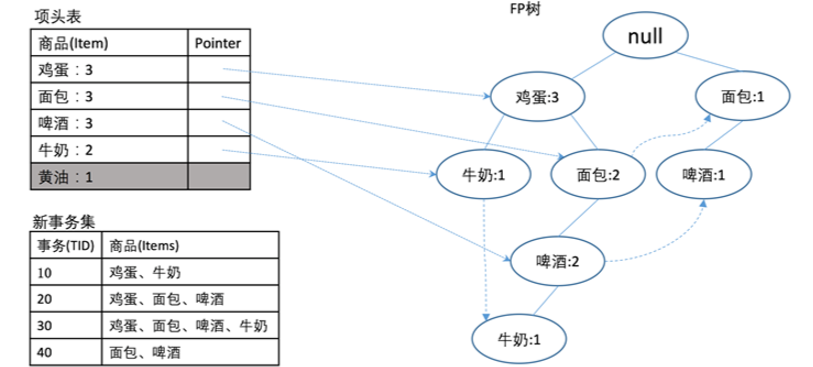

**FP-growth**

# 1. FP-growth算法
1. 与Apriori算法不同，频繁模式增长（frequent pattern growth）算法，简称FP增长算法使用一种称为FP树的数据结构，并且采用**分而治之**的策略，无需产生候选频繁项集就能得到全部的频繁项集。
2. 只扫描一次数据库，使用于大量的数据运算

# 2. 构造FP树
1. FP树是事务数据库的压缩表示，每个事务都映射到FP树中的一条路径。不同的事务可能包含若干相同的项目，因此这些路径会有所重叠，使得事务数据能得到一定程度的压缩。FP增长算法挖掘频繁项集的过程如下：
2. FP树构建过程包括以下三步：
    + 扫描数据集，得到所有频繁1项集的计数。然后删除支持度低于阈值的项，将1项频繁集放入项头表，并按照支持度**降序排列**。
    + 扫描数据集，将**非频繁**的1项集从原始数据集中剔除，并将事务按照支持度降序排列。
    + 读入排序后的事务集并按照排序顺序依次插入FP树中，排序靠前的节点是父节点，而靠后的是子节点。如果有共用的父节点，则对应的公用父节点计数加1。插入后，如果有新节点出现，则项头表对应的节点会通过节点链表链接到新节点。直到所有的数据都插入到FP树后，FP树的建立完成。

# 3. FP-growth例子
1. FP增长算法以自底向上的方式搜索FP树，由L的倒序开始，对每个1频繁项目构造条件FP树，然后递归地对该条件FP树进行挖掘。

2. 使用项头表的结构
    + 每一个事务对应一个路径，先排序
3. 每经过路径一次，对应的事务数据库中的数据需要加一。(是指树节点+1)
4. 然后找到相应的最小支持度要求