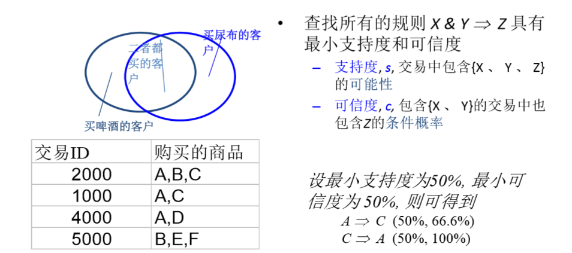

**关联分析基本概念**

# 1. 关联规则
1. 关联规则是反映**物品与其他物品**之间的关联性，常用于实体商店或在线电商的推荐系统：通过对顾客的购买记录数据进行关联规则挖掘，发现顾客群体的购买习惯的内在共性。早期的关联分析主要用于零售行业的购物行为分析，所以也称之为**购物篮分析**。需要注意的是关联关系并不意味着存在因果关系。关联规则分析中的关键概念包括支持度、置信度、提升度。在关联分析算法中，常见的有Apriori和FP增长算法。
    + 针对大数据的情况。
2. 关联不等于因果，可能是因果也可能不是因果。

# 2. 关联规则挖掘
1. 关联规则挖掘
    + 在**交易数据、关系数据或其他信息载体**中，查找存在于项目集合或对象集合之间的频繁模式、关联结构
2. 应用：
    + 购物篮分析、交叉销售、产品目录设计、聚集和分类等。
    + 一些人物，事件之间的绑定出现。
3. 举例：
    + 规则形式："Body —>Head [support, confidence]".
    + buys(x, "diapers") —> buys(x, "beers") [0.5%, 60%] x是一个假设用户
    + major(x, "CS")^takes(x, "DB") —> grade(x, "A") [1%, 75%]

# 3. 关联规则问题的形式化描述项目
1. 定义1：集合I={i1，i2，…,im}为标识符的集合，其中m为正整数，ik(k=1，2，…,m)称为项目。
2. 项目是一个从具体问题中抽象出的一个概念。在超市的关联规则挖掘问题中，项目表示各种商品，如旅游鞋等。由于在超市的关联规则挖掘中并不关心顾客购买的商品数量和价格等，因此顾客的一次购物可以用该顾客所购买的所有商品的名称来表示，称为**事务**，所有事务的集合构成关联规则挖掘的数据集，称为**事务数据库**。

## 3.1. 项目
交易数据库中的一个字段，对超市的交易来说一般是指一次交易中的一个物品

## 3.2. 事务
1. 定义2：关联规则挖掘的数据库记为D，事务数据库D中的每个元组称为事务。**一条事务T是I中项目的集合**。一条事务仅包含其涉及到的项目，而不包含项目的具体信息。在超级市场的关联规则挖掘问题中事务是顾客一次购物所购买的商品，但事务中并不包含这些商品的具体信息，如商品的数量、价格等。

## 3.3. 项目集
1. 定义3：项目集是由I中项目构成的集合。若项目集包含的项目数为k，则称 此项目集为k‐项目集。
2. 定义4：任意的项目集X和事务T若满足：T包含X，则称事务T包含项目集X。
3. 在超市的关联规则挖掘问题中项目集可以看成一个或多个商品的集合。若 某顾客一次购买所对应的事务T包含项目集X，就说该顾客在这次购物中购 买了项目集X中的所有商品。

## 3.4. 频繁项目集
1. 定义5：对任意的项目集X，若事务数据库D中ɛ%的事务包含项目集X，则项目集的支持率为ɛ，记为**support(X)= ɛ**，其中包含项目集X的事务数称为项目集X的频度，记为count(X)。若项目集X的支持率大于或等于用户指定的最小支持率(minsupport)，则项目集X称为频繁项目集(或大项目集)，否则项目集X为非频繁项目集(或小项目集)。如果数据库D中的事务数记为|D|，频繁项目集是至少被ɛ%x|D|条事务包含的项目集.
2. 频繁项目集的交集肯定是频繁的
3. 频繁项目集的并集也一定是频繁的

## 3.5. 支持度和置信度
1. 定义6:关联规则是形如X‐>Y的规则，其中X，Y为项目集且X交Y=空集。
2. 定义7：在数据库D中，若s%的事务包含X并Y，则关联规则X‐>Y的支持度为s%；在数据库D中，若c%的包含项目集X的事务也包含项目集Y，则关联规则X‐>Y的置信度为c%:
    + **p(Y│X)＝p(XY)/p(X)。**
4. 置信度反应了关联规则的可信度—购买了项目集X中的商品的顾客同时也 购买了Y中商品的可能性有多大
5. lift(X->Y) = 1，表示X和Y互相独立

## 3.6. 提升度
1. 提升度用来判断规则是否有实际价值，描述的是对比不使用规则，使用规则可以提高多少。使用规则商品在购物车中出现的次数是否高于商品单独出现在购物车中的概率。大于1说明有效，小于1则无效。计算公式如下： 
    + 
2. 例如，电商网站10月份有100万笔订单，购买面包30万笔，牛奶40万笔，同 时购买两者的20万笔，面包、牛奶、面包和牛奶支持率依次为30%、40%、 20%，所以提升度为1.667，大于1，所以牛奶面包规则是有提升效果的。

## 3.7. 强关联规则
1. 定义8：若关联规则X‐>Y的支持度和置信度分别大于或等于用户指定的最小支持率minsupport和最小置信度minconfidence，则称关联规则X‐>Y为**强关联规则**，否则称关联规则X‐>Y为弱关联规则。
2. 关联规则挖掘的**核心**就是要找出事务数据库D中的所有**强相关规则**。
3. 满足两个条件，我们才能基本确定这条规则是有效的
    + 当然这个阈值是由客户来确定，还可以增加提升度的指标

## 3.8. 关联规则挖掘问题的分解
1. 给定数据库D，关联规则的挖掘就是找出所有存在于数据库D中的强关联规则。因此整个关联规则挖掘过程可以分解为以下两个子问题：
    1. 找出所有的频繁项目集；(支持度>=最小支持度)
    2. 根据找到的频繁项目集导出所有的强关联规则。

### 3.8.1. 强关联规则的产生
1. 第一个子问题的求解，需要多次扫描数据库D，这意味着关联规则挖掘算法的效率将主要取决于数据库扫描、I/O操作和频繁项目集的计算上。因此如何迅速、高效地找出所有的频繁项目集是关联规则挖掘的中心问题
2. 第二个子问题的求解比较容易，R. Agrawal等人已提出了有效的解决办法，具体过程如下:
    + 对每个频繁项目集I，产生所有的非空真子集：对I的任意非空真真子集m， 若support(I)/Support(m)>= minconfidence，则产生强关联规则m‐>(l‐m)。
    + 穷举方法来计算强关联规则太耗时，我们就要用**启发式算法**来进行计算。

### 3.8.2. 规则度量:支持度与可信度

1. 支持度:又买A又买C除以全部的
2. 置信度:支持度/购买前项的概率 = 2/3
3. 学习关联规则时候的箭头方向不要搞错

# 4. 布尔型和数值型关联规则
1. 根据处理的项目类别，关联规则可以分为布尔型和数值型。布尔型关联规则处理的项目都是离散的，它显示了这些变量之间的关系。例如性别="女"→职业="秘书"，是布尔型关联规则。而数值型关联规则可以和多维关联或多层关联规则结合起来。对数值型属性进行处理，参考连续属性离散化方法或统计方法把其进行分割，确定划分的区间个数和区间宽度。数值型关联规则中也可以包含可分类型变量。例如性别="女"→平均收入 >2300，这里的收入是数值类型，所以是一个数值型关联规则。又如，age(x，[30，39])^income(x，[42，48]) →buys(x，"PC") [1%，75%]。这里的项目用谓词表示，其中x是变量，泛指顾客，^表示逻辑与。
    + 前项的数据可以是数值型的。

# 5. 挖掘多层关联规则
1. 自上而下，深度优先的方法：对具体的东西进行一定的抽象
    + 先找高层的"强"规则：牛奶->面包[20%, 60%].
    + 再找底层的"弱"规则：酸奶->黄面包[6%, 50%].
2. 多层关联规则的变种
    + 层次交叉的关联规则：酸奶->复旦面包房黄面包
    + 不同种分层方法间的关联规则：酸奶->复旦面包房面包
3. 对于多层关联规则(项目的概念层次不同，例如酸奶与牛奶的关系)，当项目的概念层次增加，例如关联规则光明酸奶->黑面包与酸奶->黑面包，支持度是变大还是变小？请选择大还是小。
    + 大
4. 对于多层关联规则(项目的概念层次不同，例如酸奶与牛奶的关系)，当项目的概念层次增加，例如关联规则光明酸奶->黑面包与酸奶->黑面包，置信度是变大还是变小？请选择大、小还是不确定。
    + 不确定

## 5.1. 冗余过滤
1. 由于"祖先"关系的原因，有些规则可能是多余的。
2. 例子
    + 牛奶->白面包[support = 8%, confidence = 70%]
    + 酸奶->白面包[support = 2%, confidence = 72%]
3. 第一个规则是第二个规则的祖先
4. 参考规则的祖先，如果它的支持度与"预期"的支持度近似的话，则这条规则是冗余的。

# 6. 分离关联规则
1. 分离关联规则与一般的关联规则相似，只是在关联规则中出现项目的反转项，在购物篮分析中可发现不在一起购买的商品。例如购买牛奶的顾客一般不购买汽水。这里读者思考一下，如何发现分离关联规则？
2. 买了A但是不做B
3. A->~B的支持度等于1-(A->B)的支持度。

# 7. 关联算法
1. 关联算法是一种非监督学习算法

## 7.1. 适用于关联分析的情形
1. 分析网商商品的评论和评分数据，讨论什么样的商品容易得到好的评分。
2. 从学生评教数据中，找到评分较好的课程相关重要因素。

## 7.2. 不适用于关联分析的情形
1. 从公司应聘的候选人中选择可能适合某岗位的候选人。
2. 预测贷款的人群中哪些人可能会产生坏账。

## 7.3. Apriori算法和FP增长算法
1. 对于同一个样本集，Apriori算法和FP增长算法的结果是相同的。
2. 对于Apriori算法和FP增长算法，随着最小支持度的提高(最小置信度不变)，得到的关联规则会增加。

# 8. 关联规则实现过程
1. 数据筛选，首先对数据进行清洗。
2. 支持度:从事物集合中找出频繁项集(Apriori、FP-Growth算法)
3. 置信度:从频繁项集中找出强关联规则(置信度阈值)
4. 提升度:从强关联规则中筛选出有效的强关联规则(提升度的设定)
5. 比较关键的两个点:
    1. 三种阈值的设定
    2. 如何找出频繁项集

# 9. 误导我们的强关联规则——关联规则评价准则
1. 在某些情况下，简单置信规则等是不可信的。
2. 所以我们也衍生出了其他系数指标来评判

## 9.1. 相关性系数lift

1. lift(A,B)<1:正相关
2. lift(A,B)=1:不相关
3. lift(A,B)>1:负相关

## 9.2. 卡方系数X2

## 9.3. 全自信度

## 9.4. 最大自信度
1. 最大自信度则与全自信度相反，求的不是最小的支持度而是最大的支持度，max_confidence(A,B)=max{confidence(A—>B),confidence(B—>A)}，不过感觉最大自信度不太实用。

## 9.5. Kulc
1. Kulc系数就是对两个自信度做一个平均处理：kulc(A,B)=(confidence(A—>B)+confidence(B—>A))/2。，kulc系数是一个很好的度量标准，稍后的对比我们会看到。

## 9.6. cosine(A,B)
1. cosine(A,B)=P(A交B)/sqrt(P(A)*P(B))=sqrt(P(A|B)*P(B|A))=sqrt(confidence(A—>B)*confidence(B—>A))

## 9.7. 七个评价准则的比较

# 10. 参考
1. <a href ="https://blog.csdn.net/symoriaty/article/details/100523364">机器学习-非监督分类算法之关联规则</a>