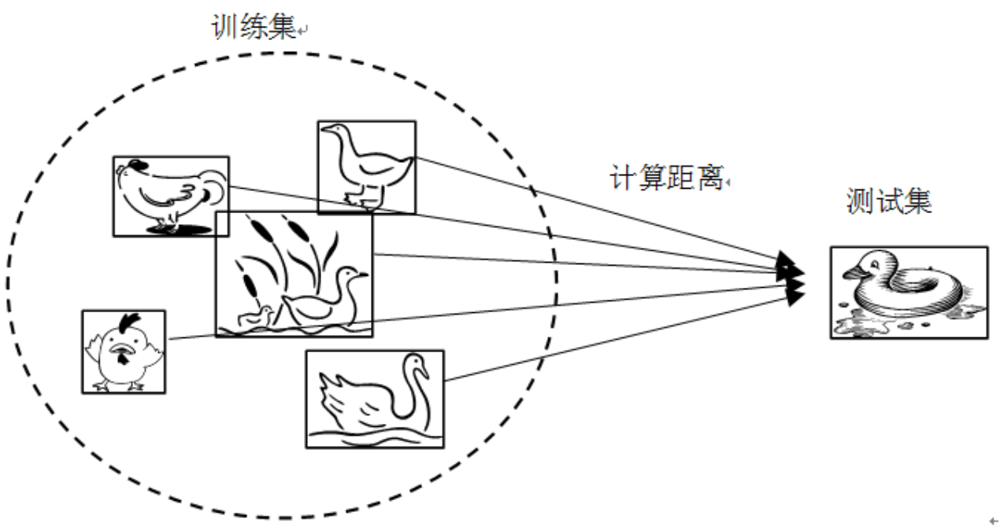

KNN
---
最近邻算法

# 1. KNN算法思想
1. 一个样本与数据集中的k个样本最相似，如果这k个样本中大多数属于一个类别，那么这个样本也属于这个类别



# 2. KNN算法的计算步骤
1. 对数据进行标准化，通常是进行归一化，避免量纲对计算距离的影响；
2. 计算待分类数据与训练集中每一个样本之间的距离；
3. 找出与待分类样本距离最近的k个样本；
4. 观测这k个样本的分类情况，计算出存在的类别出现的频率
5. 返回前k个点出现频率最高的类别作为当前点的预测分类
   1. 投票法:可以选择K个点出现频率最高的类别作为预测结果
   2. 平均法:可以计算K个点的实值输出标记的平均值作为预测结果
   3. 加权平均法:根据距离远近完成加权平均等方法

## 2.1. KNN算法中的距离度量
1. 选择两个实例相似性时，一般使用的是欧氏距离，Lp距离定义$L_p(x_i, x_j) = (\sum\limits_{l=1}\limits^n|x_{i}^{(l)} - x_j^{(l)}|^p)^{\frac{1}{p}}$
2. 其中$x_i\in R^n, x_j \in R^n$，其中$L_{\infty}$定义为$L\infty(x_i, x_j) = max_{l}|x_i^{(l)}-x_j^{(l)}|$，其中p是一个变参数
   1. $p=1$，就是曼哈顿距离(对应L1范数)
   2. $p=2$，就是欧式距离(对应L2范数)
   3. $p \to \infty$，就是切比雪夫距离

$$
L_1定义为|x|=\sum\limits_{i=1}\limits^n|x_i|，其中x=\begin{bmatrix}
   x_1 \\ x_2 \\ . \\ . \\ . \\ x_n
\end{bmatrix} \in R^n
$$

$$
L_2定义为|x|=\sqrt{\sum\limits_{i=1}\limits^{n}x_i^2}，其中x=\begin{bmatrix}
   x_1 \\ x_2 \\ . \\ . \\ . \\ x_n
\end{bmatrix} \in R^n
$$

$$
\begin{array}{l}
   n维空间点a(x_{11},x_{12},...x_{1n})与b(x_{21}, x_{22}, ..., x_{2n}) \\
   d_{12} = \max(|x_{1i}-x_{2i}|)
\end{array}
$$

## 2.2. K值的选择
1. 近似误差:对现有训练集的训练误差
2. 估计误差:对测试集的测试误差，估计误差小，说明对未知数据的预测能力好
3. K值较小，则是在较小的邻域中的训练实例进行预测，容易导致过拟合。
   1. 学习的近似误差会减小:只有输入实例较近的训练实例才会对预测结果起作用
   2. 学习的估计误差会增大:预测结果会对紧邻的实例点敏感，但是如果是噪声会导致预测出错
4. K值较大，则是在较大的邻域中的训练实例进行预测
   1. 学习的估计误差会减小
   2. 学习的近似误差会增大
5. K值一般选择样本数量的平方根

## 2.3. KNN算法的优点
1. 简单有效
2. 重新训练代价低
3. 算法复杂度低
4. 适合类域交叉样本
5. 适用大样本自动分类

## 2.4. KNN算法的缺点
1. 惰性学习
2. 类别分类不标准化
3. 输出可解释性不强
4. 不均衡性
5. 计算量较大

# 3. KNeighborsClassifier函数
`sklearn.neighbors.KNeighborsClassifier(n_neighbors=5, weights=’uniform’, algorithm=’auto’, leaf_size=30, p=2, metric=’minkowski’, metric_params=None, n_jobs=None, **kwargs)`
1. n_neighbors:临近的节点数量，默认值是5
   1. K值较小，就相当于用较小的领域中的训练实例进行预测，训练误差近似误差小（偏差小），泛化误差会增大（方差大），换句话说，K值较小就意味着整体模型变得复杂，容易发生过拟合；
   2. K值较大，就相当于用较大领域中的训练实例进行预测，泛化误差小（方差小），但缺点是近似误差大（偏差大），换句话说，K值较大就意味着整体模型变得简单，容易发生欠拟合；一个极端是K等于样本数m，则完全没有分类，此时无论输入实例是什么，都只是简单的预测它属于在训练实例中最多的类，模型过于简单。
2. weights:权重，默认值是uniform，最普遍的KNN算法是无论距离如何权重都是一样的，有如下三种选择
   1. uniform：表示每个数据点的权重是相同的；
   2. distance：离一个簇中心越近的点，权重越高；
   3. callable：用户定义的函数，用于表示每个数据点的权重
3. algorithm：sklearn中想要构建KNN模型的三种构建方法，如果KD构建也比较慢，则可以尝试使用球树。
   1. auto：根据值选择最合适的算法，当数据集比较小或稀疏时，一般会使用brute
   2. ball_tree：使用BallTree，适用于KD树解决起来比较困难的
   3. kd_tree：KDTree，适用于比较大数据集
   4. brute：使用Brute-Force查找，蛮力实现直接计算距离比较，适用于小数据集
4. leaf_size：在需要使用KD树或球树时，leaf_size传递给BallTree或者KDTree，表示构造树的大小，用于影响模型构建的速度和树需要的内存数量
   1. 值越小，生成的kd树和球树越大，层数越深，建树时间越长。随着样本的数量增加，这个值也在增加，但是过大可能会过拟合，需要通过交叉检验来选择。
   2. 最佳值是根据数据来确定的，默认值是30。
5. p，描述距离度量，p和metric结合使用的，当metric参数是"minkowski"的时候，p=1为曼哈顿距离，p=2为欧式距离。默认为p=2。
6. metric一般使用欧式距离
   1. euclidean：欧式距离，$p=2$
   2. manhattan：曼哈顿距离，$p=1$
   3. chebyshev：切比雪夫距离，$p=\infty，D(x, y) = \max|x_i - y_i|(i = 1, 2, ..., n)$
   4. minkowski：闵可夫斯基距离，默认参数，$\sqrt[q]{\sum\limits_{i=1}\limits^n(|x_i-y_i|)^p}$
7. n_jobs：指定多少个CPU进行运算，默认是-1，也就是全部都算。
8. radius：限定半径，默认为1，半径的选择与样本分布有关，可以通过交叉检验来选择一个比较小的半径
9. outlier_labe:int类型，主要用于预测时，如果目标点半径内没有任何训练集的样本点时，应该标记的类别，不建议选择默认值 None,因为这样遇到异常点会报错。一般设置为训练集里最多样本的类别。

# 4. 观察数据
1. 由于KNN分类是监督式的分类方法之前，构建一个复杂的分类模型之前，首先需要已标记的数据集
```py
from sklearn.datasets import load_iris
iris_dataset=load_iris()
iris_dataset.keys()
```
2. 样本数据:data是样本数据，共4列150行，列名是由feature_names来确定的，每一列叫做矩阵的一个特征(属性)
3. 标签:target是标签，用数字表示，target_names是标签的文本表示。
4. 查看数据的散点图:
```py
import pandas as pd
import mglearn
iris_df=pd.DataFrame(x_train,columns=iris_dataset.feature_names)
pd.plotting.scatter_matrix(iris_df,c=y_train,figsize=(15,15),marker='o',hist_kwds={'bins':20}
                    ,s=60,alpha=.8,cmap=mglearn.cm3)
```

# 5. KNN算法实现

## 5.1. 鸢尾花数据集实现1

### 5.1.1. 模型建立

### 5.1.2. 拆分数据
```py
from sklearn.model_selection import train_test_split
x_train,x_test,y_train,y_test=train_test_split(iris_dataset['data'],iris_dataset['target'],random_state=0)
```

> sklearn.model_selection.train_test_split(*arrays, test_size ,train_size ,random_state ,shuffle ,stratify )
1. test_size：拆分的测试集数据所占的百分比，如果test_size和train_size都是none，那么默认值是test_size=0.25
2. train_size：拆分的训练集数据所占的百分比，
3. random_state：如果是int，那么参数用于指定随机数产生的种子；如果是None，使用np.random作为随机数产生器
4. shuffle：布尔值，默认值是True，表示在拆分之前对数据进行洗牌；如果shuffle = False，则分层必须为None。
5. stratify：如果不是None，则数据以分层方式拆分，使用此作为类标签。

#### 5.1.2.1. 创建分类器
1. 使用KNeighborsClassifier创建分类器，设置参数n_neighbors为1：
```py
from sklearn.neighbors import KNeighborsClassifier
knn = KNeighborsClassifier(n_neighbors=1)
```

#### 5.1.2.2. 使用训练集来构建模型
>knn.fit(x_train, y_train)

#### 5.1.2.3. 预测新数据
```py
x_new=np.array([[5, 2.9, 1, 0.2]])
prediction= knn.predict(x_new)
print("prediction :{0}  ,classifier:{1}".format(prediction,iris_dataset["target_names"][prediction]))
```

### 5.1.3. 模型评估

#### 5.1.3.1. 模型的正确率
1. 在使用模型之前，应该使用测试集来评估模型，所谓模型的正确率，就是使用已标记的数据，根据数据预测的结果和标记的结果进行比对，计算比对成功的占比：
```py
assess_model_socre=knn.score(x_test,y_test)
print('Test set score:{:2f}'.format(assess_model_socre))
```

#### 5.1.3.2. 邻居个数
1. 如何确定邻居的个数，下面使用枚举法，逐个测试邻居的个数，并根据模型的score()函数查看模型的正确率。
```py
import mglearn
import matplotlib.pyplot as plt
from sklearn.datasets import load_breast_cancer
from sklearn.model_selection import train_test_split
from sklearn.neighbors import KNeighborsClassifier

cancer=load_breast_cancer()

x_train,x_test,y_train,y_test=train_test_split(cancer.data,cancer.target,random_state=66)

training_accuracy=[]
test_accuracy=[]

neighbors_settings=range(1,11)

for n_neighbors in neighbors_settings:
    knn=KNeighborsClassifier(n_neighbors)
    knn.fit(x_train,y_train)
    training_accuracy.append(knn.score(x_train,y_train))
    test_accuracy.append(knn.score(x_test,y_test))

plt.plot(neighbors_settings,training_accuracy,label='Training Accuracy')
plt.plot(neighbors_settings,test_accuracy,label='Test Accuracy')
plt.ylabel('Accuracy')
plt.xlabel('n_neighbors')
plt.legend()
```

## 5.2. 鸢尾花数据集实现2
1. 通过对比效果来找到合适的K值。

```py
from sklearn.datasets import load_iris
from sklearn.model_selection  import cross_val_score
import matplotlib.pyplot as plt
from sklearn.neighbors import KNeighborsClassifier

#读取鸢尾花数据集
iris = load_iris()
x = iris.data
y = iris.target
k_range = range(1, 31)
k_error = []
#循环，取k=1到k=31，查看误差效果
for k in k_range:
    knn = KNeighborsClassifier(n_neighbors=k)
    #cv参数决定数据集划分比例，这里是按照5:1划分训练集和测试集
    scores = cross_val_score(knn, x, y, cv=6, scoring='accuracy')
    k_error.append(1 - scores.mean())

#画图，x轴为k值，y值为误差值
plt.plot(k_range, k_error)
plt.xlabel('Value of K for KNN')
plt.ylabel('Error')
plt.show()
```

2. 执行KNN算法

```py
import matplotlib.pyplot as plt
from numpy import *
from matplotlib.colors import ListedColormap
from sklearn import neighbors, datasets

n_neighbors = 11

# 导入一些要玩的数据
iris = datasets.load_iris()
x = iris.data[:, :2]  # 我们只采用前两个feature,方便画图在二维平面显示
y = iris.target


h = .02  # 网格中的步长

# 创建彩色的图
cmap_light = ListedColormap(['#FFAAAA', '#AAFFAA', '#AAAAFF'])
cmap_bold = ListedColormap(['#FF0000', '#00FF00', '#0000FF'])


#weights是KNN模型中的一个参数，上述参数介绍中有介绍，这里绘制两种权重参数下KNN的效果图
for weights in ['uniform', 'distance']:
    # 创建了一个knn分类器的实例，并拟合数据。
    clf = neighbors.KNeighborsClassifier(n_neighbors, weights=weights)
    clf.fit(x, y)

    # 绘制决策边界。为此，我们将为每个分配一个颜色
    # 来绘制网格中的点 [x_min, x_max]x[y_min, y_max].
    x_min, x_max = x[:, 0].min() - 1, x[:, 0].max() + 1
    y_min, y_max = x[:, 1].min() - 1, x[:, 1].max() + 1
    xx, yy = np.meshgrid(np.arange(x_min, x_max, h),
                         np.arange(y_min, y_max, h))
    Z = clf.predict(np.c_[xx.ravel(), yy.ravel()])

    # 将结果放入一个彩色图中
    Z = Z.reshape(xx.shape)
    plt.figure()
    plt.pcolormesh(xx, yy, Z, cmap=cmap_light)

    # 绘制训练点
    plt.scatter(x[:, 0], x[:, 1], c=y, cmap=cmap_bold)
    plt.xlim(xx.min(), xx.max())
    plt.ylim(yy.min(), yy.max())
    plt.title("3-Class classification (k = %i, weights = '%s')"
              % (n_neighbors, weights))

plt.show()
```

# 6. 参考
1. <a href = "https://www.cnblogs.com/ljhdo/p/10600613.html">sklearn学习</a>
2. <a href = "https://blog.csdn.net/qq_40195360/article/details/86714337">【实现思路好】KNN 原理及参数总结</a>
3. <a href = "https://blog.csdn.net/sinat_30353259/article/details/80901746">机器学习之KNN（k近邻）算法详解</a>
4. <a href = "https://www.cnblogs.com/shenxiaolin/p/8854838.html">Sklearn实现鸢尾花数据集</a>
5. <a href = "https://www.cnblogs.com/listenfwind/p/10685192.html">深入浅出KNN算法（二） sklearn KNN实践</a>