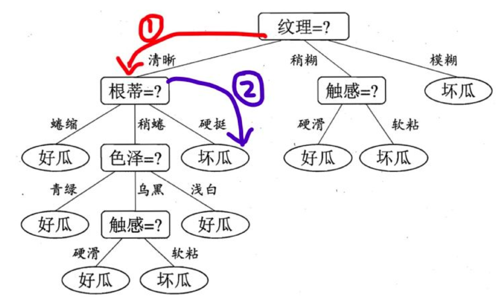

Algorithm-决策树算法
---

# 1. 决策树示例
|                      |                     |
| -------------------- | ------------------- |
|  |  |

# 2. 决策树算法
1. 分类算法是利用训练样本集获得分类函数即分类模型(分类器)，从而实现将数据集中的样本划分到各个类中。
2. 分类模型通过学习训练样本中属性集与类别之间的潜在关系，并以此为依据对新样本属于哪一类进行预测。
3. 决策树算法模拟人的是识别能力。

## 2.1. 决策树算法思想
1. 决策树通过把数据样本分配到某个叶子结点来确定数据集中样本所属的分类 
2. 决策树的组成:决策结点、分支和叶子结点
    1. 决策结点表示在样本的一个属性上进行的划分 
    2. 分支表示对于决策结点进行划分的输出,用椭圆表示 
    3. 叶结点代表经过分支到达的类，用长方形表示
3. 从决策树根结点出发，自顶向下移动，在每个决策结点都会进行次划分，通过划分的结果将样本进行分类，导致不同的分支，最后到达个叶子结点，这个过程就是利用决策树进行分类的过程.
4. 抽离出事物的最本质特征，作为特征点来进行分类。

## 2.2. ID3算法
1. 最简单的机器学习算法，使用了启发式算法来进行决策树的构造。例如，使用贪婪算法对每个结点构造部分最优决策树。
2. 算法内容:每次使用一个最有区分性的属性来看是否能把各个数据分类分开。
3. 算法精髓:在于分支处理，即确定在每个决策结点出的分支属性。分支属性的选取即对决策节点上选择哪一个属性来对数据集进行划分，要求每个分支中样本的类别纯度尽可能高，而且不要产生样本数量太少的分支。

### 2.2.1. 具体算法实现
1. ID3算法是在每个结点处选取能获得最高信息增益的分支属性进行分裂
2. 在每个决策结点处划分分支、选取分支属性的目的是将整个决策树的样本纯度提升
3. 衡量样本集合纯度的指标则是熵

$$
Entropy(S) = -\sum\limits_{i=1}\limits^{m}p_ilog_2{p_i}, p_i = \frac{|C_i|}{n}
$$

4. 举例来说，如果有一个大小为10的布尔值样本集Sp，其中有6个真值、4个假值，那么该布尔型样本分类的熵为:

$$
Entropy(S_b) = -(\frac{6}{10})log_2\frac{6}{10} - (\frac{4}{10})log_2\frac{4}{10} = 0.9710
$$

1. 问题一:如何选择出有区分度的属性？ID3使用了信息增益的概念。
2. 算法描述:按照递归来寻找有区分度的属性。算法需要获得相应可以减少不确定的因素。
    + 哪个因素考虑和不考察了之差最大就可以选择这个因素。
    + 他的符号有相应意义
3. 公式描述:
    1. 通过频率代替概率
4. 算法输入是一个决策表，最后一列是导致信号(示范)。
5. 计算分支属性对于样本集分类好坏程度的度量--信息增益
6. 由于分裂后样本集的纯度提高，则样本集的熵降低，熵降低的值即为该分裂方法的信息增益

$$
Gain(S, A) = Entropy(S) - \sum\limits_{i=1}\limits^v\frac{|S_i|}{|S|}Entropy(S_i)
$$

1. 他的物理含义就是两个熵之差，也就是考虑A的熵减去不考虑A的熵。
2. 我需要依次计算每一个因素的，而公式中第一个熵是不考虑任何其他因素的情况下的，后面的是考虑A后的熵

### 2.2.2. 例子


1. 不考虑任何因素，直接按照导致信号进行计算熵。也是所有情况的熵和。
2. 然后从其他属性中找到一个属性来进行计算，在A条件下，是导致信号的数量。(计算条件熵)
    + 比如在非A条件下，分别计数是导致信号的有几个，不是的有几个。如果相应比例大的话，当然可以降低不确定性因素。(在第二种情况下，比如在A条件下，重复上述操作。)
3. 然后计算整个样本的情况的熵和来作为公式第二项。
4. 结果:比较保留最大值。


#### 2.2.2.1. 饮食习性为分类


#### 2.2.2.2. 全部结果


1. 将胎生动物作为根节点，然后按照情况画分支，分开样本集，然后相应分支再继续向下分(递归)。
    + 当分支下到全是同一类的就不用再进行分支了。
    


### 2.2.3. 算法总结
1. 由根结点通过计算信息增益选取合适的属性进行分裂，若新生成的结点的分类属性不唯一，则对新生成的结点继续进行分裂，不断重复此步骤，直至所有样本属于同一类，或者达到要求的分类条件为止
2. 常用的分类条件包括结点样本数最少于来设定的值、决策树达到预先设定的最大深度等
3. 在决策树的构建过程中，会出现使用了所有的属性进行分支之后，类别不同的样本仍存在同一个叶子结点中。当达到了限制条件而被强制停止构建时，也会出现结点中子样本集存在多种分类的情况。对于这种情况，一般取此结点中子样本集占数的分类作为结点的分类
4. 分支多的属性并不一定是最优的，就如同将100个样本分到99个分支中并没有什么意义，这种分支属性因为分支太多可能相比之下无法提供太多的可用信息，例如个人信息中的“省份”属性
5. CSDN上的python实现ID3<a href = "https://blog.csdn.net/weixin_38273255/article/details/88981748">详见</a>

## 2.3. C4.5算法(ID3算法变种)
1. C4.5算法总体思路与ID3类似，都是通过构造决策树进行分类，其区别在于分支的处理，在分支属性的选取上，ID3算法使用信息增益作为度量，而C4.5算法引入了信息增益率作为度量

$$
Gain_ratio(A) = \frac{Gain(A)}{-\sum\limits_{i=1}\limits^{S_i}log_2(\frac{|S_i|}{S})}
$$

2. 由信息增益率公式中可见，当v比较大时，信息增益率会明显降低，从而在一定程度上能够解决ID3算法存在的往往选择取值较多的分支属性的问题
3. 在前面例子中，假设选择“饮食习性”作为分支属性，其信息增益率为

$$
Gain_ratio(饮食习性) = \frac{Gain(饮食习性)}{-\sum\limits_{i=1}^{v}\frac{|S_i|}{|S|}log_2\frac{|S_i|}{|S|}} \\
= -\frac{0.2080}{-(\frac{8}{14}*log_2\frac{8}{14} + \frac{2}{14}log_2\frac{2}{14} + \frac{4}{14}log_2\frac{4}{14})} = 0.1509
$$

1. 整体思路相似，但是将信息增益除以分母。
    1. v代表每种取值。
    2. 选择的并不是信息增益最大的一部分，而是选择信息增益率最大的一部分
2. 每选择一个特点，就空间划分出来一个空间出来。

## 2.4. C5.0算法
1. C5.0算法是Quinlan在C4.5算法的基础_上提出的商用改进版本，目的是对含有大量数据的数据集进行分析
2. C5.0算法与C4.5算法相比有以下优势:
   1. 决策树构建时间要比C4.5算法快上数倍，同时生成的决策树规模也更小，拥有更少的叶子结点数
   2. 使用了提升法(boosting)，组合多个决策树来做出分类，使准确率大大提高
   3. 提供可选项由使用者视情况决定，例如是否考虑样本的权重、样本错误分类成本等

## 2.5. CART算法
1. CART算法采用的是一种二分循环分割的方法，每次都把当前样本集划分为两个子样本集，使生成的决策树的结点均有两个分支，显然，这样就构造了一个二叉树。如果分支属性有多于两个取值，在分裂时会对属性值进行组合，选择最佳的两个组合分支。假设某属性存在q个可能取值，那么以该属性作为分支属性，生成两个分支的分裂方法共有$2^{q-1}- 1$种
2. CART算法在分支处理中分支属性的度量指标是Gini指标
3. 在前面例子中，假设选择“会飞”作为分支属性，其Gini指标为

$$
Gini(会飞) = \frac{|S_1|}{|S|}Gini(S_1) + \frac{|S_2|}{|S|}Gini(S_2) = \\
\frac{11}{14} * |1 - (\frac{7}{11})^2 - (\frac{4}{11})^2| + \frac{3}{14}|1 - (\frac{1}{3})^2 - (\frac{2}{3})^2 = 0.4589
$$

1. 度量指标:Gini指标，这个指标是越小越有区分力，不确定因素越小。

### 2.5.1. 样例


1. graphviz是可视化库
2. fit是进行学习的部分

结果
---


### 2.5.2. C5.0和CART算法的比较

<a href = "https://mp.weixin.qq.com/s?__biz=MzA3OTAxMDQzNQ==&mid=2650624953&idx=1&sn=51ba7c9e8e49ef060d2e1bf01f378b1b&source=41#wechat_redirect">C5.0与CART算法比较</a>

## 2.6. GBDT
1. 决策树一般分为回归树与分类树:
    1. 分类树的结果不能进行加减运算。
    2. 回归树的结果是数值，可以进行加减运算，如年龄、身高等。
    3. GBDT中的决策树是回归树。
    4. 通过损失函数:最大熵VS均方差来评估模型的准确率。
2. 如果在不改变原有模型的结构的基础上提升模型的拟合能力?
    + 可以优化模型。
    + 也可以增加一个新的模型，拟合其残差。比如(170+10=180)

$$
J(y, F(x)) = \frac{1}{2}(y - F(X))^2 \\
y_i - F(x_i) = -\frac{\partial J}{\partial F(x_i)}
$$

3. 第一个F(x)是均方差，第二个是差等于负梯度方向，作为残差的估计值。对于负梯度直接求导是一个比较快速的方法。

### 2.6.1. 思路分析
1. 利用梯度下降，用损失函数的负梯度在当前模型的值，作为提升树中**残差**的近似值来**拟合回归决策树**，算法过程如下:
    1. 初识化决策树，估计一个使损失函数最小化的常数构建一个只有根节点的树。
    2. 不断提升迭代:
        1. 计算当前模型中损失函数的负梯度值，作为残差的估计值。
        2. 估计回归树中叶子节点的区域，拟合残差的近似值。
        3. 利用线性搜索估计叶节点区域的值，使损失函数极小化。
        4. 更新决策树。
    3. 经过若干论的提升法迭代过程之后，输出最终的模型.
2. 加法模型

$$
\hat{y_i} = \sum\limits_{k=1}^Kf_k(x_i)，f_k \in F
$$

3. K个基模型，F为所有树组成的函数

$$
\hat{y_i}^{t} = \hat{y_i}^{t-1} + f_t(x_i) \\
Obj^{(t)} = \sum\limits_{i=1}^{\infty}(y_i * \hat{y_i}^(t-1) +f_i(x_i)) + \Omega(f_i) + constant
$$

1. 多个基模型作为基础，来进行一步一步拟合决策树
2. 最后一个公式是每个的固定值的损失+正则部分(最终的损失函数)

### 2.6.2. XGBoost树提升系统
1. 对于GBDT算法的具体实现，最为出色的是XGBoost树提升系统。
2. 下面是在Python环境下使用XGBoost模块进行回归的调用示例，首先用 pandas构造一个最简单的数据集df，其中x的值为[1,2,3]，y的值为[10,20,30] ，并构建训练集矩阵T_train_xbg。
3. 代码如下:
```python
import pandas as pd
import xgboost as xgb
df = pd.DataFrame({'x':[1,2,3], 'y':[10,20,30]})
X_train = df.drop('y',axis=1)
Y_train = df['y']
T_train_xgb = xgb.DMatrix(X_train, Y_train)
params = {"objective": "reg:linear", "booster":"gblinear"}# reg线性回归，booster使用gb线性回归
gbm = xgb.train(dtrain=T_train_xgb,params=params)# 进行训练
Y_pred = gbm.predict(xgb.DMatrix(pd.DataFrame({'x':[4,5]}))) print(Y_pred)#输入一个x的一个值，就可以输出一个y的值。
```

### 2.6.3. GBDT特点
1. 特点:
   1. 超参比较多，可用交叉验证的方法选择最佳参数: 
   2. 非线性变换比较多，表达能力强，不需要做复杂的特征工程和特征变换:
   3. Boost是串行过程，难以并行化，计算复杂度高，不适合高维稀疏特征;
   4. 样本中异常值较多时，可将平方损失用绝对损失或Huber损失代替

$$
L(y, F) = |y - F|\ L(y,F) = \begin{cases}
    \frac{1}{2}|y-F|^2\ |y-F| \leq \delta \\
    \delta(|y-F| - \frac{\delta}{2}) \ |y-F| > \delta \\
\end{cases}
$$

2. 应用场景：
   1. 线性/非线性回归问题
   2. 推荐系统
3. 超参比较多:交叉验证、grad_search进行自动化调参。
4. 不用正则化、归一化等问题的处理。
5. Boost是串行过程，按照线性序列顺序做，很难进行并行处理。
    + 可以通过PC降维处理来完成使用
6. 平方损失:用绝对损失，我的预测值和之前的模型的差不进行平方，减少异常值造成的损失，而Huber损失是均衡进行，根据阈值进行比较。
    + 减去阈值/2->调整因子
7. 其他可以看官网手册。