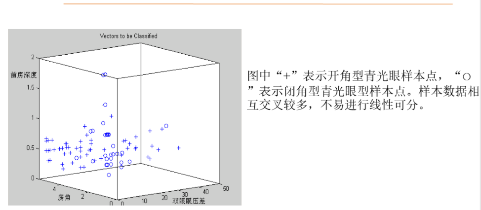
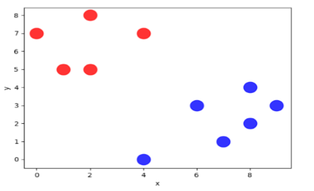
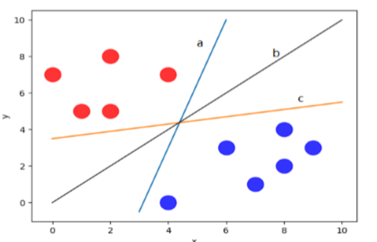
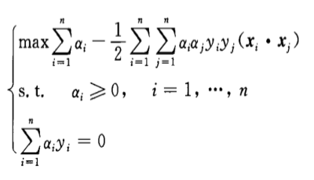
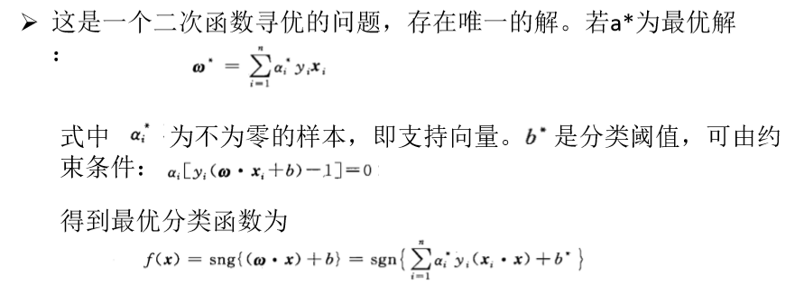
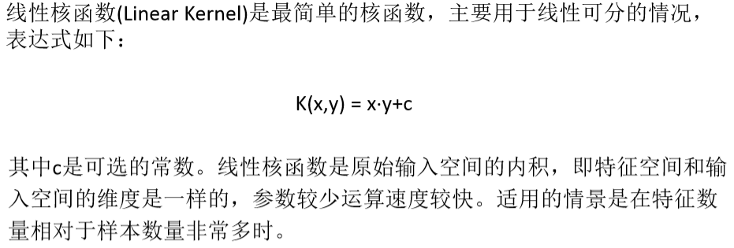
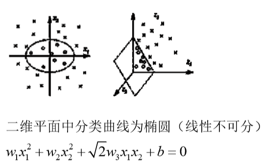
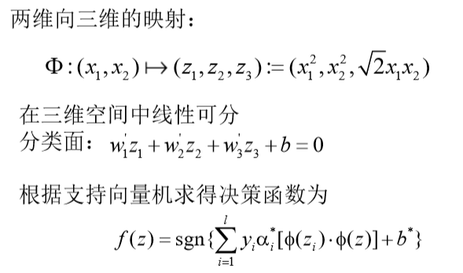

Algorithm-支持向量机
---

# 1. 什么是支持向量机
1. 支持向量机（Support Vector Machine，SVM）属于有监督学习模型，主要用于解决数据分类问题。
2. 通常SVM用于**二元分类**问题，对于多元分类可将其**分解为多个二元分类问题**，再进行分类，主要应用场景有图像分类、文本分类、面部识别和垃圾邮件检测等领域。
3. 支持向量机是监督的

# 2. 支持向量机模型

## 2.1. 例子:青光眼诊断



1. 首先选择了相关的比较重要的属性作为我们分类问题的特征。
2. 数据量不足的情况下，难以使用神经网络，避免欠拟合。
3. 数据量不足且不明显成线性相关的情况下，使用向量机是一个好的决定。

## 2.2. 支持向量机模型


1. 将低维升到高维空间，低维不可分高维未必不可分。
2. 我们通过核函数来将相应的低维生成高维
3. 支持向量机在高维或无限维空间中构造超平面或超平面集合，将原有限维空间映射到维数高得多的空间中，在该空间中进行分离可能会更容易。它可以同时**最小化经验误差和最大化集合边缘区**，因此它也被称为最大间隔分类器。直观来说，分类边界距离最近的训练数据点越远越好，因为这样可以缩小分类器的泛化误差。
4. 如果线性可分，那么我们使用超平面就可以区分开，如果线性不可分，我们可以使用超曲面来进行分类。
5. 问题:如何获得一个超平面或者超曲面？

## 2.3. 模型基本思想

### 2.3.1. 引入:二元分类问题


1. 找到一条泛化能力最强的用来分类的直线。



2. 怎么来找一条最合适的直线呢？
    + 在a、b、c中，我们选择b线
    + 在数据集扩展后，来确定不同直线


3. 线在边界点上，这两条线能把两个样本最大程度分开，我们能不能找到边缘点，然后保证数据集的边缘点到分界点的距离d最大。**最大程度分开**
    + 支持向量:虚线穿过的边缘点
    + 分类间隔:2d

## 2.4. 支持向量机原理


1. x是横坐标和纵坐标形成的列向量，w,b是向量的参数。
2. 判决函数也是对应一个直线，这就是分类器表示的方法。
3. 为了能区分开，我们使用y1取-1和1来区分，并且sgn()是符号函数。

### 2.4.1. 如何求w，b这些超参数(推导过程)
1. 理论上是只有一对，也就是唯一的。
2. 距离我们可以轻松知道距离是2/w
3. 超平面间的距离越大，他的泛化能力越强。
4. 转化为优化问题。
    + 二维平面下的直线，我们可以转化为多元函数的极值。
    + 偏差要保证比较小


1. 修改成一个等价的问题来求解，这样子也让我们更加容易去求偏导。


1. 约束条件，我们不仅仅想要尽可能的大，我们还想要能够做到充分的分类。
    + 线上面:w*x<sub>0</sub> + b >= 1
    + 线下面:w*x<sub>2</sub> + b <= -1
    + 主要是运筹学


1. 求在相应条件下的优化问题
    + x是支持向量，w,b都是相应待运算的参数。
    + 拉格朗日函数来求解带有约束条件的相应函数的极值。
    + 在线性可分条件下。

优化问题具体化
---


1. 等价变化是有小技巧的。

将最优平面的问题转化为对偶问题
---


1. 对偶问题主要是在运筹学中，用来转化相应的优化问题。
2. 求对偶问题的解。

最终结果
---


1. 最后直接把x带入即可。
2. 支持向量机可以通过计算把低维向量转换为高维向量。

## 2.5. 核函数
1. 支持向量机通过线性变换A(x)将输入空间X映射到高维特征空间Y，如果低维空间存在函数K，x,y∈X，使得K(x,y)=A(x)·A(y)，则称K(x,y)为核函数。核函数 方法可以与不同的算法相结合，形成多种不同的基于核函数的方法，常用的核函数有:
    1. 线性核函数
    2. 多项式核函数
    3. 径向基核函数
    4. Sigmoid核函数

### 2.5.1. 线性核函数



### 2.5.2. 多项式核函数


### 2.5.3. 径向基核函数


1. a的大小会决定模型的泛化能力。

### 2.5.4. Sigmoid核函数


# 3. SVM python代码实践
<a href = "https://www.cnblogs.com/cxhzy/p/10753028.html">详情</a>

# 4. 支持向量机的应用
1. 支持向量机（SVM）算法比较适合图像和文本等样本特征较多的应用场合。
    + 青光眼的治疗
2. 基于结构风险最小化原理，对样本集进行压缩，解决了以往需要大样本数量进行训练的问题。它将文本通过计算抽象成向量化的训练数据，提高了分类的精确率。

## 4.1. 新闻主题的分类
1. 新闻的分类是根据新闻中与主题相关的词汇来完成的。应用SVM对新闻分类可以划分为五个步骤：
    1. 获取数据集
    2. 将文本转化为可处理的向量:预处理，将文本转换成相应的向量。
    3. 分割数据集
    4. 支持向量机分类
    5. 分类结果显示

### 4.1.1. 获取数据集
1. 数据集来自于sklearn官网上的20组新闻数据集，<a href ="http://scikit-learn.org/stable/datasets/index.html#the-20-newsgroups-textdataset">下载地址</a>
    + 首先使用pip来安装，调用SVM来调用相应函数。
2. 数据集中一共包含20类新闻，选择其中三类新闻，对应的target依次为 0,1,2。部分代码如下
```python
select = ['alt.atheism', 'talk.religion.misc', 'comp.graphics']
newsgroups_train_se = fetch_20newsgroups(subset='train', categories=select)
```

### 4.1.2. 文本转化为向量
1. sklearn中封装了向量化工具TfidfVectorizer，它统计每则新闻中各个单词出现的频率，并进行TF-IDF处理，其中TF（term frequency）是某一个给定的词语在该文件中出现的次数。IDF（inverse document frequency）是逆文档频率，用于降低其它文档中普遍出现的词语的重要性，TF-IDF倾向于过滤掉常见的词语，保留重要的词语。通过TF-IDF来实现文本特征的选择，也就是说， 一个词语在当前文章中出现次数较多，但在其它文章中较少出现，那么可认为这个词语能够代表此文章，具有较高的类别区分能力。使用TfidfVectorizer实例化、建立索引和编码文档的过程如下:
```python
vectorizer = TfidfVectorizer()
vectors = vectorizer.fit_transform(newsgroups_train_se.data)
print(vectors.shape)
```

### 4.1.3. 支持向量机分类
1. 使用sklearn中的SVM工具包SVC（C-Support Vector Classification）来进行分类 ，核函数采用的是线性核函数，代码如下：
```python
svc = SVC(kernel = "linear")# 选择线性方式进行训练
svc.fit(x_train,y_train)# 对数据进行训练
```

### 4.1.4. 分类结果显示
```python
print(svc.score(x_test,y_test))# 也就是使用训练样本进行检验，得到的是正确率
# 用检验样本检验，确定具体的进一步样本的训练结果。
```
1. 如果结果不理想，我们再使用非线性的来做。

## 4.2. 基于支持向量机和主成分分析的人脸识别
1. 主成分分析（Principal Component Analysis , PCA）是一种降维方法，可以从多种特征中解析出主要的影响因素，使用较少的特征数量表示整体。PCA的 目标就是找到方差大的维度作为特征。本案例可以被划分为六个步骤：
    1. 获取数据集
    2. 将图片转化为可处理的n维向量
    3. 分隔数据集
    4. PCA主成分分析，降维处理
    5. 支持向量机分类
    6. 查看训练后的分类结果

### 4.2.1. 获取数据集
1. 数据集是来自英国剑桥大学的AT&T人脸数据集。
    + 一共400张照片，图片大小112*92
    + 已经经过灰度处理，被划分为40个类

### 4.2.2. 图片转化为向量
1. 由于每张图片的大小为112x92,每张图片共有10304个像素点，这时需要一个图片转化函数ImageConvert()，将每张图片转化为一个10304维向量，代码如下:
```python
def ImageConvert(): 
    for i in range(1, 41): 
        for j in range(1, 11): 
            path = picture_savePath + "s" + str(i) + "/" + str(j) + ".pgm" # 单通道读取图片
            img = cv2.imread(path, cv2.IMREAD_GRAYSCALE)
            h, w = img.shape
            img_col = img.reshape(h * w)
            data.append(img_col) label.append(i)
```
2. data变量中存储了每个图片的10304维信息,格式为列表变量（list）。变量label中存储了每个图片的类别标签，为数字1~40。应用numpy生成特征向量 矩阵，代码如下：
    + 分类贴标签
```python
import numpy as np
C_data = np.array(data)
C_label = np.array(label)
```
4. 之后进行主成分分析降维。

### 4.2.3. 分割数据集
1. 将训练集与测试集按照4:1的比例进行随机分配，即测试集占20%。
```python
from sklearn,model_selection import train_test_split
x_train, x_test, y_train, y_test = train_test_split(C_data, C_label, test_size=0.2, random_state=256)
```

### 4.2.4. PCA主成分分析，降维处理
1. 引入sklearn工具进行PCA处理:
```python
from sklearn.decomposition import PCA
pca = PCA(n_components=15, svd_solver='auto').fit(x_train) 
# 方法中的15表示处理后保留维度为15个，auto表示PCA会自动选择合适的 SVD算法，进行维度转化
x_train_pca = pca.transform(x_train)
x_test_pca = pca.transform(x_test)
```

### 4.2.5. 支持向量机分类
1. 使用sklearn中的SVM工具包SVC(C-Support Vector Classification)来进行分类，核函数使用的是线性核函数，代码如下:
```python
svc = SVC(kernel='linear')
svc.fit(x_train, y_train)
```

### 4.2.6. 查看训练后的分类后的结果
1. 使用测试集评估分类器的效果
    + 代码实现:`print('%.5f' % svc.score(x_test_pca, y_test)) `
2. 同时可以使用对比试验，调整保留不同维度的情况来对比分类的效果，排除过拟合和欠拟合的情况。


3. 准确度是比较高的
    + 我们之前是卷积神经网络来进行训练，400张很难提高

## 4.3. 主成分分析
1. 主成分分析时最常用一种线性降维方法
    + 主要用于多个维度，并且每个维度之间存在一定的相关性的时候。
    + 主成分变量是原来变量的线性组合，并且在处理后得到的更少的变量有更多的信息
2. 目标是通过某种线性投影，将高维的数据映射到低维的空间中，并期望在所投影的维度上数据的方差最大，以此使用较少的维度，同时保留较多原数据的维度

### 4.3.1. PCA算法
1. 尽可能如果把所有的点都映射到一起，那么几乎所有的区分信息都丢失了，而如果映射后方差尽可能的大，那么数据点则会分散开来，特征更加明显。PCA是丢失原始数据信息最少的一种线性降维方法，最接近原始数据。
2. 算法目标是求出样本数据的协方差矩阵的特征值和特征向量，而**协方差矩阵的特征向量的方向**就是**PCA需要投影(主成分分析)**的方向。使样本数据向低维投影后，能尽可能表征原始的数据。协方差矩阵可以用散布矩阵代替，协方差矩阵乘以（n-1）就是散布矩阵，n为样本的数量。协方差矩阵和散布矩阵都是对称矩阵，主对角线是各个随机变量（各个维度）的方差。

### 4.3.2. PCA算法的一般步骤
设有m条n维数据，PCA的一般步骤如下:
1. 将原始数据按列组成n行m列矩阵X
2. 计算矩阵X中每个特征属性（n维）的平均向量M（平均值）
3. 将X的每行（代表一个属性字段）进行零均值化，即减去M
4. 按照公式𝐶 = 1/m*𝑋𝑋𝑇求出协方差矩阵
5. 求出协方差矩阵的特征值及对应的特征向量
6. 将特征向量按对应特征值从大到小按行排列成矩阵，取前k（k < n）行组成基向量P
7. 通过𝑌 = 𝑃𝑋计算降维到k维后的样本特征

### 4.3.3. 主成分分析python实现
1. 基于sklearn和numpy随机生成2个类别共40个3维空间的样本点:
```python
mu_vec1 = np.array([0,0,0])
cov_mat1 = np.array([[1,0,0],[0,1,0],[0,0,1]])
class1_sample = np.random.multivariate_normal(mu_vec1, cov_mat1, 20).T
mu_vec2 = np.array([1,1,1])
cov_mat2 = np.array([[1,0,0],[0,1,0],[0,0,1]])
class2_sample = np.random.multivariate_normal(mu_vec2, cov_mat2, 20).T
```

## 4.4. 线性不可分的情况



1. 使用非线性核函数



1. 我们将二维中的椭圆线性不可分问题，转换成三维中平面的线性可分。

# 5. 算法选择
1. 我们选择传统算法也可以获得比较好的效率。

# 6. 如何学习SVM
1. <a href = "https://mp.weixin.qq.com/s/lTOGzGXxBJfx8AdtAm4OXw">学习SVM</a>