Algorithm-支持向量机
---

# 1. 什么是支持向量机
1. 支持向量机(Support Vector Machine，SVM)属于有监督学习模型，主要用于解决数据分类问题。
2. 通常SVM用于**二元分类**问题，对于多元分类可将其**分解为多个二元分类问题**，再进行分类，主要应用场景有图像分类、文本分类、面部识别和垃圾邮件检测等领域。
3. 支持向量机是监督的

# 2. 支持向量机模型

## 2.1. 例子:青光眼诊断


1. 首先选择了相关的比较重要的属性作为我们分类问题的特征。
2. 数据量不足的情况下，难以使用神经网络，避免欠拟合。
3. 数据量不足且不明显成线性相关的情况下，使用向量机是一个好的决定。

## 2.2. 支持向量机模型


1. 将低维升到高维空间，低维不可分高维未必不可分。
2. 我们通过核函数来将相应的低维生成高维
3. 支持向量机在高维或无限维空间中构造超平面或超平面集合，将原有限维空间映射到维数高得多的空间中，在该空间中进行分离可能会更容易。它可以同时**最小化经验误差和最大化集合边缘区**，因此它也被称为最大间隔分类器。直观来说，分类边界距离最近的训练数据点越远越好，因为这样可以缩小分类器的泛化误差。
4. 如果线性可分，那么我们使用超平面就可以区分开，如果线性不可分，我们可以使用超曲面来进行分类。
5. 问题:如何获得一个超平面或者超曲面？

## 2.3. 模型基本思想

### 2.3.1. 引入:二元分类问题


1. 找到一条泛化能力最强的用来分类的直线。


2. 怎么来找一条最合适的直线呢？
    + 在a、b、c中，我们选择b线
    + 在数据集扩展后，来确定不同直线

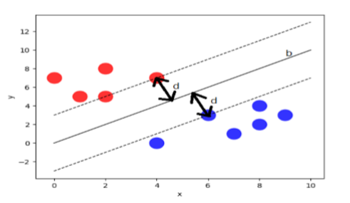

3. 线在边界点上，这两条线能把两个样本最大程度分开，我们能不能找到边缘点，然后保证数据集的边缘点到分界点的距离d最大。**最大程度分开**
    + 支持向量:虚线穿过的边缘点
    + 分类间隔:2d

## 2.4. 支持向量机原理


1. x是横坐标和纵坐标形成的列向量，w,b是向量的参数。
2. 判决函数也是对应一个直线，这就是分类器表示的方法。
3. 为了能区分开，我们使用y1取-1和1来区分，并且sgn()是符号函数。

### 2.4.1. 如何求w，b这些超参数(推导过程)
1. 理论上是只有一对，也就是唯一的。
2. 距离我们可以轻松知道距离是2/w
3. 超平面间的距离越大，他的泛化能力越强。
4. 转化为优化问题。
    + 二维平面下的直线，我们可以转化为多元函数的极值。
    + 偏差要保证比较小
5. 容易看出，最优化目标就是最大化几何间隔，并且注意到集合间隔与||w||反比，因此只需要找到最小的||w||，即

$$
\min||w||
$$

6. 对于这个目标函数，可以用一个等价的目标函数里替代

$$
\frac{1}{2}||w||^2
$$

1. 修改成一个等价的问题来求解，这样子也让我们更加容易去求偏导。
2. 为使分类对所有样本正确分类，要求满足如下约束

$$
y_i[(w*x_i) + b] \geq 1\ i = 1,2,3,...,l
$$

1. 约束条件，我们不仅仅想要尽可能的大，我们还想要能够做到充分的分类。
    + 线上面:w*x<sub>0</sub> + b >= 1
    + 线下面:w*x<sub>2</sub> + b <= -1
    + 主要是运筹学
2. 优化问题

$$
\min \frac{1}{2}||w||^2\ s.t. y_i[(wx_i) + b] - 1 \geq 0 (i = 1, 2, ..., n)
$$

3. 为解决这个约束问题的最优解，引入Lagrange函数

$$
L(w, b ,\alpha) = \frac{1}{2}||w||^2 - \sum\limits_{i = 1}^{n}\alpha_i[y_i(w *x_i + b) - 1]
$$

4. 其中$\alpha_i \geq 0$是lagrange乘子，为求函数最小值，分别对w，b和$\alpha_i$求偏微分
5. 求在相应条件下的优化问题
    + x是支持向量，w,b都是相应待运算的参数。
    + 拉格朗日函数来求解带有约束条件的相应函数的极值。
    + 在线性可分条件下。

#### 2.4.1.1. 优化问题具体化
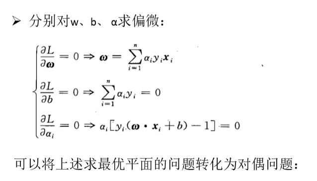

1. 等价变化是有小技巧的。

#### 2.4.1.2. 将最优平面的问题转化为对偶问题


1. 对偶问题主要是在运筹学中，用来转化相应的优化问题。
2. 求对偶问题的解。

#### 2.4.1.3. 最终结果


1. 最后直接把x带入即可。
2. 支持向量机可以通过计算把低维向量转换为高维向量。

## 2.5. 核函数
1. 支持向量机通过线性变换A(x)将输入空间X映射到高维特征空间Y，如果低维空间存在函数K，x,y∈X，使得K(x,y)=A(x)·A(y)，则称K(x,y)为核函数。核函数 方法可以与不同的算法相结合，形成多种不同的基于核函数的方法，常用的核函数有:
    1. 线性核函数
    2. 多项式核函数
    3. 径向基核函数
    4. Sigmoid核函数

### 2.5.1. 线性核函数


### 2.5.2. 多项式核函数


### 2.5.3. 径向基核函数


1. a的大小会决定模型的泛化能力。

### 2.5.4. Sigmoid核函数


# 3. SVM python代码实践
<a href = "https://www.cnblogs.com/cxhzy/p/10753028.html">详情</a>

# 4. 支持向量机的应用
1. 支持向量机(SVM)算法比较适合图像和文本等样本特征较多的应用场合。
    + 青光眼的治疗
2. 基于结构风险最小化原理，对样本集进行压缩，解决了以往需要大样本数量进行训练的问题。它将文本通过计算抽象成向量化的训练数据，提高了分类的精确率。

## 4.1. 新闻主题的分类
1. 新闻的分类是根据新闻中与主题相关的词汇来完成的。应用SVM对新闻分类可以划分为五个步骤：
    1. 获取数据集
    2. 将文本转化为可处理的向量:预处理，将文本转换成相应的向量。
    3. 分割数据集
    4. 支持向量机分类
    5. 分类结果显示

### 4.1.1. 获取数据集
1. 数据集来自于sklearn官网上的20组新闻数据集，<a href ="http://scikit-learn.org/stable/datasets/index.html#the-20-newsgroups-textdataset">下载地址</a>
    + 首先使用pip来安装，调用SVM来调用相应函数。
2. 数据集中一共包含20类新闻，选择其中三类新闻，对应的target依次为 0,1,2。部分代码如下
```python
select = ['alt.atheism', 'talk.religion.misc', 'comp.graphics']
newsgroups_train_se = fetch_20newsgroups(subset='train', categories=select)
```

### 4.1.2. 文本转化为向量
1. sklearn中封装了向量化工具TfidfVectorizer，它统计每则新闻中各个单词出现的频率，并进行TF-IDF处理，其中TF(term frequency)是某一个给定的词语在该文件中出现的次数。IDF(inverse document frequency)是逆文档频率，用于降低其它文档中普遍出现的词语的重要性，TF-IDF倾向于过滤掉常见的词语，保留重要的词语。通过TF-IDF来实现文本特征的选择，也就是说， 一个词语在当前文章中出现次数较多，但在其它文章中较少出现，那么可认为这个词语能够代表此文章，具有较高的类别区分能力。使用TfidfVectorizer实例化、建立索引和编码文档的过程如下:
```python
vectorizer = TfidfVectorizer()
vectors = vectorizer.fit_transform(newsgroups_train_se.data)
print(vectors.shape)
```

### 4.1.3. 支持向量机分类
1. 使用sklearn中的SVM工具包SVC(C-Support Vector Classification)来进行分类 ，核函数采用的是线性核函数，代码如下：
```python
svc = SVC(kernel = "linear")# 选择线性方式进行训练
svc.fit(x_train,y_train)# 对数据进行训练
```

### 4.1.4. 分类结果显示
```python
print(svc.score(x_test,y_test))# 也就是使用训练样本进行检验，得到的是正确率
# 用检验样本检验，确定具体的进一步样本的训练结果。
```
1. 如果结果不理想，我们再使用非线性的来做。

## 4.2. 基于支持向量机和主成分分析的人脸识别
1. 主成分分析(Principal Component Analysis , PCA)是一种降维方法，可以从多种特征中解析出主要的影响因素，使用较少的特征数量表示整体。PCA的 目标就是找到方差大的维度作为特征。本案例可以被划分为六个步骤：
    1. 获取数据集
    2. 将图片转化为可处理的n维向量
    3. 分隔数据集
    4. PCA主成分分析，降维处理
    5. 支持向量机分类
    6. 查看训练后的分类结果

### 4.2.1. 获取数据集
1. 数据集是来自英国剑桥大学的AT&T人脸数据集。
    + 一共400张照片，图片大小112*92
    + 已经经过灰度处理，被划分为40个类

### 4.2.2. 图片转化为向量
1. 由于每张图片的大小为112x92,每张图片共有10304个像素点，这时需要一个图片转化函数ImageConvert()，将每张图片转化为一个10304维向量，代码如下:
```python
def ImageConvert(): 
    for i in range(1, 41): 
        for j in range(1, 11): 
            path = picture_savePath + "s" + str(i) + "/" + str(j) + ".pgm" # 单通道读取图片
            img = cv2.imread(path, cv2.IMREAD_GRAYSCALE)
            h, w = img.shape
            img_col = img.reshape(h * w)
            data.append(img_col) label.append(i)
```
2. data变量中存储了每个图片的10304维信息,格式为列表变量(list)。变量label中存储了每个图片的类别标签，为数字1~40。应用numpy生成特征向量 矩阵，代码如下：
    + 分类贴标签
```python
import numpy as np
C_data = np.array(data)
C_label = np.array(label)
```
4. 之后进行主成分分析降维。

### 4.2.3. 分割数据集
1. 将训练集与测试集按照4:1的比例进行随机分配，即测试集占20%。
```python
from sklearn,model_selection import train_test_split
x_train, x_test, y_train, y_test = train_test_split(C_data, C_label, test_size=0.2, random_state=256)
```

### 4.2.4. PCA主成分分析，降维处理
1. 引入sklearn工具进行PCA处理:
```python
from sklearn.decomposition import PCA
pca = PCA(n_components=15, svd_solver='auto').fit(x_train) 
# 方法中的15表示处理后保留维度为15个，auto表示PCA会自动选择合适的 SVD算法，进行维度转化
x_train_pca = pca.transform(x_train)
x_test_pca = pca.transform(x_test)
```

### 4.2.5. 支持向量机分类
1. 使用sklearn中的SVM工具包SVC(C-Support Vector Classification)来进行分类，核函数使用的是线性核函数，代码如下:
```python
svc = SVC(kernel='linear')
svc.fit(x_train, y_train)
```

### 4.2.6. 查看训练后的分类后的结果
1. 使用测试集评估分类器的效果
    + 代码实现:`print('%.5f' % svc.score(x_test_pca, y_test)) `
2. 同时可以使用对比试验，调整保留不同维度的情况来对比分类的效果，排除过拟合和欠拟合的情况。

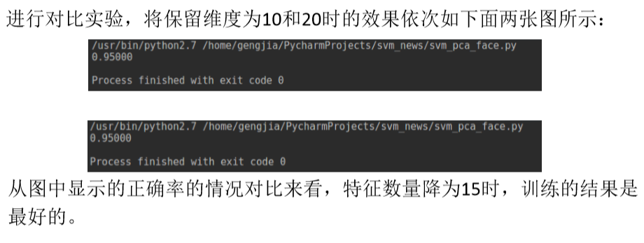

3. 准确度是比较高的
    + 我们之前是卷积神经网络来进行训练，400张很难提高

## 4.3. 主成分分析
1. 主成分分析时最常用一种线性降维方法
    + 主要用于多个维度，并且每个维度之间存在一定的相关性的时候。
    + 主成分变量是原来变量的线性组合，并且在处理后得到的更少的变量有更多的信息
2. 目标是通过某种线性投影，将高维的数据映射到低维的空间中，并期望在所投影的维度上数据的方差最大，以此使用较少的维度，同时保留较多原数据的维度

### 4.3.1. PCA算法
1. 尽可能如果把所有的点都映射到一起，那么几乎所有的区分信息都丢失了，而如果映射后方差尽可能的大，那么数据点则会分散开来，特征更加明显。PCA是丢失原始数据信息最少的一种线性降维方法，最接近原始数据。
2. 算法目标是求出样本数据的协方差矩阵的特征值和特征向量，而**协方差矩阵的特征向量的方向**就是**PCA需要投影(主成分分析)**的方向。使样本数据向低维投影后，能尽可能表征原始的数据。协方差矩阵可以用散布矩阵代替，协方差矩阵乘以(n-1)就是散布矩阵，n为样本的数量。协方差矩阵和散布矩阵都是对称矩阵，主对角线是各个随机变量(各个维度)的方差。

### 4.3.2. PCA算法的一般步骤
设有m条n维数据，PCA的一般步骤如下:
1. 将原始数据按列组成n行m列矩阵X
2. 计算矩阵X中每个特征属性(n维)的平均向量M(平均值)
3. 将X的每行(代表一个属性字段)进行零均值化，即减去M
4. 按照公式𝐶 = 1/m*𝑋𝑋𝑇求出协方差矩阵
5. 求出协方差矩阵的特征值及对应的特征向量
6. 将特征向量按对应特征值从大到小按行排列成矩阵，取前k(k < n)行组成基向量P
7. 通过𝑌 = 𝑃𝑋计算降维到k维后的样本特征

### 4.3.3. 主成分分析python实现
1. 基于sklearn和numpy随机生成2个类别共40个3维空间的样本点:
```python
mu_vec1 = np.array([0,0,0])
cov_mat1 = np.array([[1,0,0],[0,1,0],[0,0,1]])
class1_sample = np.random.multivariate_normal(mu_vec1, cov_mat1, 20).T
mu_vec2 = np.array([1,1,1])
cov_mat2 = np.array([[1,0,0],[0,1,0],[0,0,1]])
class2_sample = np.random.multivariate_normal(mu_vec2, cov_mat2, 20).T
```

## 4.4. 线性不可分的情况


1. 使用非线性核函数


1. 我们将二维中的椭圆线性不可分问题，转换成三维中平面的线性可分。

# 5. 算法选择
1. 我们选择传统算法也可以获得比较好的效率。

# 6. 如何学习SVM
1. <a href = "https://mp.weixin.qq.com/s/lTOGzGXxBJfx8AdtAm4OXw">学习SVM</a>

# 7. SVM 支持向量机

## 7.1. 线性划分和非线性划分
|  | 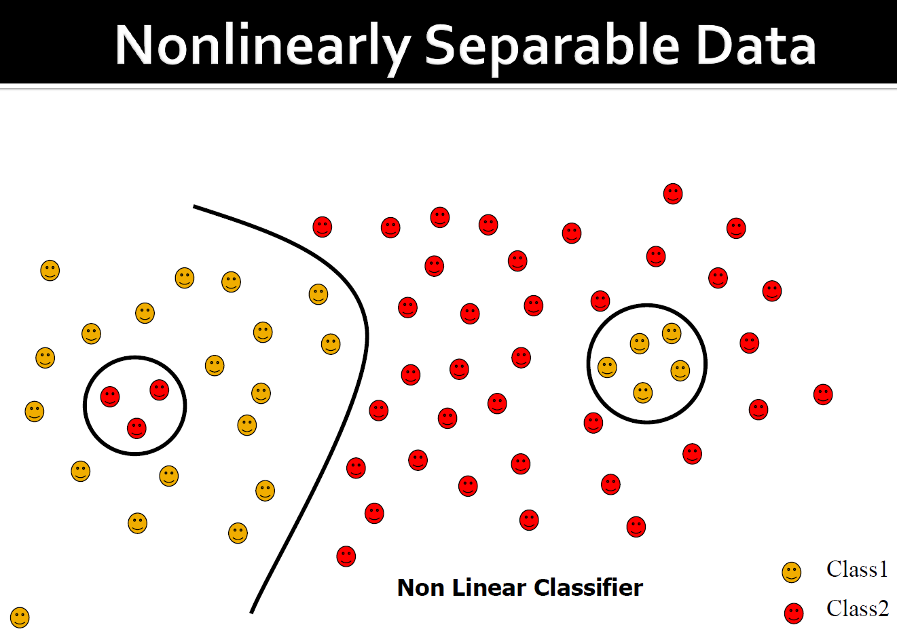 |
| -------------------- | -------------------- |

## 7.2. 分类标注的起源：逻辑回归
1. 逻辑回归的目的是从特征学习出一个0/1分类模型，而这个模型是将特征的线性组合作为自变量，由于自变量的取值范围是负无穷到正无穷，因此我们使用sigmoid函数将自变量映射到(0, 1)上，映射后的值被认为是属于y=1的规律。

$$
\begin{array}{l}
   sigmoid(x) = \frac{1}{ 1 + e^{-x}} \\
   h_\theta(x) = g(\theta^Tx) = \frac{1}{1+e^{-\theta^Tx}}
\end{array}
$$

2. $h_\theta(x)$只和$\theta^Tx$有关，如果$\theta^Tx>0.5$，则$h_\theta(x)>0.5$
3. 希望模型达到的目标就是让训练集中y=1的特征$\theta^Tx>>0$，而y=0的特征$\theta^Tx<<0$
4. 对于更高维的情况，我们可以得到下式$\theta^Tx = w^Tx + b$

## 7.3. 函数间隔(Functional margin)与几何间隔(Geometrical margin)

### 7.3.1. 函数间隔
1. 函数间隔$\hat{\gamma} = y(w^Tx+b) = yf(x)$
2. 超平面(w, b)关于T中所有样本点的最小函数间隔即为超平面(w, b)关于训练数据集T的函数间隔

$$
\hat{\gamma} = \min\hat{\gamma},(i = 1, ..., n)
$$

3. 函数间隔存在问题，如果成比例修改w和b会导致函数间隔的值f(x)变为原来2倍。

### 7.3.2. 几何间隔
1. 我们对于点x，令其垂直投影到超平面上的点$x_0$，w是垂直于超平面的向量，$\gamma$是样本x到分类间隔的距离


2. 有$x = x_0 + \gamma\frac{w}{||w||}$，其中||w||是范数
3. 又因为$x_0$在平面上，所以$f(x_0)=0$，代入超平面的方程可以计算出

$$
\gamma = \frac{f(x)}{||w||}
$$

4. 为了获取$\gamma$的绝对值，使其乘以其类别，得到几何间隔

$$
\hat{\gamma} = y\gamma = \frac{\hat{\gamma}}{||w||}
$$

## 7.4. 最大分离器Maximum Margin Classifier的定义
1. 最大间隔分类器的目标函数为$\max\hat{\gamma}$
2. 其他满足条件:$y_i(w^Tx_i + b) = \hat{\gamma_i}\geq\hat{\gamma}, i = 1,...,n$
3. 如果函数间隔$\hat{\gamma}$为1，上述目标函数在转化为

$$
\max\frac{1}{||w||}, s.t.\ y_i(w^Tx_i + b) \geq 1, i = 1, ..., n
$$

## 7.5. 如何寻找到最优超平面
1. 最大化距离:最大化距离可以为模型带来比较好的泛化能力


2. 支持向量的图形化表示

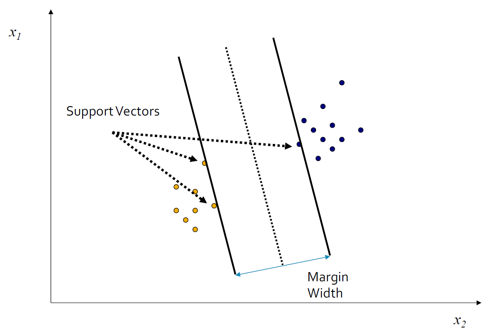

3. 最初优化问题:我们选择最大间距作为这个优化问题的最优解，也就是使得$\frac{2}{||w||}$的值最大，并且满足一下两个约束条件
   1. $(wx+b) \geq 1, \forall$ x in class 1
   2. $(wx+b) \leq -1, \forall$ x in class 2

4. 线性分类器
   1. $w^Tx + b = 0$
   2. $f(x) = w^Tx +b$

## 7.6. 决策边界

### 7.6.1. 线性分类边界


### 7.6.2. 非线性分类边界


> 使用二次曲线进行划分

## 7.7. 支持向量机
1. 我们想要通过一条尽可能好的直线(超平面)将两类不同的物体分开。
2. 数据:
   1. 训练集:$(x_1,y_1),...,(x_n,y_n)$
   2. 对于每一个例i:
      1. $x_i = \{x_i^{(1)}, ... , x_i^{(d)}\}$，$x_i^{(j)}是实数$
      3. $y_i \in \{-1, +1\}$
   3. 向量内积:$w*x = \sum\limits_{j=1}\limits^{d}w^{(j)}*x^{(j)}$
   4. 什么是被$w$定义的最佳的线性分类器?

### 7.7.1. 最大距离
1. 距分离超平面的距离对应于预测的"置信度"
2. 在下图中，我们认为A和B是左侧类的概率比C大。


3. Margin $\gamma$:距离分类直线或超平面最近的一个点的距离。

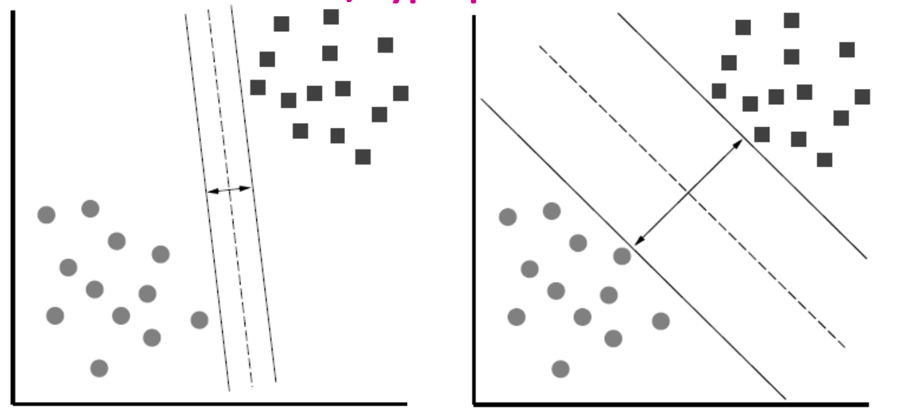

3. 之所以以这种方式定义边距，是因为理论上的边界以及依赖于边距值的泛化误差范围的存在。

### 7.7.2. 为什么最大距离是好的
1. 点积:$A * B = ||A|| * ||B|| * \cos \theta$


2. $\gamma$和间距是线性正相关，所以是可以的

### 7.7.3. 距离如何表示


### 7.7.4. 最大距离的求解
1. 预测值 = $sign(w*x+b)$
2. 置信度(Confidence) = $(w*x + b)y$
3. 对于第i个数据点:$\gamma_i = (w*x_i + b)y_i$
4. 解决的问题:$\max\limits_w\min\limits_i\gamma_i$
5. 重新解释为:求解$\max\limits_{w,\gamma}\gamma s.t.\forall i, y_i(w*x_i + b) \geq \gamma$


## 7.8. 规范超平面
1. 转化问题:$(2wx + 2b)y = 2\gamma$
2. 一般化w:$\gamma = (\frac{w}{||w||} * x + b) y$
3. 当然提供**支持向量**$x_j$在差平面上被定义为$w*x_j + b = \pm 1$


- 前提条件
$$
\begin{array}{l}
   x_1 = x_2 + 2 \gamma\frac{w}{||w||} \\
\ \\
   w * x_1 + b = +1 \\
   w * x_2 + b = -1 \\
\end{array}
$$

- 计算$\gamma$

$$
\begin{array}{l}
   w * x_1 + b = + 1 \\
   w (x_2 + 2\gamma\frac{w}{||w||}) + b = + 1 \\
   \ \\
   w * x_2 + b + 2\gamma\frac{w}{||w||} = + 1 \\
   \ \\
   \gamma = \frac{||w||}{w * w} = \frac{1}{||w||} \\   
\end{array}
$$

## 7.9. 通过上述化简后最大距离
$$
\arg \max\gamma = arg \arg\min\frac{1}{||w||} = \arg\min\frac{1}{2}||w||^2
$$

- 支持向量机的强约束条件:

$$
\min\limits_w\frac{1}{2}||w||^2 \\
s.t. \forall i, y_i(w * x_i + b) \geq 1
$$

## 7.10. 非线性分析
1. 如果数据不是线性可分的，那么我们需要添加惩罚项C

$$
\min\limits_w\frac{1}{2}||w||^2 + C \\
\ \\
s.t. \forall i, y_i(w * x_i + b) \geq 1
$$

2. 通过交叉检验法确定C的值
3. 所有的错误并不是一样的坏
4. 引入宽松量$\xi_i$

$$
\min\limits_{w,b,\xi_i \geq 0} \frac{1}{2} * ||w||^2 + C*\sum\limits_{i=1}\limits^{n}\xi_i \\
\ \\
s.t. \forall i, y_i(w*x_i + b) \geq 1 - \xi_i
$$

5. 如果$x_i$位于错误的一边，那么他将会有惩罚项$\xi_i$

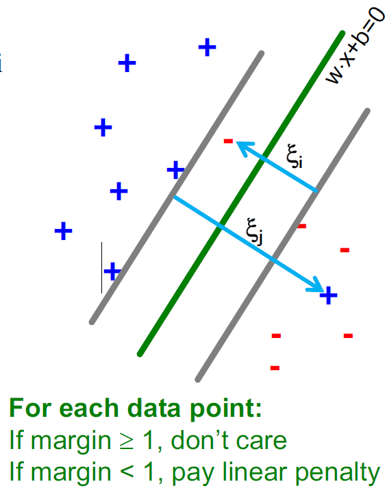

### 7.10.1. Slack Penalty C
1. 当C是无穷时，我们只希望通过w和b来分开数据
2. 当C是0时，我们无论设置$\xi_i$是多少，w都是0，也就是忽略了数据

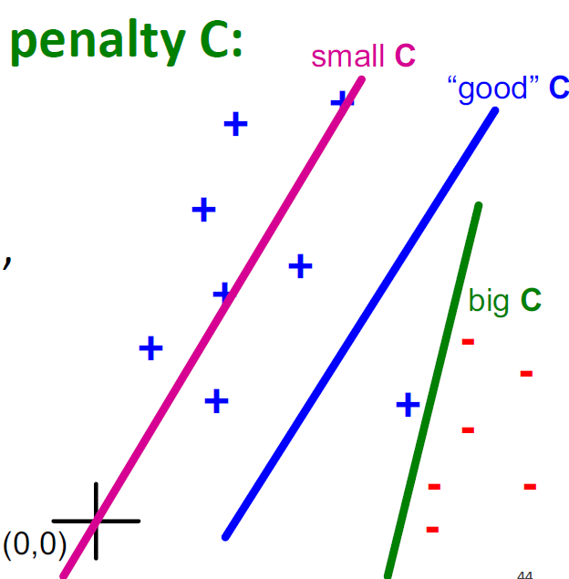

### 7.10.2. 支持向量机的自然形式
$$
\arg\min\limits_{w,b}\frac{1}{2}w*w + C*\sum_{i=1}^{n}\max\{0,1-y_i(w*x_i+b)\}
$$

- $w * w$:距离
- $C$:正则化参数
- $\sum_{i=1}^{n}\max\{0,1-y_i(w*x_i+b)\}$:经验损失L(我们如何拟合训练数据)
- SVM使用"Hinge Loss":max{0, 1-z}


## 7.11. 如何计算距离
$$
\min\limits_{w,b}\frac{1}{2}w*w + C*\sum_{i=1}^{n}\xi_i \\
s.t. 
\forall i,y_i*(x_i * w + b) \geq 1 - \xi_i
$$

- 使用二次求解器
  - 最小化二次函数
  - 受到线性约束
- 问题:求解器对于大数据效率低下！

$f(w,b) = \frac{1}{2} w * w + C*\sum_{i=1}^{n}\max\{0,1-y_i(w*x_i+b)\}$

- 如何最小化凸函数g(z):切线
- 使用梯度下降法


## 7.12. 如何计算w


# 8. 深入SVM

## 8.1. 从线性可分到线性不可分到线性不可分

### 8.1.1. 从原始问题到对偶问题求解
1. 等价问题转化

$$
\max\frac{1}{||w||}, s.t.\ y_i(w^Tx_i + b) \geq 1, i = 1, ..., n \\
转化为 \\
\min \frac{1}{2}||w||^2, s.t.\ y_i(w^Tx_i + b) \geq 1, i = 1, ..., n \\
$$

1. 我们可以看到目标函数是二次的，约束条件是线性的，所以其实一个凸二次规划问题。
2. 由于问题的特殊性，我们可以根据拉格朗日对偶性对换到对偶变量的优化问题，即通过求解与原问题等价的对偶问题得到原始问题的最优解，优点如下
   1. 对偶问题更容易求解。
   2. 便于引入核函数，推广到非线性分类问题。
3. 拉格朗日对偶性：通过给每一个约束条件加上一个拉格朗日乘子$\alpha$

$$
L(w, b, \alpha) = \frac{1}{2}||w||^2 - \sum\limits_{i=1}\limits^n\alpha_i*(y_i(w^T*x_i + b) - 1) \\
\theta(w) = \max\limits_{\alpha_i\geq 0}L(w, b ,\alpha) \\
$$

4. 容易验证，如果某个约束条件不满足，则$\theta(w) = \infty$，当所有的约束条件满足时，则有$\theta(w) = \frac{1}{2}||w||^2$，即最初要最小化的值。
5. 即将问题转化为求解

$$
\min\limits_{w, b}\theta(w) = \min\limits_{w, b}\max\limits_{\alpha_i\geq 0}L(w, b ,\alpha) = p^*
$$

6. 这样是不容易求解的我们将最大和最小进行交换，得到

$$
\max\limits_{\alpha_i\geq 0}\min\limits_{w, b}L(w, b ,\alpha) = d^*
$$

7. 我们可以知道有$d^*\leq p^*$(在满足K.K.T.条件时等价)，对偶问题更容易求解，下面先求L对w和b的极小，再求L对$\alpha$的极大

### 8.1.2. K.K.T.条件
1. 一般最优化数学模型能表示为如下标准形式

$$
\min f(x) \\
s.t. h_j(x) = 0, j = 1, ..., p\\
g_k(x)\leq 0, k = 1, ..., q \\
x \in X \subset R^n \\
$$

- f(x)是需要最小化的函数，h(x)是等式约束，g(x)是不等式约束，p和q分别为等式约束和不等式约束的数量。

2. 凸优化:$X\subset R^n$是一凸集，f:X->R为一凸函数，凸优化就是要找出一点$x^* \in X$，使得每一个$x \in X$满足$f(x^*) \leq f(x)$
3. KKT条件的意义:是一个非线性规划问题能有最优解的必要和充分条件。

> KKT条件：对之前的标准形式最优化数学模型，如果满足
> 1. $h_j(x^*) = 0, j = 1, ..., p，g_k(x^*) \leq 0, k = 1, ..., q$
> 2. $\triangle f(x^*) + \sum\limits_{j=1}\limits^p\lambda_j\triangle h_j(x^*) + \sum\limits_{j=1}\limits^p\mu_k\triangle g_k(x^*) = 0, \lambda_j \neq 0, u_k \geq 0, \mu_kg_k(x^*) = 0$
> 作为满足KKT条件

### 8.1.3. 对偶问题求解的三个步骤
1. 第一步：固定$\alpha$，对w和b分别求偏导，带回L并化简(最后一步，注意$\sum\limits_{i=1}\limits^n\alpha_iy_i = 0$)


2. 第二步：求对$\alpha$的极大

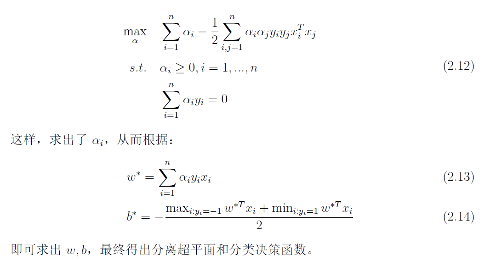

3. 第三步：计算完成$L(w, b, \alpha)$关于w和b的最小化，以及与$\alpha$的极大之后，最后就是使用SMO算法求解对偶问题中的拉格朗日乘子$\alpha$


### 8.1.4. 线性不可分问题
1. 对于一个数据点进行分类，实际上是将x代入$f(x) = w^Tx+b$计算出结果，根据正负号进行类别划分。

$$
\begin{array}{l}
   \because w^* = \sum\limits_{i=1}\limits^{n}\alpha_iy_ix_i \\
   \therefore f(x) = (\sum\limits_{i=1}\limits^{n}\alpha_iy_ix_i)^T x + b \\
   = \sum\limits_{i=1}\limits^{n}\alpha_iy_i<x_i, x> + b   
\end{array}
$$

2. 也就是对新点预测，只需要计算其与训练数据点的内积即可：非支持向量对应的$\alpha=0$，这些点不影响分类


## 8.2. SVM：核函数：kernel

### 8.2.1. 特征空间的隐式映射：核函数
1. 对于非线性情况，SVM选择一个核函数K(·,·)，通过将数据映射到高维空间，来解决在原始空间中线性不可分的问题。

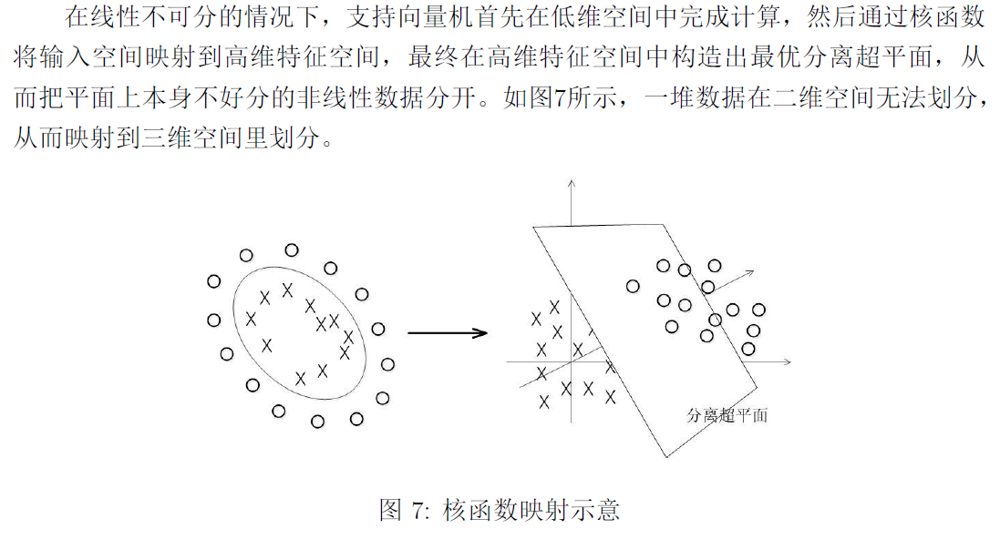

2. 非线性分类器模型:$f(x) = \sum\limits_{i=1}\limits^Nw_i\phi(x)+b$，建立非线性份分类器步骤
   1. 首先用非线性映射将数据变换到一个特征空间F：重点
   2. 在特征空间使用线性分类器进行分类
3. 非线性决策规则:

$$
f(x) = \sum\limits_{i=1}\limits^l\alpha_iy_i<\phi(x_i), \phi(x)>+b
$$

### 8.2.2. 核函数：如何处理非线性数据
1. 将非线性数据映射为线性数据

#### 8.2.2.1. 二维空间描述
$$
a_1X_1+a_2X_1^2+a_3X_2+a_4X_2^2+a_5X_1X_2+a_6=0
$$

#### 8.2.2.2. 从二维空间到五维空间映射
$$
Z_1=X_1,Z_2=X_1^2,Z_3=X_3,Z_4=X_4,Z_5=X_1X_2
$$

#### 8.2.2.3. 五维空间描述(线性超平面)
$$
\sum\limits_{i=1}\limits^5a_iZ_i + a_6 = 0
$$

#### 8.2.2.4. 计算方法
> 假设有两个变量$x_1 = (\eta_1, \eta_2)^T, x_2 = (\xi_1,\xi_2)^T$

1. 方法一：映射后的内积为

$$
<\phi(x_1), \phi(x_2)> = \eta_1\xi_1 + \eta_1^2\xi_1^2 + \eta_2\xi_2 + \eta_2^2\xi_2^2 + \eta_1\eta_2\xi_1\xi_2
$$

2. 方法二：平方，在低维空间计算，如果遇到维度爆炸，前一种可能无法计算

$$
\begin{array}{l}
   (<x_1, x_2> + 1)^2 = 2\eta_1\xi_1 + \eta_1^2\xi_1^2 + 2\eta_2\xi_2 + \eta_2^2\xi_2^2 + 2\eta_1\eta_2\xi_1\xi_2 + 1 \\
   等价于 \\
   \phi(x_1, x_2) = (\sqrt{2}x_1, x_1^2, \sqrt{2}x_2,x_2^2,\sqrt{2}x_1x_2,1)^T \\   
\end{array}
$$

### 8.2.3. 核函数
1. 计算两个向量在隐式映射过后的空间中的内积的函数叫做核函数
2. 上例中为$K(x_1, x_2) = (<x_1, x_2> + 1)^2$
3. 分类函数为:$f(x) = \sum\limits_{i=1}\limits^Na_iy_iK(x_i, x)+b$

### 8.2.4. 常见核函数
1. 多项式核:$K(x_1, x_2) = (<x_1, x_2> + R)^d$，空间维度为$C_{m+d}^d$，原始空间维度为m
2. 高斯核:$K(x_1,x_2) = \exp^{-\frac{||x_1-x_2||^2}{2\delta^2}}$，$\delta$影响高次特征上权重衰减的速度

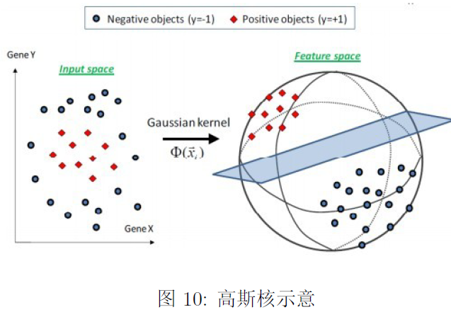

3. 线性核:$K(x_1,x_2) = <x_1, x_2>$

## 8.3. 使用松弛变量处理outliers方法
1. 如果有些情况下数据有噪声，我们称偏离正常位置很远的数据点为outlier

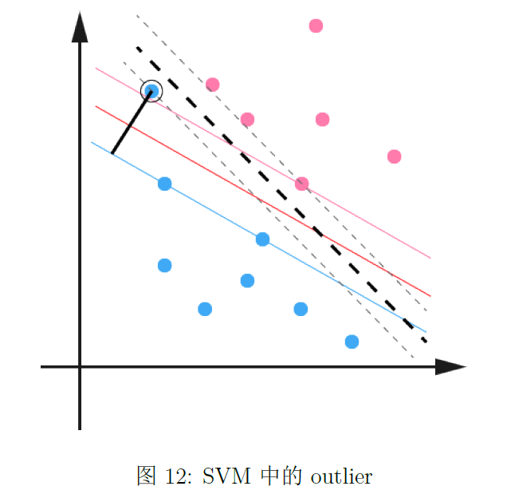

2. 噪声点对目前的SVM有比较大的影响，我们通过允许数据点在一定程度上偏离超平面来解决这个问题。
3. 原本约束条件为:$y_i(w^Tx_i+b)\geq 1,i =1,...,n$
4. 新的约束条件为:$y_i(w^Tx_i+b)\geq 1 - \xi_i,i =1,...,n$
5. $\xi_i$是松弛变量，对应数据点$x_i$允许偏离函数间隔的距离，对应的我们应该修正我们的优化问题：$\min \frac{1}{2}||w||^2 + C\sum\limits_{i = 1}\limits^n\xi_i$
   1. 参数C:控制目标函数"寻找margin最大的超平面"和"保证数据点偏差量最小"之间的权重，实现确定好的变量。
   2. 参数$\xi$是需要优化的变量
6. 新的拉格朗日函数如下

$$
L(w, b, \xi, \alpha, r) = \frac{1}{2}||w||^2 + C\sum\limits_{i=1}\limits^n\xi_i - \sum\limits_{i=1}\limits^n\alpha_i(y_i(w^Tx_i+b) - 1 + \xi_i) - \sum\limits_{i=1}\limits^nr_i\xi_i
$$

7. 分析方法和上面相同

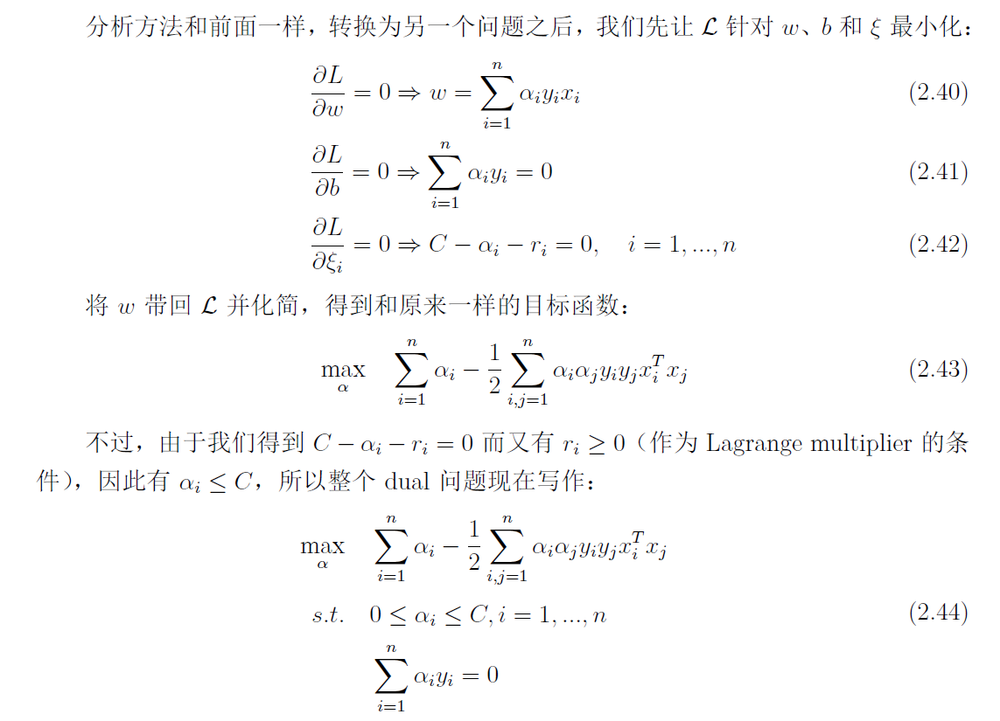
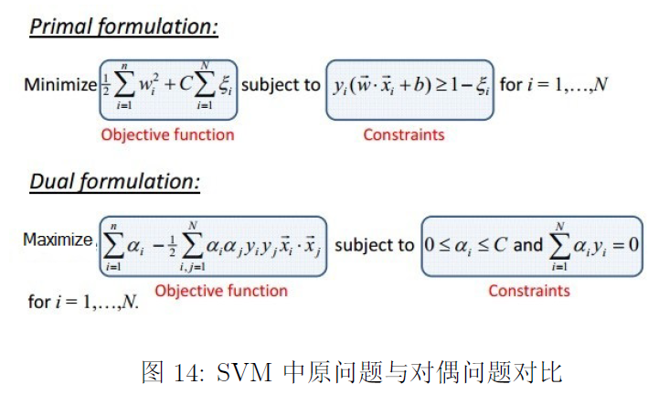

# 9. 证明SVM
1. 比较复杂，参见参考五

# 10. 参考
1. 《支持向量机通俗导论(理解SVM的三层境界)》
2. <a href = "https://blog.csdn.net/laobai1015/article/details/82763033">SVM的Python实现</a>