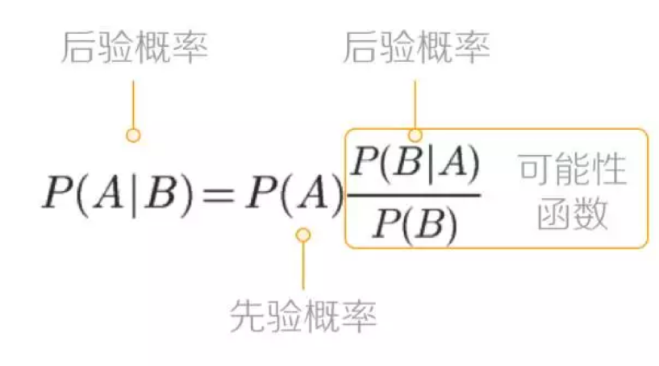
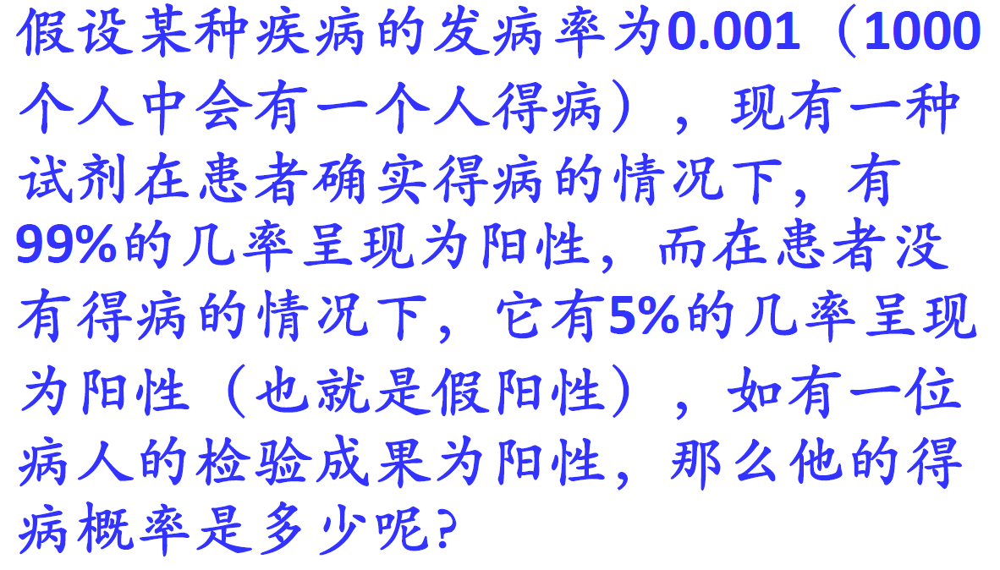
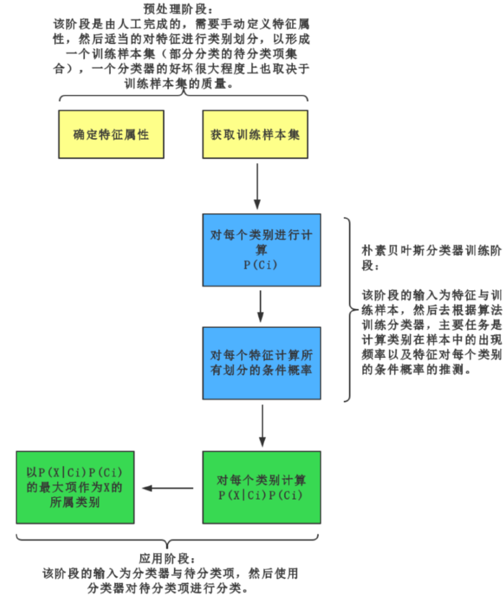
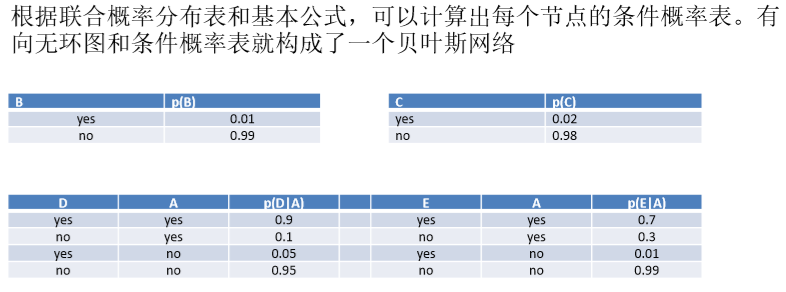
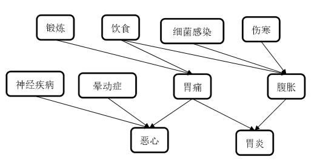

Algorithm-朴素贝叶斯和贝叶斯网络
---

# 1. 朴素贝叶斯

## 1.1. 数学基础

### 1.1.1. 条件概率
1. 指在事件B发生的情况下，事件A发生的概率，用$P(A|B)$表示，读作在B条件下的A的概率

### 1.1.2. 全概率公式
$P(A) = P(A|B_1) + P(A|B_2) + ... + P(A|B_N)$

### 1.1.3. 贝叶斯公式
1. 后验概率 = 先验概率 * 调整因子
2. $P(A|B)=P(A)*\frac{P(B|A)}{P(B)}$



### 1.1.4. 贝叶斯的例子



## 1.2. 什么是朴素贝叶斯分类模型
1. 朴素贝叶斯分类模型是一种简单的**构造分类器**的方法。
2. 朴素贝叶斯分类模型是将问题分为**特征向量和决策向量**两类，并假设问题的特征向量都是相互独立地作用于决策向量的，即问题的特征之间都是互不相关的。
   1. x是特征向量，y是决策向量，判断类别。
   2. 和决策树不同，它是计算先验概率等概率。
3. 朴素贝叶斯分类模型
   1. 可以指数型的降低贝叶斯网络构建的复杂性
   2. 可以很好地处理训练样本中的**噪声**和无关属性
   3. 需要改善变量间的独立性限制保证朴素贝叶斯分类模型可以应用到更多问题上。

## 1.3. 朴素贝叶斯的概率模型
> 1. 一个待分类项:$X = x_1, x_2, x_3,..., x_n$
> 2. 类别集合:$Y_1, Y_2, ...,Y_m$
> 3. 需要计算:$P(Y_1|X), P(Y_2|X), ...,P(Y_m|X)$

1. 计算如下结果，这一步是模型的关键一步
   1. 离散型的特征属性$x_i$，可以使用Y中的属性值等于$x_i$的样本进行估计
   2. 连续性的特征属性$x_i$，一般先将离散化，然后根据Y中的训练样本落入的离散区间的比例估计。
   3. 问题:$P(Xi|Y)=0$时，这一项在乘法中会覆盖其他项，因此需要进行**Laplace修正**，做法：对所有类别下的划分计数均加一，避免出现等于0的情况，训练集较大时，修正对先验的影响之间降低。

$$
\begin{array}{l}
  P(x_1|Y_1), P(x_2|Y_1),..., P(x_n|Y_1),\\ P(x_1|Y_2), ...,P(x_1|Y_m),...,P(x_n|Y_m)
\end{array}
$$

2. 计算目标

$$
\begin{array}{l}
  P(Y_k|X) = max(P(Y_1|X), P(Y_2|X), ...,P(Y_m|X))\\
  X \in Y_k, P(Y_i|X) = \frac{P(X|Y_i) * P(Y_i)}{P(X)} \\
  P(X|Y_i)P(Y_i) = P(f_1|Y_i)*P(f_2|Y_i)*...*P(f_n|Y_i)P(Y_i)\\ = P(Y_i)\prod\limits_{j=1}\limits^nP(f_i|Y_i) \\
  P(Y_i|X) = \frac{P(Y_i)\prod\limits_{j=1}\limits^nP(f_i|Y_i)}{P(X)}
\end{array}
$$

3. 结论，我们只需要找到$P(Y)\prod\limits_{i=1}\limits^np(x_i|Y)$最大的类即可。

## 1.4. 朴素贝叶斯流程


## 1.5. 朴素贝叶斯分类器的提升
1. 朴素贝叶斯分类器还可以进行**提升(Boosting)**，提升方法的主要思想是学习多个分类器组成一个**分类器序列**，序列中后面的分类器对前面的分类器导致的错误分类的数据给予**更高的重视**，即调整前一个分类器分类**错误**的训练集的权值，并对训练集重新计算权值以调整下一个分类器，以此类推，最终得到提升后的强分类器。
2. 朴素贝叶斯分类模型结构简单，只有**两层结构(一个x一个y)**。由于**特征向量**间的相互独立，算法简单易于实现。同时算法有稳定的分类效率，对于不同特点的数据集其分类性能差别不大。朴素贝叶斯分类在小规模的数据集上表现优秀，并且分类过程时空开销小。算法也适合增量式训练，在数据量较大时，可以人为划分后分批增量训练。

## 1.6. 朴素贝叶斯的Python实现
```py
# -*- coding: utf-8 -*-
from sklearn.datasets import make_blobs
from sklearn.model_selection import train_test_split
from sklearn.naive_bayes import GaussianNB
from sklearn.metrics import accuracy_score
import numpy as np

centers = [(-5, -5), (0, 0), (5, 5)]
n_samples = 50000
# 制作聚类样本
x, y = make_blobs(n_samples=n_samples, n_features=2, cluster_std=1.0, centers = centers, shuffle=False, random_state=42)
# 调整标签
y[:n_samples//2] = 0
y[n_samples//2:] = 1
# 随机生成权重
sample_weight = np.random.RandomState(42).rand(y.shape[0])
# 划分训练集和测试集
x_train, x_test, y_train, y_test, sw_train, sw_test = train_test_split(x, y, sample_weight, test_size=0.9, random_state=42)
# 朴素贝叶斯模型
clf = GaussianNB()
clf.fit(x_train, y_train)
prob_pos_clf = clf.predict_proba(x_test)[:, 1]
target_pred = clf.predict(x_test)
# 评估
score = accuracy_score(y_test, target_pred, normalize=True)
print("Accuracy Score:", score)
```

## 1.7. 朴素贝叶斯的缺点
1. 贝叶斯定理的缺点：独立性的要求高
   1. 很难保证两个变量之间是完全独立的
   2. 很多时候，变量之间的关系是复杂的，调整成为完全独立是不合理的。
2. 不确定性推理是机器学习的重要研究内容之一，用概率论方法进行不确定推理的一般流程是先将问题抽象为一组随机变量与其联合概率分布表，然后根据概率论公式进行推理计算，但是计算复杂度高。

# 2. 贝叶斯网络
1. 贝叶斯网络(Bayesian network)，又称为信念网络(Belief network)，是一种通过有向无环图(Directed acyclic graph, DAG)表示**一组随机变量及其条件依赖概率**的概率图模型。
   1. 概率图中
      1. 节点表示随机变量
      2. 有向边表示随机变量间的依赖关系
      3. 条件概率表示依赖关系的强度
   2. 没有父节点的节点用**先验概率**表达信息。两个节点若无连接则表示相互独立的随机变量。
2. 贝叶斯网络中的节点可以表示任意问题，丰富的概率表达能力使能较好地处理不确定性信息或问题。
3. 贝叶斯网络中所有节点都是可见的，并且节点间的因果关系可以非常直观地观察到。这些特性都使得贝叶斯网络在众多智能系统中有相当重要的应用
4. 监督学习算法

## 2.1. 例子：警铃模型
1. 欧阳老师的家中安置了一套智能监控设备，在家中**遭受盗窃或发生火灾**，设备会发出刺耳的警铃声，欧阳老师的邻居是**小明和小红**，假设两个邻居一般都在家中，他们听到欧阳老师家中的警报时会给欧阳老师打电话，但警报响的时候两个邻居可能会听不见。某天，出门在外的欧阳老师接到了小明的电话，小明说听到了欧阳老师家中的警报声。欧阳老师想知道家中遭受盗窃的可能性有多大？
2. 五个变量:每一个变量都有Yes和No两种取值
    1. 警报(A)
    2. 遭受盗窃(B)
    3. 发生火灾(C)
    4. 接到小明电话(D)
    5. 接到小红电话(E)


3. 我们则会用到$2^5$种概率情况
4. 目标：$P(B = yes|D = yes)$的值

$$
\begin{array}{l}
   P(B, D) = \sum\limits_{A, C, E}p(A, B, C, D, E) \\
   P(B = yes|D = yes) = \frac{p(B=yes, D=yes)}{p(D = yes)} = \frac{p(B=yes, D=yes)}{p(B=yes, D=yes) + p(B=no, D=yes)}\\
   = \frac{0.000115}{0.000115 + 0.00015} \approx 0.61
\end{array}
$$

## 2.2. 不确定性分析的问题
1. 例子中的问题的复杂度过高，包含n个变量的联合概率有$2^n$个项，其中有$2_{n-1}$个独立参数，当n增加时，独立参数个数成指数型增长。
2. 我们分析上例，可以发现盗窃(B)和发生火灾(C)是无关的，P(C|B)可以简化为p(C)，可以认为接到小明电话(D)和接到小红电话(E)实际只与警报(A)有关，于是有p(D|B, C, A)=P(D|A)，p(E|B, C, A, D) = p(E|A)，所以上式可以简化为

$$
p(B, C, A, D, E) = p(B)p(C)p(A|B, C)p(D|A)p(E|A)
$$

3. 我们可以发现独立参数减少，复杂度大大降低，将这个过程一般化，我们可以运用条件概率的链式法则，并进行化简

$$
p(x_1, ..., x_n) = p(x_1)p(x_2|x_1)...p(x_n|x_1, ..., x_{n-1}) = \prod\limits_{i=1}\limits^np(x_i|x_1, ..., x_{i-1}) 
$$

## 2.3. 优化的贝叶斯网络
1. 继续如上，我们假定

$$
\forall x_i, \exist \phi(X), \phi(x) \subset {x_1, ..., x_n} s.t. X 与 {x_1, ..., x_n} - \phi(X)中任意元素条件独立 \\
p(x_1, ..., x_n) = \prod\limits_{i=1}\limits^np(x_i|\phi(x))
$$

2. 假设$\phi(x)$最多有m个元素，一般而言，m < n，复杂度进一步下降。
3. Pearl在1986年提出用一个有向无环图来表示这种依赖关系和条件独立性，即变量x作为图中的定点，而$\phi(x)$中的结点都有一条有向边指向X
4. 警铃模型的有向无环图：下图左侧为简化的贝叶斯网络，右侧是这个问题的概率表

|  |  |
| --------------------- | --------------------- |

## 2.4. 贝叶斯网络的表示
1. 朴素贝叶斯是一个x，一个y，而贝叶斯网络是多个x和一个y。
2. 贝叶斯网络是使用有向无环图来表示变量间依赖关系的概率图模型。网络中每个节点表示一个随机变量，每一条边表示随机变量间的依赖关系，同时每个节点都对应一个**条件概率表**(Condition Probability Table，CPT)，用于描述该变量与父变量之间的依赖强度，也就是联合概率分布。
3. 贝叶斯网络可以形式化表示。一个贝叶斯网络由结构G和参数$\theta$两部分构成，结构G是有向无环图，图中每一个节点对应一个随机变量。

## 2.5. 贝叶斯网络的构建
1. 贝叶斯网络的构建一般有三种方式
    1. 根据问题和领域专家知识手工构建
    2. 通过对数据进行分析得到贝叶斯网络
    3. 结合了领域专家知识和数据分析得到贝叶斯网络
2. 贝叶斯网络是由有向无环图结构和对应的条件概率表构成，所以手工构建的过程也包括了确定网络结构和确定网络参数两个环节。
3. 网络参数在手工构建时一般通过数据统计分析和专家知识获得,常通过假设条件分布具有某种规律以减少网络参数的个数
4. 构建过程
   1. 确定一组随机变量$\{x_1, ..., x_n\}$
   2. 将随机变量按照某种熟悉依次加入到结构G中
   3. 每一次添加$x_i$时，需要确定$x_i$在图中依赖的节点集$\phi(x_i)$，对$\phi(x_i)$中的结点，添加一条指向$x_i$的有向边。

## 2.6. 贝叶斯网络的学习
1. 贝叶斯网路学习是对数据进行统计分析获取贝叶斯网络的过程，学习包括了**参数学习和结构学习**
   1. 参数学习是在网络结构已知的情况下确定参数，即条件概率表中的值。
   2. 结构学习需要确定网络结构G以定性反应变量间的依赖关系，又需要确定网络参数以定量得到条件概率表中的值。
2. 在对贝叶斯网络进行参数学习时，我们已经知道了网络结构G和G中的所有节点或部分节点的状态值，这些状态是需要学习的数据集。

## 2.7. 贝叶斯网络的推理
1. 贝叶斯网络的**推理**是指在已知网络结构G和参数$\theta$下，给定某些证据或变量的值通过概率论的方法求目标变量值的过程。贝叶斯网络的推理主要包括两种
   1. 自顶向下的推理
   2. 自底向上的推理 
2. 推理主要运用的方法有精确推理和近似推理两种，分别有一些算法来解决实际问题。不同情况下有不同因素影响推理，**贝叶斯网络拓扑结构和推理任务**是两大主要复杂度来源。
3. **网络的大小、变量的类型和分布情况、推理任务的类型和相关证据的特征**都会影响推理过程和结果，实际应用中也应灵活选择推理方法

### 2.7.1. 精准推理
1. 精确推理最简单的方法即计算**全局的联合概率**，但直接对联合概率进行计算的效率很低，常常采用**变量消元法**分别联合概率的求解达到简化计算的目的。
2. 变量消元法利用链式乘积法则和条件独立性对联合概率计算表达式进行变换，改变基本运算的次序改变消元的次序，最终达到减少计算量的目的。该方法的基本思想可以通过一个简单例子描述，假设有如下所示的简单贝叶斯网络
   1. A通过语料库学习等方法来学习完成。
   2. B、C的条件概率表都需要准备好。


3. 精准推理的公式：计算量通过改变次序可以有较大的降低，所以降低复杂度的关键就是找到一个最优的变量校园次序。

$$
P(D) = \sum\limits_{A, B, C}P(A, B, C, D) = \sum\limits_{A, B, C}P(A)P(B|A)P(C|B)P(D|C) \\
P(D) = \sum\limits_{C}P(D|C) \sum\limits_{B}P(C|B)\sum\limits_{A}P(A)P(B|A)
$$

### 2.7.2. 近似推理
1. 在贝叶斯网络节点很多或依赖关系很复杂时，精确推理的复杂度很高，通常需要降低推理的复杂度，在问题的因果关系在网络中可独立于某一块存在时，可以将这一部分结构提取出来用精确推理的方法推理。**在不能利用局部独立时，就需要降低计算的精度，即采用近似推理的方法**。
2. 随机抽样算法是最常用的近似推理方法。该方法又被认为蒙特卡洛算法或随机仿真。算法的基本思想上根据某种概率分布进行随机抽样以得到一组随机样本，再根据这一组随机样本近似地估计需要计算的值

## 2.8. 贝叶斯网络的Python实现
TODO：垃圾邮件分类实现


## 2.9. 贝叶斯网络的应用
1. 贝叶斯网络经过长期的发展，现已被应用到人工智能的众多领域。包括模式识别、数据挖掘、自然语言处理、辅助智能决策等等。其中针对很多领 域核心问题的分类问题，大量卓有成效的算法都是基于贝叶斯理论设计
2. 在医疗领域，贝叶斯网络用于医疗诊断
3. 在工业领域，贝叶斯网络用于对工业制品的故障检测和性能分析
4. 在军事上也被应用于身份识别等各种战场推理
5. 在生物农业领域，贝叶斯网络在基因连锁分析、农作物推断、兽医诊断、 环境分析等等问题上都有大量的应用
6. 在金融领域可用于构建风控模型
7. 在企业管理上可用于决策支持
8. 在自然语言处理方面可用于文本分类、中文分词、机器翻译

### 2.9.1. 中文分词
1. 中文分词问题可以描述为给定一句话，将其切分为合乎语法和语义的词语序列。一个经典的中文分词案例是对"南京市长江大桥"的分词。正确的 分词结果为"南京市/长江大桥"，错误的分词结果是"南京市长/江大桥"。下面我们使用贝叶斯算法来解决这一问题。
2. 设完整的一句话为X，Y为组成该句话的词语集合，共有n个词语。于是分词问题可以转化为求下列式子最大值的问题:

$$
P(Y|X) = \frac{p(Y)p(X|Y)}{p(X)}
$$

1. 使用贝叶斯网络:所以只需找到p(Y)p(X|Y)的最大值。由于任意的分词情况下由词语序列生成句子是精确的，所以可以忽略p(X|Y)，只需找到p(Y)的最大值即可。按照联合概率公式对p(Y)进行展开，有

$$
p(Y) = p(Y_1, Y_2, ..., Y_n) = p(Y_1) * P(Y_2|Y_1) * p(Y_3|Y_1, Y_2)
$$

1. 这样的展开子式是指数级增长的，并且数据稀疏的问题也会越来越明显。
2. 所以假设每个词语只会依赖于词语序列中该词前面出现的k个词语，即**k元语言模型(k-gram)**。这里我们假设k=2，于是就有

$$
p(Y) = p(Y_1) * P(Y_2|Y_1) * P(Y_3|Y_2) * ...
$$

1. 回到上面到问题，正常的语料库中，"南京市长"与"江大桥"同时出现的概率一般为0，所以这一分词方式会被舍弃，"南京市/长江大桥"的分词方式会是最终的分词结果
2. 算法:K-gram:一个词的出现和前面k个词有关。

### 2.9.2. 机器翻译
1. 基于统计的方法是机器翻译常用的实现，这种方法的核心算法即是贝叶斯方法。统计机器翻译问题可以描述为，给定某种源语言的句子X，其可能的目标语言翻译出的句子Y，p(Y|X)代表该种翻译句子符合人类翻译的程度,所以即找到使p(Y|X))最大的y即可。根据贝叶斯公式

$$
P(Y|X) = \frac{p(Y)p(X|Y)}{p(X)}
$$

2. 所以需要找到使得p(Y)p(X|Y)最大的Y。对于p(Y)，在中文分词案例中可以利用k元语言模型(k-gram)计算出。而对于p(X|Y)，通常利用一个分词对齐的平行语料库，具体言之，将英文"you and me"翻译为汉语，最佳的对应模式为"你和我"，此时有

$$
P(X|Y) = p(you|你)p(and|和)p(me|我)
$$

1. 上式中右边各项都可以很容易地计算出，所以便可以通过分词对齐的方法
2. 计算出p(X|Y)的值，最终找到使得p(Y|X)最大的B， 便是X最佳的翻译方式


### 2.9.3. 故障诊断
1. 故障诊断是为了找到某种设备出现故障时故障的所在部件，在工业领域，自动的故障诊断装置能节省一线工作人员大量的预判断时间。基于规则的系统可以被用于故障诊断，但是起不能处理不确定性问题，在实际环境中难以灵活应用。贝叶斯网能较好地描述可能的故障来源，在处理故障诊断的不确定问题上有优秀的表现。多年来研究人员开发出了多种基于贝叶斯网络的故障诊断系统，包括对汽车启动故障的诊断、波音飞机的故障诊断、核电厂软硬件的故障诊断等等。
2. 故障诊断的网络


2. 根据网络，按照联合概率来计算最后的简化的联合概率。

### 2.9.4. 疾病诊断
1. 首先建立网络。
2. 然后根据语料库来建立相应的条件概率表。
3. 疾病诊断是从一系列历史经验和临床检验结果中对病人患有疾病种类和患病程度的判断。机器学习在疾病诊断领域有较多的应用，在上世纪70年代就有基于规则设计的产生式专家系统用于对疾病进行诊断，但是该类型系统不能处理不确定性使其诊断正确率远低于临床医生。后来研究人员基于贝叶斯网络设计了新的疾病诊断系统以处理不确定性问题，新系统的诊断准确程度已可与专业临床医生相当。

#### 2.9.4.1. 示例
1. 下面是一个对胃部疾病建模的简单贝叶斯网络的部分，网络结构与条件概率不一定符合真实情况，这里关键是对贝叶斯网络的应用予以阐释。假设我们已经根据历史诊断经验得到了如下图所示贝叶斯网络结构



#### 2.9.4.2. 疾病诊断过程
1. 对于"锻炼"和"饮食"节点

$$
P(锻炼=是)=0.5\\
p(锻炼=否)=0.5\\
p(饮食=健康)=0.4\\
p(饮食=亚健康)=0.6\\
$$


2. 现在我们可以利用该贝叶斯网络对患者进行诊断，假设现在只基于给定的条件概率表中有节点进行判断，不考虑没有条件概率的节点。现有患者A,我们对其状况毫不知情，我们需要先判断其是否患有"胃痛"。该问题即转化为求p(胃痛="是")的概率。求解过程为:设x∈{是，否}表示锻炼情况的两个取值，y$\in${健康，亚健康}表示饮食情况的两个取值，于是有p(胃痛="是")

$$
p(胃疼=是) \\
= \sum\limits_{x}\sum\limits_{y}p(胃疼=是|锻炼=x, 饮食=y)p(锻炼=x, 饮食=y) \\
= 0.5 * 0.4 * 0.2 + 0.5 * 0.6 * 0.45 + 0.5 * 0.4 * 0.55 + 0.5 * 0.6 * 0.7 \\
= 0.495
$$

3. 所以没有先验条件下患者有胃疼病症的可能性为49.5%
4. 添加先验条件，假设病人告诉我们他有"恶心"的症状，我们判断其是否患有"胃痛"，问题转化为求p(胃痛="是"|恶心="是")的概率。根据贝叶斯概率公式，有

$$
p(胃疼=是|恶心=是)=\frac{p(胃疼=是，恶心=是)p(胃疼=是)}{p(恶心=是)}
$$

5. 于是需要计算p(恶心=是)， 设x∈{是，否}表示胃痛情况的两个取值，根据全概率公式，有

$$
p(恶心=是) = \sum p(恶心=是|胃疼=x)p(胃疼=x) \\
= 0.7 * 0.495 + 0.2 * 0.505 = 0.4475
$$

6. 代入上文公式

$$
p(胃痛=是|恶心=是)=\frac{0.7 * 0.495}{0.4475} = 0.7743
$$

1. 所以在恶心条件下患者有胃疼病症的可能性为49.5%