Lecture6-分类
---

# 1. 集成学习
- 集成学习并不是简单地将数据集在多个不同分类器上重复训练，而是对数据集进行扰动
- 一个分类训练中的错误还可以被下一个分类器进行利用
- 分类器预测错误的原因是未知的实例与学习的实例的分布有区别，通过扰动，分类器可以学习到更加一般的模型，从而消除单个分类器产生的偏差，而得到更为精准的模型。

## 1.1. 什么是集成学习法(Ensemble learning)
1. 集成学习法通过多个分类学习方法聚集一起来提高分类准确率，提高模型的稳定性
2. 通常情况下，一个集成分类器的分类型能要好于单个分类器
3. 集成学习法由训练数据构建一组基分类器(base classifier)，然后通过对每个基分类器的预测进行投票来实现分类。
4. 在构建分类器的过程中，一般有两种集成方法
   1. 一种是使用训练集的不同自己训练得到不同的基分类器
   2. 另一种方法是使用同一个训练集的不同属性子集训练得到不同的基分类器

## 1.2. 集成学习的基本思想
在原始数据集上构建多个分类器，然后在分类未知样本时聚集它们的预测结果。

## 1.3. 构建集成分类器的过程描述

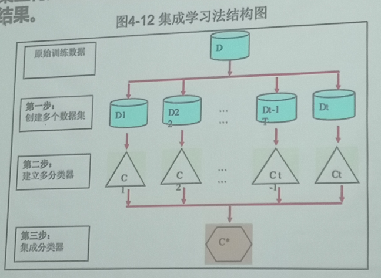

- 上图是集成学习法的逻辑结构图

## 1.4. 构建集成分类器的方法

### 1.4.1. 通过处理训练数据集
1. 它根据某种抽样分布，通过对原始数据进行再抽样来得到多个训练集然后使用特定的学习算法为每个训练集建立一个分类器。
2. 典型的处理训练数据集的组合方法有装袋(bagging)和提升(boosting)

### 1.4.2. 通过处理输入特征
1. 在这种方法中，通过选择输入特征的自己来形成每个训练集。一些研究表明，对那些含有大量冗余特征的数据集，这种方法的性能非常好。
2. 随机森林(Random forest)就是一种处理输入特征的组合方法

### 1.4.3. 通过处理类标号
1. 这种方法适用于类数足够多的情况。通过将类标号随机划分成两个不相交的子集A0和A1，把训练数据变换为二类问题，类标号属于子集A0的训练样本指派到类0，而那些类标号属于子集A1的训练样本指派到类1。
2. 然后使用重新标记过的数据来训练一个基分类器，重复重新标记类和构建模型步骤多次，就得到一组基分类器
3. 当遇到一个检验样本时，使用每个基分类器Ci预测它的类标号。
   1. 如果被预测为类0，则所有属于A0的类都得到一票
   2. 如果被预测为类1，则所有属于A1的类都得到一票
4. 最后统计选票，将检验样本指派到得票最高的类。

### 1.4.4. 通过处理学习算法
1. 在同一个训练集上执行不同算法而得到不同的模型。

## 1.5. 集成分类器方法的优缺点
1. 优点:集成分类器的应用，克服了单一分类器的诸多缺点，比如对样本的敏感性，难以提高分类精度等
2. 缺点:集成分类器的性能优于单个分类器，必须满足基分类器之间完全独立，但时间上很难保证基分类器之间完全独立

# 2. SVM 支持向量机

## 2.1. 线性划分和非线性划分
|                      |                      |
| -------------------- | -------------------- |
| 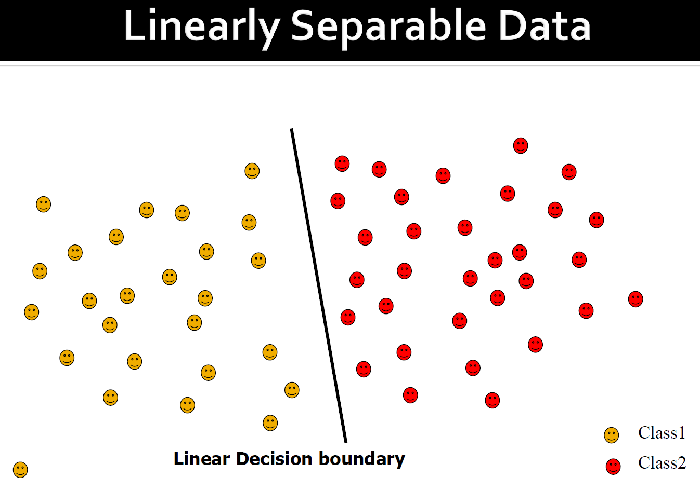 |  |

## 2.2. 分类标注的起源：逻辑回归
1. 逻辑回归的目的是从特征学习出一个0/1分类模型，而这个模型是将特征的线性组合作为自变量，由于自变量的取值范围是负无穷到正无穷，因此我们使用sigmoid函数将自变量映射到(0, 1)上，映射后的值被认为是属于y=1的规律。

$$
\begin{array}{l}
   sigmoid(x) = \frac{1}{ 1 + e^{-x}} \\
   h_\theta(x) = g(\theta^Tx) = \frac{1}{1+e^{-\theta^Tx}}
\end{array}
$$

2. $h_\theta(x)$只和$\theta^Tx$有关，如果$\theta^Tx>0.5$，则$h_\theta(x)>0.5$
3. 希望模型达到的目标就是让训练集中y=1的特征$\theta^Tx>>0$，而y=0的特征$\theta^Tx<<0$
4. 对于更高维的情况，我们可以得到下式$\theta^Tx = w^Tx + b$

## 2.3. 函数间隔(Functional margin)与几何间隔(Geometrical margin)

### 2.3.1. 函数间隔
1. 函数间隔$\hat{\gamma} = y(w^Tx+b) = yf(x)$
2. 超平面(w, b)关于T中所有样本点的最小函数间隔即为超平面(w, b)关于训练数据集T的函数间隔

$$
\hat{\gamma} = \min\hat{\gamma},(i = 1, ..., n)
$$

3. 函数间隔存在问题，如果成比例修改w和b会导致函数间隔的值f(x)变为原来2倍。

### 2.3.2. 几何间隔
1. 我们对于点x，令其垂直投影到超平面上的点$x_0$，w是垂直于超平面的向量，$\gamma$是样本x到分类间隔的距离

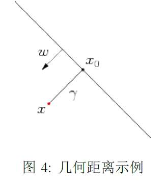

2. 有$x = x_0 + \gamma\frac{w}{||w||}$，其中||w||是范数
3. 又因为$x_0$在平面上，所以$f(x_0)=0$，代入超平面的方程可以计算出

$$
\gamma = \frac{f(x)}{||w||}
$$

4. 为了获取$\gamma$的绝对值，使其乘以其类别，得到几何间隔

$$
\hat{\gamma} = y\gamma = \frac{\hat{\gamma}}{||w||}
$$

## 2.4. 最大分离器Maximum Margin Classifier的定义
1. 最大间隔分类器的目标函数为$\max\hat{\gamma}$
2. 其他满足条件:$y_i(w^Tx_i + b) = \hat{\gamma_i}\geq\hat{\gamma}, i = 1,...,n$
3. 如果函数间隔$\hat{\gamma}$为1，上述目标函数在转化为

$$
\max\frac{1}{||w||}, s.t.\ y_i(w^Tx_i + b) \geq 1, i = 1, ..., n
$$

## 2.5. 如何寻找到最优超平面
1. 最大化距离:最大化距离可以为模型带来比较好的泛化能力

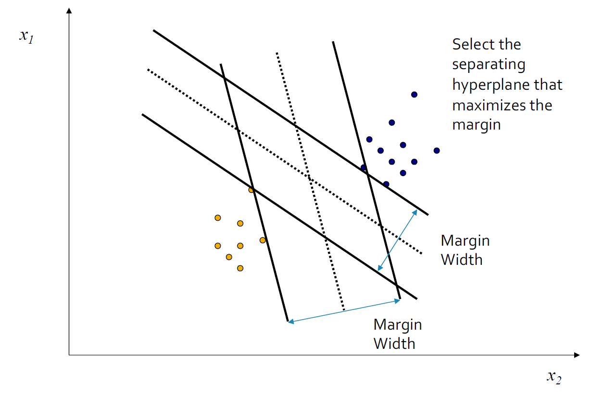

2. 支持向量的图形化表示

3. 最初优化问题:我们选择最大间距作为这个优化问题的最优解，也就是使得$\frac{2}{||w||}$的值最大，并且满足一下两个约束条件
   1. $(wx+b) \geq 1, \forall$ x in class 1
   2. $(wx+b) \leq -1, \forall$ x in class 2

4. 线性分类器
   1. $w^Tx + b = 0$
   2. $f(x) = w^Tx +b$

## 2.6. 决策边界

### 2.6.1. 线性分类边界
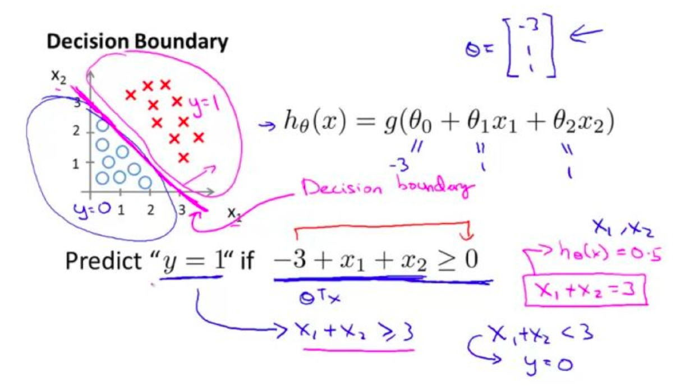

### 2.6.2. 非线性分类边界

> 使用二次曲线进行划分

## 2.7. 支持向量机
1. 我们想要通过一条尽可能好的直线(超平面)将两类不同的物体分开。
2. 数据:
   1. 训练集:$(x_1,y_1),...,(x_n,y_n)$
   2. 对于每一个例i:
      1. $x_i = \{x_i^{(1)}, ... , x_i^{(d)}\}$，$x_i^{(j)}是实数$
      3. $y_i \in \{-1, +1\}$
   3. 向量内积:$w*x = \sum\limits_{j=1}\limits^{d}w^{(j)}*x^{(j)}$
   4. 什么是被$w$定义的最佳的线性分类器?

### 2.7.1. 最大距离
1. 距分离超平面的距离对应于预测的“置信度”
2. 在下图中，我们认为A和B是左侧类的概率比C大。

3. Margin $\gamma$:距离分类直线或超平面最近的一个点的距离。

3. 之所以以这种方式定义边距，是因为理论上的边界以及依赖于边距值的泛化误差范围的存在。

### 2.7.2. 为什么最大距离是好的
1. 点积:$A * B = ||A|| * ||B|| * \cos \theta$

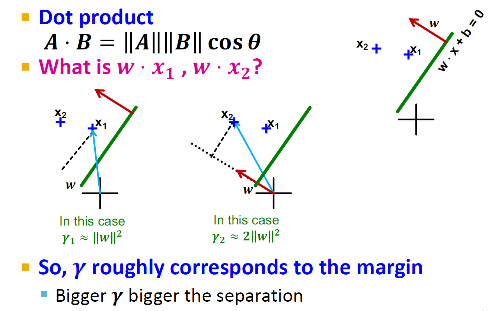

2. $\gamma$和间距是线性正相关，所以是可以的

### 2.7.3. 距离如何表示

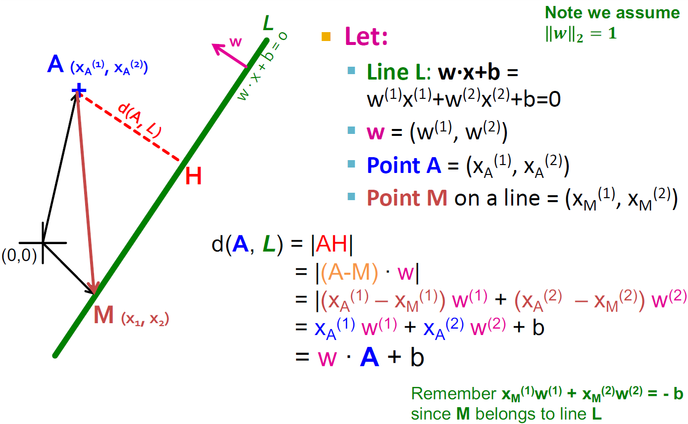

### 2.7.4. 最大距离的求解
1. 预测值 = $sign(w*x+b)$
2. 置信度(Confidence) = $(w*x + b)y$
3. 对于第i个数据点:$\gamma_i = (w*x_i + b)y_i$
4. 解决的问题:$\max\limits_w\min\limits_i\gamma_i$
5. 重新解释为:求解$\max\limits_{w,\gamma}\gamma s.t.\forall i, y_i(w*x_i + b) \geq \gamma$

## 2.8. 规范超平面
1. 转化问题:$(2wx + 2b)y = 2\gamma$
2. 一般化w:$\gamma = (\frac{w}{||w||} * x + b) y$
3. 当然提供**支持向量**$x_j$在差平面上被定义为$w*x_j + b = \pm 1$

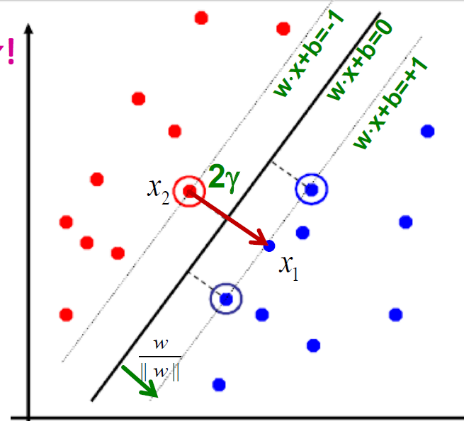

- 前提条件
$$
\begin{array}{l}
   x_1 = x_2 + 2 \gamma\frac{w}{||w||} \\
\ \\
   w * x_1 + b = +1 \\
   w * x_2 + b = -1 \\
\end{array}
$$

- 计算$\gamma$

$$
\begin{array}{l}
   w * x_1 + b = + 1 \\
   w (x_2 + 2\gamma\frac{w}{||w||}) + b = + 1 \\
   \ \\
   w * x_2 + b + 2\gamma\frac{w}{||w||} = + 1 \\
   \ \\
   \gamma = \frac{||w||}{w * w} = \frac{1}{||w||} \\   
\end{array}
$$

## 2.9. 通过上述化简后最大距离
$$
\arg \max\gamma = arg \arg\min\frac{1}{||w||} = \arg\min\frac{1}{2}||w||^2
$$

- 支持向量机的强约束条件:

$$
\min\limits_w\frac{1}{2}||w||^2 \\
s.t. \forall i, y_i(w * x_i + b) \geq 1
$$

## 2.10. 非线性分析
1. 如果数据不是线性可分的，那么我们需要添加惩罚项C

$$
\min\limits_w\frac{1}{2}||w||^2 + C \\
\ \\
s.t. \forall i, y_i(w * x_i + b) \geq 1
$$

2. 通过交叉检验法确定C的值
3. 所有的错误并不是一样的坏
4. 引入宽松量$\xi_i$

$$
\min\limits_{w,b,\xi_i \geq 0} \frac{1}{2} * ||w||^2 + C*\sum\limits_{i=1}\limits^{n}\xi_i \\
\ \\
s.t. \forall i, y_i(w*x_i + b) \geq 1 - \xi_i
$$

5. 如果$x_i$位于错误的一边，那么他将会有惩罚项$\xi_i$

### 2.10.1. Slack Penalty C
1. 当C是无穷时，我们只希望通过w和b来分开数据
2. 当C是0时，我们无论设置$\xi_i$是多少，w都是0，也就是忽略了数据

### 2.10.2. 支持向量机的自然形式
$$
\arg\min\limits_{w,b}\frac{1}{2}w*w + C*\sum_{i=1}^{n}\max\{0,1-y_i(w*x_i+b)\}
$$

- $w * w$:距离
- $C$:正则化参数
- $\sum_{i=1}^{n}\max\{0,1-y_i(w*x_i+b)\}$:经验损失L（我们如何拟合训练数据）
- SVM使用"Hinge Loss":max{0, 1-z}

## 2.11. 如何计算距离
$$
\min\limits_{w,b}\frac{1}{2}w*w + C*\sum_{i=1}^{n}\xi_i \\
s.t. 
\forall i,y_i*(x_i * w + b) \geq 1 - \xi_i
$$

- 使用二次求解器
  - 最小化二次函数
  - 受到线性约束
- 问题:求解器对于大数据效率低下！

$f(w,b) = \frac{1}{2} w * w + C*\sum_{i=1}^{n}\max\{0,1-y_i(w*x_i+b)\}$

- 如何最小化凸函数g(z):切线
- 使用梯度下降法

## 2.12. 如何计算w
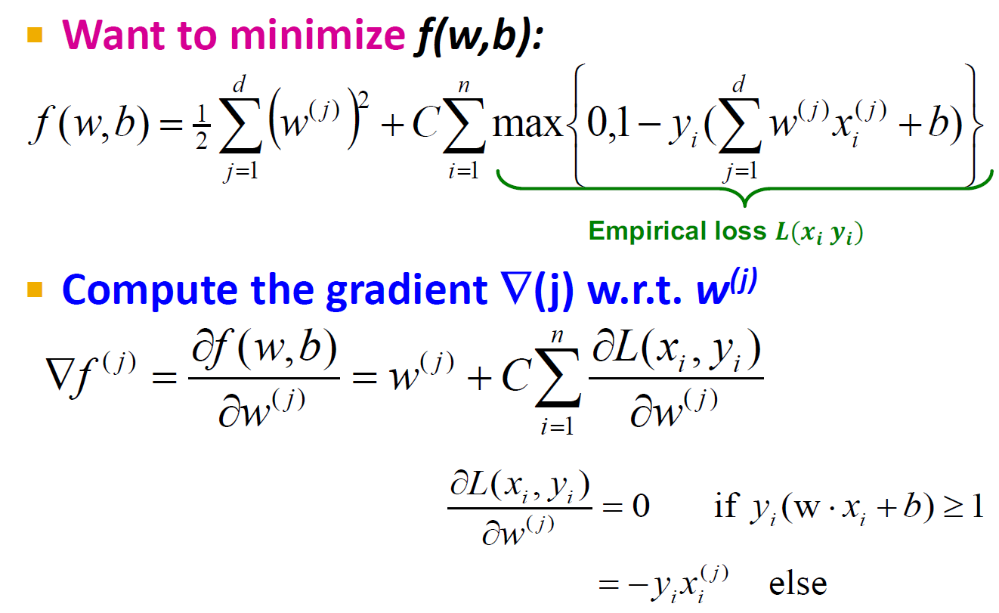

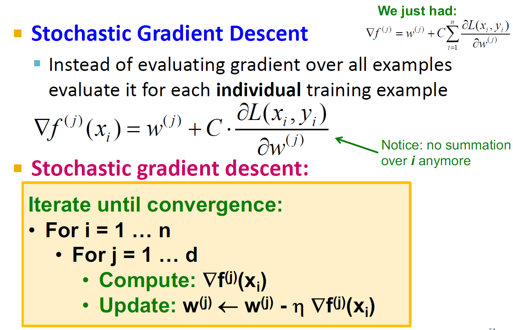

# 3. 深入SVM

## 3.1. 从线性可分到线性不可分到线性不可分

### 3.1.1. 从原始问题到对偶问题求解
1. 等价问题转化

$$
\max\frac{1}{||w||}, s.t.\ y_i(w^Tx_i + b) \geq 1, i = 1, ..., n \\
转化为 \\
\min \frac{1}{2}||w||^2, s.t.\ y_i(w^Tx_i + b) \geq 1, i = 1, ..., n \\
$$

1. 我们可以看到目标函数是二次的，约束条件是线性的，所以其实一个凸二次规划问题。
2. 由于问题的特殊性，我们可以根据拉格朗日对偶性对换到对偶变量的优化问题，即通过求解与原问题等价的对偶问题得到原始问题的最优解，优点如下
   1. 对偶问题更容易求解。
   2. 便于引入核函数，推广到非线性分类问题。
3. 拉格朗日对偶性：通过给每一个约束条件加上一个拉格朗日乘子$\alpha$

$$
L(w, b, \alpha) = \frac{1}{2}||w||^2 - \sum\limits_{i=1}\limits^n\alpha_i*(y_i(w^T*x_i + b) - 1) \\
\theta(w) = \max\limits_{\alpha_i\geq 0}L(w, b ,\alpha) \\
$$

4. 容易验证，如果某个约束条件不满足，则$\theta(w) = \infty$，当所有的约束条件满足时，则有$\theta(w) = \frac{1}{2}||w||^2$，即最初要最小化的值。
5. 即将问题转化为求解

$$
\min\limits_{w, b}\theta(w) = \min\limits_{w, b}\max\limits_{\alpha_i\geq 0}L(w, b ,\alpha) = p^*
$$

6. 这样是不容易求解的我们将最大和最小进行交换，得到

$$
\max\limits_{\alpha_i\geq 0}\min\limits_{w, b}L(w, b ,\alpha) = d^*
$$

7. 我们可以知道有$d^*\leq p^*$(在满足K.K.T.条件时等价)，对偶问题更容易求解，下面先求L对w和b的极小，再求L对$\alpha$的极大

### 3.1.2. K.K.T.条件
1. 一般最优化数学模型能表示为如下标准形式

$$
\min f(x) \\
s.t. h_j(x) = 0, j = 1, ..., p\\
g_k(x)\leq 0, k = 1, ..., q \\
x \in X \subset R^n \\
$$

- f(x)是需要最小化的函数，h(x)是等式约束，g(x)是不等式约束，p和q分别为等式约束和不等式约束的数量。

2. 凸优化:$X\subset R^n$是一凸集，f:X->R为一凸函数，凸优化就是要找出一点$x^* \in X$，使得每一个$x \in X$满足$f(x^*) \leq f(x)$
3. KKT条件的意义:是一个非线性规划问题能有最优解的必要和充分条件。

> KKT条件：对之前的标准形式最优化数学模型，如果满足
> 1. $h_j(x^*) = 0, j = 1, ..., p，g_k(x^*) \leq 0, k = 1, ..., q$
> 2. $\triangle f(x^*) + \sum\limits_{j=1}\limits^p\lambda_j\triangle h_j(x^*) + \sum\limits_{j=1}\limits^p\mu_k\triangle g_k(x^*) = 0, \lambda_j \neq 0, u_k \geq 0, \mu_kg_k(x^*) = 0$
> 作为满足KKT条件

### 3.1.3. 对偶问题求解的三个步骤
1. 第一步：固定$\alpha$，对w和b分别求偏导，带回L并化简(最后一步，注意$\sum\limits_{i=1}\limits^n\alpha_iy_i = 0$)

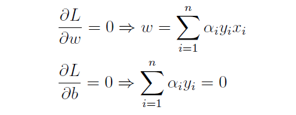
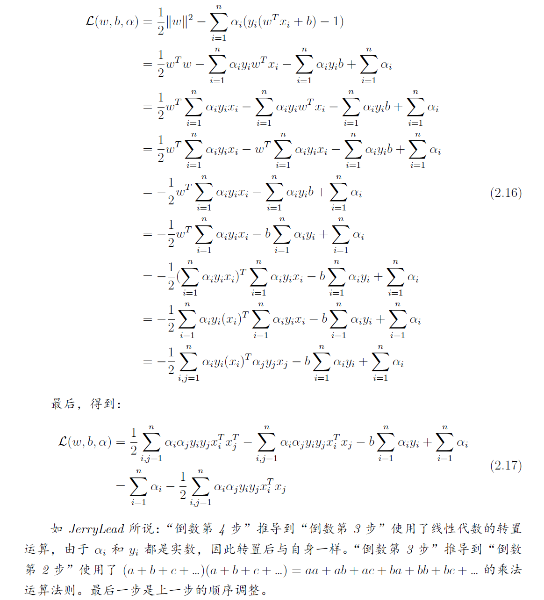

2. 第二步：求对$\alpha$的极大

3. 第三步：计算完成$L(w, b, \alpha)$关于w和b的最小化，以及与$\alpha$的极大之后，最后就是使用SMO算法求解对偶问题中的拉格朗日乘子$\alpha$

### 3.1.4. 线性不可分问题
1. 对于一个数据点进行分类，实际上是将x代入$f(x) = w^Tx+b$计算出结果，根据正负号进行类别划分。

$$
\begin{array}{l}
   \because w^* = \sum\limits_{i=1}\limits^{n}\alpha_iy_ix_i \\
   \therefore f(x) = (\sum\limits_{i=1}\limits^{n}\alpha_iy_ix_i)^T x + b \\
   = \sum\limits_{i=1}\limits^{n}\alpha_iy_i<x_i, x> + b   
\end{array}
$$

2. 也就是对新点预测，只需要计算其与训练数据点的内积即可：非支持向量对应的$\alpha=0$，这些点不影响分类

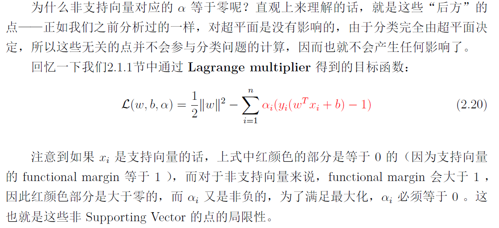

## 3.2. SVM：核函数：kernel

### 3.2.1. 特征空间的隐式映射：核函数
1. 对于非线性情况，SVM选择一个核函数K(·,·)，通过将数据映射到高维空间，来解决在原始空间中线性不可分的问题。

2. 非线性分类器模型:$f(x) = \sum\limits_{i=1}\limits^Nw_i\phi(x)+b$，建立非线性份分类器步骤
   1. 首先用非线性映射将数据变换到一个特征空间F：重点
   2. 在特征空间使用线性分类器进行分类
3. 非线性决策规则:

$$
f(x) = \sum\limits_{i=1}\limits^l\alpha_iy_i<\phi(x_i), \phi(x)>+b
$$

### 3.2.2. 核函数：如何处理非线性数据
1. 将非线性数据映射为线性数据

#### 3.2.2.1. 二维空间描述
$$
a_1X_1+a_2X_1^2+a_3X_2+a_4X_2^2+a_5X_1X_2+a_6=0
$$

#### 3.2.2.2. 从二维空间到五维空间映射
$$
Z_1=X_1,Z_2=X_1^2,Z_3=X_3,Z_4=X_4,Z_5=X_1X_2
$$

#### 3.2.2.3. 五维空间描述(线性超平面)
$$
\sum\limits_{i=1}\limits^5a_iZ_i + a_6 = 0
$$

#### 3.2.2.4. 计算方法
> 假设有两个变量$x_1 = (\eta_1, \eta_2)^T, x_2 = (\xi_1,\xi_2)^T$

1. 方法一：映射后的内积为

$$
<\phi(x_1), \phi(x_2)> = \eta_1\xi_1 + \eta_1^2\xi_1^2 + \eta_2\xi_2 + \eta_2^2\xi_2^2 + \eta_1\eta_2\xi_1\xi_2
$$

2. 方法二：平方，在低维空间计算，如果遇到维度爆炸，前一种可能无法计算

$$
\begin{array}{l}
   (<x_1, x_2> + 1)^2 = 2\eta_1\xi_1 + \eta_1^2\xi_1^2 + 2\eta_2\xi_2 + \eta_2^2\xi_2^2 + 2\eta_1\eta_2\xi_1\xi_2 + 1 \\
   等价于 \\
   \phi(x_1, x_2) = (\sqrt{2}x_1, x_1^2, \sqrt{2}x_2,x_2^2,\sqrt{2}x_1x_2,1)^T \\   
\end{array}
$$

### 3.2.3. 核函数
1. 计算两个向量在隐式映射过后的空间中的内积的函数叫做核函数
2. 上例中为$K(x_1, x_2) = (<x_1, x_2> + 1)^2$
3. 分类函数为:$f(x) = \sum\limits_{i=1}\limits^Na_iy_iK(x_i, x)+b$

### 3.2.4. 常见核函数
1. 多项式核:$K(x_1, x_2) = (<x_1, x_2> + R)^d$，空间维度为$C_{m+d}^d$，原始空间维度为m
2. 高斯核:$K(x_1,x_2) = \exp^{-\frac{||x_1-x_2||^2}{2\delta^2}}$，$\delta$影响高次特征上权重衰减的速度

3. 线性核:$K(x_1,x_2) = <x_1, x_2>$

## 3.3. 使用松弛变量处理outliers方法
1. 如果有些情况下数据有噪声，我们称偏离正常位置很远的数据点为outlier

2. 噪声点对目前的SVM有比较大的影响，我们通过允许数据点在一定程度上偏离超平面来解决这个问题。
3. 原本约束条件为:$y_i(w^Tx_i+b)\geq 1,i =1,...,n$
4. 新的约束条件为:$y_i(w^Tx_i+b)\geq 1 - \xi_i,i =1,...,n$
5. $\xi_i$是松弛变量，对应数据点$x_i$允许偏离函数间隔的距离，对应的我们应该修正我们的优化问题：$\min \frac{1}{2}||w||^2 + C\sum\limits_{i = 1}\limits^n\xi_i$
   1. 参数C:控制目标函数“寻找margin最大的超平面”和“保证数据点偏差量最小”之间的权重，实现确定好的变量。
   2. 参数$\xi$是需要优化的变量
6. 新的拉格朗日函数如下

$$
L(w, b, \xi, \alpha, r) = \frac{1}{2}||w||^2 + C\sum\limits_{i=1}\limits^n\xi_i - \sum\limits_{i=1}\limits^n\alpha_i(y_i(w^Tx_i+b) - 1 + \xi_i) - \sum\limits_{i=1}\limits^nr_i\xi_i
$$

7. 分析方法和上面相同

# 4. 证明SVM
1. 比较复杂，参见参考五

# 5. 参考
1. 《支持向量机通俗导论（理解SVM的三层境界）》
2. <a href = "https://blog.csdn.net/laobai1015/article/details/82763033">SVM的Python实现</a>
