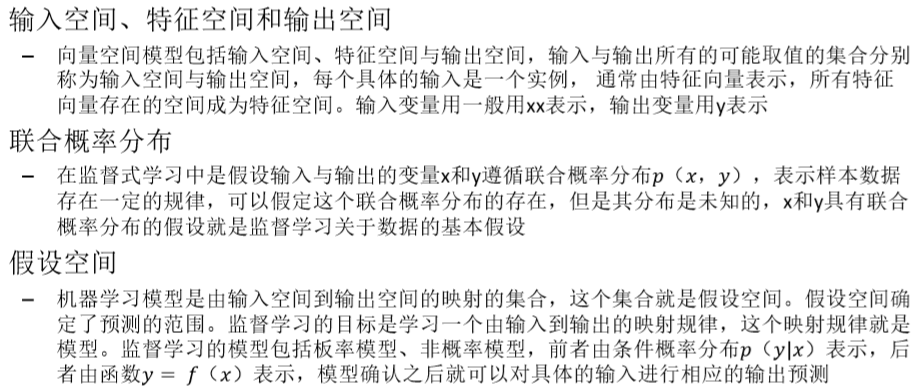
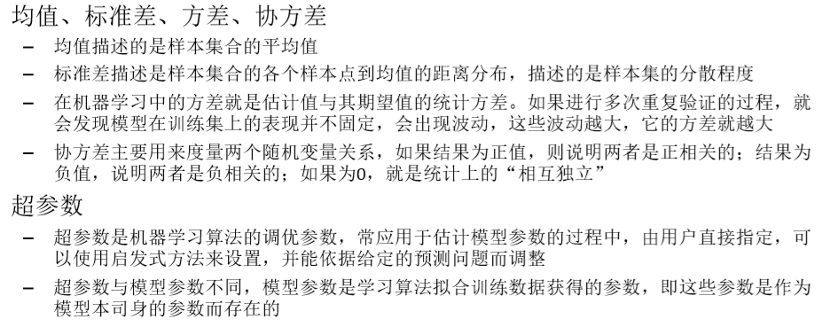
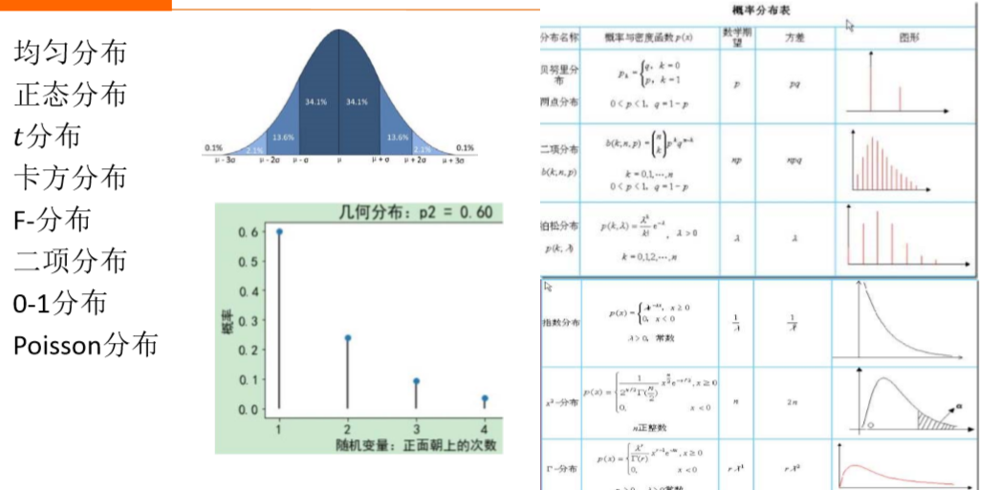
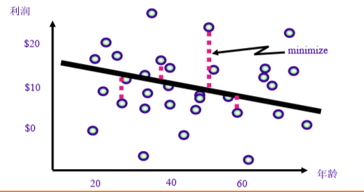

**回归分析基础**
1. 回归分析是监督学习等的数学基础。

# 1. 统计分析
1. 统计学是研究如何搜集资料、整理资料和进行量化分析、推断的一门科学，在科学计算、工业和金融等领域有着重要应用，统计分析是机器学习的基本方法
2. 与统计分析相关的基本概念有以下几个
    + 总体：根据定目的确定的所要研究事物的全体
    + 样本：从总体中随机抽取的若干个体构成的集合
    + 推断：以样本所包含的信息为基础对总体的**某些特征**作出判断、预测和估计
    + 推断可靠性：对推断结果从概率上的确认，作为决策的重要依据
3. 统计分析分为描述性统计和推断性统计，描述性统计是通过对样本进行整理、分析并就数据的分布情况获取有意义的信息，从而得到结论。推断统计又分为参数估计和假设检验，**参数估计**是对样本整体中某个数值进行估计，如推断总体平均数等，而假设检验是通过对所做的推断验证，从而进择行才方案
4. 假设送外卖是服从泊松分布

## 1.1. 统计基础

1. 在输入空间中提取输入变量，然后特征空间也就是连接输入空间和输出空间。
2. 利用可视化分析来了解变量的概率分布。
3. 假设空间:
    + 目的：找到输入和输出之间的关系
    + 有可能存在不同的映射规律

1. 标准差和方差是用来了解数据离散程度。
2. 协方差:
    + 大于0:正相关
    + ==：横竖
    + 小于0:负相关

1. 均方误差可以被作为一个损失函数不为负数
2. 评估指标，越小越好。

### 1.1.1. 正则化与交叉验证
1. L1正则化
2. L2正则化
3. HoldOut检验
4. 简单交叉检验
5. K折交叉检验
6. 留一交叉检验

### 1.1.2. 常见概率分布

### 1.1.3. 参数估计
1. 参数估计是用样本统计量去估计总体的参数，即根据样本数据选择统计量去推断总体的分布或数字特征
2. 估计参数的目的，是希望用较少的参数去描述数据的总体分布，前提是要了解样本总体分布（如正态分布），这样就只需要估计其中参数的值。如果无法确认总体分布，那就要采用非参数估计的方法
3. 参数估计是统计推断的种基本形式，分为点估计和区间估计两部分。其中有多种方法，除了最基本的最小二乘法和极大似然法、贝叶斯估计、极大后验估计，还有矩估计、一致最小方差无偏估计、最小风险估计、最小二乘法、最小风险法和极小化极大熵法等

### 1.1.4. 假设检验
1. 假设检验假设检验是先对总体的参数（或分布形式）提出某种假设，然后利用样本信息判断假设是否成立的过程。假设检验的基本思想是小概率反证法思想
2. 假设检验包括原假设与备选假设。其中检验假设正确性的是原假设，表明未知参数的看法。而备选假设通常反映研究者对参数可能数值对立的看法
3. 假设检验的具体过程如下：首先所研究问题的总体做某种假设，记作HO；选取合适的统计量，这个统计量的选取要使得在假设HO成立时，其分布为已知；由实测的样本，计算出统计量的值，并根据预先给定的显著性水平进行检验，做出拒绝或接受假设HO的判断
4. 常用的假设检验方法有u检验法、t检验法、x2检验法（卡方检验）、F检验法、秩和检验等
5. 显著性检验是根据一定的理论或经验，认为某一假设HO成立。例如，首先假设人的收入是服从F在分布的。当收集了一定的收入数据后。可以评价实际数据与理论假设HO >间的偏离，如果偏离达到了“显著”的程度就拒 绝H10假设，这样的检验方法称为显著性检验
6. 显著程度从中心的H0“非常显著”开始向外不断移动，当偏离达到某一较低 显著的程度a（如0.05）时，再看H0假设，已经很难证明其正确了，这时就可以认为H0假设不成立，也就是被拒绝了，就是它成立的概率不超过a，a称为显著性水平。这种假设检验的好处是不用考虑备择假设，只关心实验数据与理论之间拟合的程度，所以也称之为拟合优度检验.

# 2. 回归分析
1. 分析一个变量与**其他一个（或几个）变量**之间的相关关系的统计方法就称为回归分析。常见的回归分析包括线性回归、多元回归、非线性回归、广义线性回归（对数回归、泊松回归）等。回归分析主要内容包括确定连续值变量之间的相关关系，建立回归模型，检验变量之间的相关程度，应用回归模型对变量进行预测等

2. 回归分析就是能不能找到一个曲线来保证其与曲线之间的距离尽可能的小。

# 3. 正则化和过拟合的关系
1. 在模型训练的开始，我们往往不能确定我们需要使用哪些特征，所以我们往往会不可避免的对训练集产生了过拟合的情况。
2. 对于L1正则化:如果施加 L1，则新的函数为：Loss()+C|w|，要想消除这个特征的作用，只需要令 w = 0，使它取得极小值即可。且可以证明：添加L1正则后 ，只要满足：
    + 系数 C 大于原函数在 0 点处的导数的绝对值，w = 0 就会变成一个极小值点。
3. 如果施加 L2,  则新的函数为：Loss()+Cw^2 ，求导可得：d(Loss)/d(w)  + 2Cw，要想在w = 0点处取得极小值，必须得满足:
    + d(Loss)/d(w)  = 0

# 4. 建议阅读链接
1. <a href = "https://mp.weixin.qq.com/s/H6pkywUbDR8-6BNHXGl5Kw">数据分析师必须掌握的7种回归分析方法</a>
2. <a href = "https://mp.weixin.qq.com/s/CmDkR557MZDlD735wIlSVQ">Logistic线性回归</a>
3. <a href = "https://mp.weixin.qq.com/s/tIJQVhuo2MRbTVs84a9Kyg">正则化到底是怎么消除过拟合的？这次终于有人讲明白了！</a>