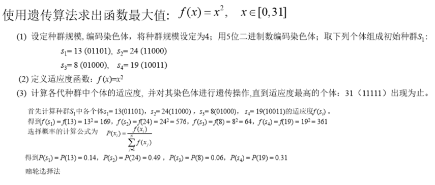
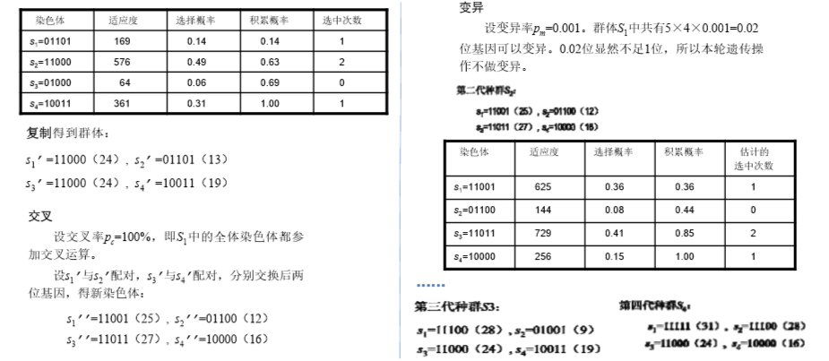

遗传算法
---
1. 遗传算法(Genetic Algorithm, GA)起源于对生物系统所进行的计算机模拟研究。它是模仿自然界生物进化机制发展起来的**随机全局搜索和优化**方法，借鉴了达尔文的进化论和孟德尔的遗传学说。其本质是一种**高效、并行、全局搜索**的方法，能在搜索过程中自动获取和积累有关搜索空间的知识，并自适应地控制搜索过程以求得最佳解。
2. 进化计算包括遗传算法、进化策略和基因编程等。**进化计算**是**受进化生物学启发**而发展起来的计算模型，其实现过程基于达尔文的生物进化原理，将现实问题转化为**基因染色体**表示，通过**染色体操作**，逐步逼近优解。本章主要是介绍遗传算法的概念、实现方法等基础知识，并结合实例对蚁群算法和蜂群算法做出介绍。
3. 遗传算法初始的种群可以采用随机化以及扩大样本的个数来增加得到最优解的可能。

# 1. 遗传算法的基础
1. Holland在上世纪60年代提出了遗传算法遗传算法是进化计算的一个分支，是一种模拟自然界生物进化过程的随机搜索算法。
2. 遗传算法首先对问题进行编码，然后随机初始化种群，每个个体对应一个编码。通过**适应度函数**以及**选择函数**来进行对个体的淘汰，保留优良个体基因，产生新的子代。
3. 遗传算法中有一些基本概念：
    + 选择算子：根据**适应值**把个体按比例进行淘汰，从而提高群体的适应值。高适应度的个体的概率会比较大。
    + 交叉算子：种群中**随机选择**两个个体，交换染色体部分编码，产生两个新的子个体。
    + 变异算子：以一个**很小的概率**随机改变染色体上的某个基因来增加群体的多样性。
4. 一开始我们可以随机生成一个个体编码解。

# 2. 遗传算法术语
1. 编码(coding)：将物体的表现型用编码的方式转为程序可控的基因型。
    + Eg.比如现在要计算北京、天津、广东、新疆这四个城市的一条最优路径，但算法程序不能够直接处理北京、天津、广东、新疆这些数据，所以我们得给 它们编上号，北京(0)、天津(1)、广东(2)、新疆(3)，路径(天津->新疆->北京->广东)可以表示成基因型串结构数据 (1302)，这样算法程序只要直接处理它们的编号就行了。
    + (1)二进制编码，基因用0或1表示(常用于解决01背包问题)
    + 如：基因A：00100011010 (代表一个个体的染色体)
    + (2)互换编码(用于解决排序问题，如旅行商问题和调度问题)
    + 如旅行商问题中，一串基因编码用来表示遍历的城市顺序，如：234517986，表示九个城市中，先经过城市2，再经过城市3，依此类推。
2. 解码(decoding)：基因型到表现型的映射。
3. 基因型(genotype)：参数的因子；
4. 表现型(phenotype)：根据不同因子最终展现的形态；
5. 适应度(fitness)：度量某个结果的好坏。
6. 进化(evolution)：不断剔除差的结果，最终逐步留下好的结果。
7. 选择(selection)：以一定的概率从种群中选择若干个个体留下，并繁殖。选择过程是一种基于适应度的优胜劣汰的过程。
8. 复制(reproduction)：将父本、母本的基因复制，以便产生下一代。
9. 交叉(crossover)：两个染色体的某一相同位置处DNA被切断，前后两串分别交叉组合形成两个新的染色体。也称基因重组或杂交；
10. 变异(mutation)：交叉后可能(很小的概率)对染色体进行更改，来防止算法过早收敛而陷入局部最优解中。
11. 个体(individual)：指染色体带有特征的实体；
12. 种群(population)：个体的集合，该集合内个体数称为种群的大小

## 2.1. 交叉算法(基因重组)

### 2.1.1. 单交叉点法 (用于二进制编码)
1. 选择一个交叉点,子代在交叉点前面的基因从一个父代基因那里得到,后面的部分从另外一个父代基因那里得到。
2. 单点交叉也叫简单交叉，只在个体编码中随机设置一个交叉点，在该点互换两个配对个体的部分染色体。在单点交叉情况下，个体两两配对，其中每一对配对的个体都依照设定的交叉概率在交叉点处相互交换后续的染色体编码串，从而产生两个新的个体。
```
如：交叉前：
00000|01110000000010000
11100|00000111111000101
交叉后：
00000|00000111111000101
11100|01110000000010000
双亲                   
X1  1000 | 10011110
X2  0110 | 11000110
(本例中交叉右半部分)
后代
x1* 1000   11000110
x2* 0110   10011110
```

### 2.1.2. 双交叉点法 (用于二进制编码)
1. 选择两个交叉点,子代基因在两个交叉点间部分来自一个父代基因,其余部分来自于另外一个父代基因.
2. 两点交叉是指在个体编码中随机设置了两个交叉基因点，然后再进行部分基因片段的交换，交换的部分就是所设定的两个交叉点之间的部分染色体。将单点交叉和两点交叉的概念加以推广，扩展到多点交叉。就是在个体编码串中随机设置多个交叉点，然后进行基因片段的交换。但在实际的遗传算法中，一般不使用多点交叉算子。因为交叉点增多，个体结构被破坏的可能性就更大，个体基因的稳定性就难以保持，从而可能会影响到遗传算法的效率。
```
如：交叉前：
01 |0010| 11
11 |0111| 01
(对换两个交叉点之间的部分)
交叉后：
11 |0010| 01
01 |0111| 11
```

均匀交叉
---
均匀交叉可以看成是多点交叉的一种特殊形式，是指两个配对个体的每个基因位上的基因都以**相同的概率**进行交换，组合成两个新的个体。具体的运算可以设置一串规则来确定新个体每个位置的基因如何继承哪一个父类基因位。

### 2.1.3. 基于" 与/或 "交叉法 (用于二进制编码)
1. 对父代按位"与"逻辑运算产生一子代A;按位"或"逻辑运算产生另一子代B。该交叉策略在解背包问题中效果较好 .
```
如：交叉前：
01001011
11011101
交叉后：
01001001
11011111
```

### 2.1.4. 单交叉点法 (用于互换编码)
1. 选择一个交叉点，子代的从初始位置出发的部分从一个基因复制，然后在另一个基因中扫描，如果某个位点在子代中没有，就把它添加进去。
```
如：交叉前：
87213 | 09546
98356 | 71420
交叉后：
87213 | 95640
98356 | 72104
```

### 2.1.5. 部分匹配交叉(PMX)法(用于互换编码)
1. 先随机产生两个交叉点，定义这两点间的区域为匹配区域，并用交换两个父代的匹配区域。
```
父代A：872 | 130 | 9546
父代B：983 | 567 | 1420    变为：
TEMP A: 872 | 567 | 9546
TEMP B: 983 | 130 | 1420
对于 TEMP A、TEMP Ｂ中匹配区域以外出现的数码重复，要依据匹配区域内的位置逐一进行替换。匹配关系：1<——>５　３<——>６　７<——>０
子代Ａ：802 | 567 | 9143
子代Ｂ：986 | 130 | 5427
```

### 2.1.6. 顺序交叉法(OX) (用于互换编码)
1. 从父代Ａ随机选一个编码子串，放到子代Ａ的对应位置；子代Ａ空余的位置从父代Ｂ中按Ｂ的顺序选取(与己有编码不重复)。同理可得子代Ｂ。
```
父代A: 872 | 139 | 0546
父代B: 983 | 567 | 1420
交叉后：
子代A: 856 | 139 | 7420
子代B: 821 | 567 | 3904
```

### 2.1.7. 循环交叉(CX)(用于互换编码)
1. CX同OX交叉都是从一个亲代中取一些城市，而其它城市来自另外一个亲代，但是二者不同之处在于：OX中来自第一个亲代的编码子串是随机产生的，而CX却不是，它是根据两个双亲相应位置的编码而确定的。
```
父代A：1 2 3 4 5 6 7 8 9
父代B：5 4 6 9 2 3 7 8 1
可得循环基因：1->5->2->4->3->6->9->7->8
子代Ｂ的编码同理。(循环基因 5->1->4->2->6->3->9->7->8)
```

### 2.1.8. 算术交叉
1. 算术交叉是指两个个体通过线性组合产生两个新的子代个体。采用这种交叉方式的遗传算法通常采用浮点编码染色体。例如A、B为父体。配对后两个子代为a和b，a=mA+(1‐m)B，b=mB+(1‐m)A。m可以取一个常数，也可以选择一个由参数决定的变量。
2. 如果A、B的编码是浮点数。


## 2.2. 变异算法(基因突变)
1. 基因突变是指染色体编码的某一位基因上的改变。基因突变使一个基因变成了它的等位基因，并且通常会引起一些表现型上的变化。
2. 二进制编码中，基因突变是指按照一定概率将基因串上的0、1取反。
3. 浮点型编码中，基因突变指的是将原来的浮点数增加或者减少一个小随机数。
4. 例：100011000110->100011010110
5. 变异概率Pm不能太小，这样降低全局搜索能力；也不能太大，Pm > 0.5，这时GA退化为随机搜索。

### 2.2.1. 基本位变异算子(用于二进制编码)
1. 基本位变异算子是指对个体编码串随机指定的某一位或某几位基因作变异运算。对于基本遗传算法中用二进制编码符号串所表示的个体，若需要进行变异操作的某一基因座上的原有基因值为0，则变异操作将其变为1；反之，若原有基因值为1，则变异操作将其变为0。
```
变异前：
000001110000000010000
变异后：
000001110001000010000
```

### 2.2.2. 逆转变异算子(用于互换编码)(源代码中使用类似此方法)
在个体中随机挑选两个逆转点，再将两个逆转点间的基因交换。
```
变异前：
1346798205
变异后：
1246798305
```

# 3. 遗传算法步骤
1. 随机产生一组初始个体构成**初始种群**，并评价每个个体的适应值；
2. 判断算法收敛准则是否满足，满足输出搜索结果，否则执行下面的步骤；
3. 根据适应值大小以一定方式进行选择操作；
4. 按**交叉**概率p<sub>c</sub>执行交叉操作
5. 按**变异**概率p<sub>m</sub>执行变异操作
6. 返回第二步进行循环
+ 每一次循环都是一次迭代，达到目标停止，没达到计算，运算量比较大

# 4. 遗传算法实现技术

## 4.1. 编码
1. 二进制编码，采用二进制0，1表示染色体的基因信息。
2. 格雷码方法，是二进制编码的一种变形，是指连续两个整数所对应的编码值之间只有一个码位是不同的。这一特点解决了二进制编码中的相邻数字的距离较远的问题。
3. 浮点编码法，对于一些**多维、高精度要求**的**连续**函数优化问题，使用二进制编码会使编码冗长，不利于算法效率的提高。浮点数编码采用**浮点数**来表示个体的每个基因值，这种编码法需要限制基因值始终在给定区间内。
4. 符号编码法，符号编码是指**染色体编码**中的基因值可能涉及符号集的字符，使用**符号编码**，便于编码有意义的基因值。这种编码方法需要认真设计交叉、变异等遗传运算，以满足问题的各种约束，从而提高算法的**搜索性能**。
5. 对于函数的优化问题，二进制编码的效率一般地域浮点数编码

## 4.2. 群体的策略
1. **规模较大**的群体一般对应的个体多样性较高，可以避免算法陷入局部优解。但增大群体规模也会增加复杂度，**降低算法效率**。
2. 群体规模一般选在**编码长度的一个倍数值**，群体的规模是可变的，可以根据算法得到的解的结果进行调整
3. 初始群体的选取采用随机的方法产生，也可以采用其他优化方法或者启发方法选取更加优良的群体。

## 4.3. 选择策略
选择函数用于选择优胜个体，淘汰不满足条件的个体。有以下三种策略：
1. 基于**适应值比例**的策略，计算个体的相对适应度，用于评价个体的好坏。以相对适应度为选择概率用轮盘赌选择种群。
    + 深度越大越好，根据底下的作为概率


2. 基于**排名**的策略，根据个体适应度在群体中的排名来确定其选择概率，再用第一种方法进行选择，可以避开非线性加速可能产生的**早熟**现象。
3. 基于**局部竞争机制**的策略，群体中随机选择若干个个体(一般是两个)进行比较，其中适应度好的个体被确定为生成下一代的父体。


## 4.4. 适应性能及选择函数
1. **适应度函数**用于判定群体中的个体是否满足条件，一般是一个实值函数对个体进行评价，适应度函数值越大，越满足条件。
    + 深度越大越好，直接使用适应度函数。否则使用其倒数。
2. 适应度函数的输出值需要是能够进行比较的非负结果。适应度评价是选择操作的依据，适应度函数设计直接影响到遗传算法的性能。
3. 选择函数用选择运算来实现对群体中的个体进行优胜劣汰，适应度高的个体被遗传到下一代种群中的概率就大。
4. 选择算子是一种选择方法，从父代中选择满足条件的个体遗传到下一代，常用的选择方法有轮盘赌选择法、随机遍历抽样法、局部选择法、最佳个体保存方法、排序选择法、联赛选择方法。

## 4.5. 变异算子
1. 变异算子能使个体按一定概率发生变异，产生新的遗传基因，有助于增加种群多样性，是提高全局优搜索能力的有效步骤，也是保持群体差异，防止过早出现收敛的重要手段。遗传算法中交叉和变异的操作使算法具备兼顾全局和局部的均衡搜索能力。
2. 群体的替换率与交叉概率和变异概率相关，替换率较低的情况下每代种群更新较慢，使得搜索范围扩展较慢，但能够较大程度保留现有基因。过高的替换率可能会过滤掉当前的优解，可以采用保留策略，使上一代的当前优解能够流传到下一代。

# 5. 遗传算法的优越性
1. 能够普遍适用于**数值求解**问题，对目标函数要求低，总能以较大的概率找到全局优解。
2. 在求解很多组合优化问题时，不需要对问题有非常深入的了解，在确定问题的决策变量编码后，其**计算过程是比较简单的**，且可较快的得到一个满意解。
3. 与其他启发式算法有**较好的兼容性**，容易结合形成性能更优的问题求解方法。

# 6. 遗传算法例子

## 6.1. 优化问题:求最大值
1. 求函数y = x<sup>2</sup>的最大值，x∈[0,31]
2. 遗传问题使用二进制编码，最大为31，0-31对应的二进制
    + 31 -> 011111
    + 编码可能对应的就是一个数



1. 变量使用5位进行编码。
2. 适应度函数即为深度函数。因为求的是最大值。
3. 个体选择的概率，根据种群全体来决定



4. 根据概率计算出样本的选中的次数
    + 基本上没有选中的样本就被淘汰掉
    + 然后进行复制得到之后的群体
5. 之后根据一次次的迭代进行计算指定的代数。
    + 通过交叉，来加深每一代的深度
6. 停止节点:最深的节点的值不再变化的时候

## 6.2. 旅行商问题
1. 旅行商问题可以用于评价不同的遗传操作以及选择机制的性能。这是因为：
    1. 旅行商问题是一个易于描述却难以处理的问题，在可计算理论中有重要的理论价值；
    2. 旅行商问题是诸多领域内出现的多种复杂问题的集中概括和简化形式，有一定的实际应用价 值；
    3. 这个问题的求解可以划分为三个步骤：
        1. 编码
        2. 适应度函数:求其倒数最大
        3. 基于遗传算法求解
    
### 6.2.1. 编码
1. 路径编码：一串数字代表一条路径，其中每个数字代表一个城市
2. 顺序编码：将所有城市按顺序构成一个顺序表，对于一个旅程，可以依据行程经过的顺序处理每个城市，每个城市在顺序表中的顺序就是一个遗传因子，每次处理完一个城市，从顺序表中去掉该城市。处理完所有城市后，将每个城市的遗传因子表示连接起来，即成为这个旅程的基因编码。
3. 布尔矩阵编码：布尔矩阵编码采用非向量表示方法，一个旅程定义为一个优先权布尔矩阵M，当且仅当城市i排在城市j之前时矩阵元素M<sub>ij</sub>= 1

### 6.2.2. 适应度函数
适应度函数为回路长度的倒数

### 6.2.3. 求解问题
1. 如两个父个体A:(1 2 3 4 5 6 7 8 9)和B:(4 1 2 8 7 6 9 3 5)，对两个父代矩阵中位进行交叉运算(A中的4 1 3与B中的5 3 3交换)，得一新矩阵，产生无矛盾的部分序：
```
A 112141311 → 112153321 A’ B 515553321 → 515541311 B’
```
2. 由交叉结果得：城市1优先于2,3,5,6,7,8,9；城市2优先于3,5,6,7,8,9；城市3优先于5；城市4优先于5,6,7,8,9；城市6,7,8优先于9。
3. 在交叉变异过程中，会有约束(否则会产生不可行解)，也就是我们要淘汰掉经过一个城市超过一次或者不足一次的。

# 7. 参考
1. <a href = "https://blog.csdn.net/zj15527620802/article/details/82121414">常用的启发式算法</a>
2. <a href = "https://blog.csdn.net/u010451580/article/details/51178225">遗传算法详解</a>
3. <a href = "https://blog.csdn.net/b2b160/article/details/4680853">比较好理解的遗传算法实例</a>