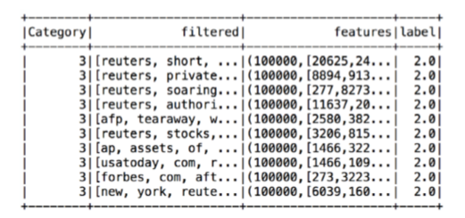

文本分析应用
---
文本分析在实际应用中涉及的范围较广，本节主要介绍**文本分类、信息抽取、问答系统、情感分析和内容摘要**，在具体领域内的应用一般是上述技术的组合运用
<!-- TOC -->

- [1. 文本分类](#1-文本分类)
    - [1.1. 基于Spark框架下逻辑回归方法进行文本分类](#11-基于spark框架下逻辑回归方法进行文本分类)
        - [1.1.1. 引入数据库和相关模块](#111-引入数据库和相关模块)
        - [1.1.2. 数据预处理](#112-数据预处理)
        - [1.1.3. 进行训练集和测试集划分](#113-进行训练集和测试集划分)
        - [1.1.4. 进行分类评估](#114-进行分类评估)
- [2. 信息抽取](#2-信息抽取)
- [3. 问答系统](#3-问答系统)
- [4. 自动摘要](#4-自动摘要)
- [5. 推荐阅读](#5-推荐阅读)

<!-- /TOC -->
# 1. 文本分类
1. 文本分类(Text Classification)的任务是根据给定文档的内容或主题，**自动分配预先定义的类别标签。**对**文档进行分类**，先将文本表示成特征向量形式，然后采用各种**分类或聚类**模型，通过训练分类器或进行聚类，实现文本分类。
2. 一般可以直接使用经典的模型或算法解决文本分类或聚类问题。例如，对于文本分类，可以选用朴素贝叶斯、决策树、KNN(最近邻算法)、逻辑回归、支持向量机等分类模型。
3. 对于文本聚类，可以选用k‐均值、层次聚类或谱聚类等聚类算法。但是，在算法应用过程中会面临很多与文本特征相关的问题，例如，文本的向量是稀疏的，以及文本具有定的序列特点，并且同一语义对应多种表述方式等，这些问题都是构建文本分类模型所面临的关键问题
4. 文本分类分为
    1. 基于规则的分类模型
    2. 基于机器学习的分类模型
    3. 基于神经网络的模型等

## 1.1. 基于Spark框架下逻辑回归方法进行文本分类
1. 对于规模比较大的数据，我们可以使用spark框架
2. 对于规模相对比较小的数据，我们可以使用python内置的机器学习库


### 1.1.1. 引入数据库和相关模块
1. 数据集来自AG新闻语料库，新闻类别包括全球、体育、商业、科技等类别
2. 首先，引入Python语言的pyspark库及相应模块包，并使用Spark中SQLContext读取csv格式的训练文本，代码如下
```py
from pyspark.sql import SQLContext 
from pyspark import SparkContext
from pyspark.sql.functions import col
from pyspark.ml.feature import RegexTokenizer, StopWordsRemover, CountVectorizer
from pyspark.ml.classification import LogisticRegression #使用逻辑回归
from pyspark.ml.feature import OneHotEncoder, StringIndexer, VectorAssembler
from pyspark.ml import Pipeline
from pyspark.ml.feature import HashingTF, IDF
from pyspark.ml.evaluation import MulticlassClassificationEvaluator 
sc=SparkContext()
sqlContext= SQLContext(sc) data=sqlContext.read.format('com.databricks.spark.csv').options(header='true',inferschema='true').load('train_text.csv') # 将机器学习的数据转化成一定的格式
data.show(10)
```
3. 每条新闻由类别(Category)、标题(Title)、内容详情(Detail)三部分组成
4. 训练集的10条新闻内容


### 1.1.2. 数据预处理
1. 首先应用正则化方法(RegexTokenizer方法实现)对详情字段分词，新增名为words的列，使用RegexTokenizer去掉words列中的停用词，增加名为filtered的列。
2. 采用TF‐IDF提取新闻内容特征(作用于filtered列)，其中词语在IDF最少要出现3次，输出的列名为features。用管道(Pipeline)按顺序执行前述的分词、去停用词、特征提取和类型转换等阶段(Stage)，使用pipeline.fit()和pipeline.transform()方法执行各阶段(Stage)的原始DataFrame处理和转换。
3. 例如RegexTokenizer.transform()方法将实现分词，并增加words列到原始的dataframe上。HashingTF.transform()方法将单词列转化为特征向量，给dataframe增加一个带有特征向量的列

```py
regexTokenizer= RegexTokenizer(inputCol="Detail", outputCol="words", pattern="\\W") add_stopwords=["this","that","rt","t","c","the","me","he","it","a","an","is","has","had"] 
stopwordsRemover=StopWordsRemover(inputCol="words",outputCol="filtered") .setStopWords(add_stopwords) 
label_stringIdx= StringIndexer(inputCol= "Category", outputCol= "label") 
hashingTF= HashingTF(inputCol="filtered", outputCol="rawFeatures", numFeatures=100000)
idf= IDF(inputCol="rawFeatures", outputCol="features", minDocFreq=3)# 从文本中提取重要的词
pipeline = Pipeline(stages=[regexTokenizer, stopwordsRemover, hashingTF, idf, label_stringIdx])
pipelineFit= pipeline.fit(data)# 将词作为分类的依据
dataset = pipelineFit.transform(data)
```

4. 生成的数据集dataset中，选择10条新闻记录进行显示，包括字段为类型、 filtered列、详情特征列行标签



### 1.1.3. 进行训练集和测试集划分
1. 将数据集按照7:3比例随机分为训练集和测试集，应用逻辑回归算法进行训练，最多训练迭代次数为20次。对模型lr训练后，使用测试集评估分类效果
```py
(trainingData,testData)=dataset.randomSplit([0.7,0.3],seed=42) #训练模型 
lr=LogisticRegression(maxIter=20,regParam=0.3,elasticNetParam=0)#调用逻辑回归
lrModel=lr.fit(trainingData)#对模型进行训练
predictions=lrModel.transform(testData) 
predictions.select("Detail","Category","probability","label","prediction").show(n=10,truncate=30)# 检验展示结果
```


### 1.1.4. 进行分类评估
1. 应用多类别分类评估器(MulticlassClassificationEvaluator)对分类效果评估，代码如下
```py
eval= MulticlassClassificationEvaluator(predictionCol="prediction")
print("accuracy:",eval.evaluate(predictions,{eval.metricName:"accuracy"}))

```
2. accuracy: 0.9037890353920889

# 2. 信息抽取
1. 信息抽取(Information Extraction)是指从文本中提取指定类型的信息，如实体、属性、关系、事件等，并通过信息归并、冗余消除和冲突消解等手段将**非结构化文本**转换为**结构化信息**
2. 每一句文本所蕴含的意思可以描述为其中实体之间的关联，因此文本实体和及其之间的语义关系也就成为理解文本意义的基础，信息抽取可以通过抽取实体之间的语义关系，或其语义角色关系，并基于这些信息进行计算和推理，有效理解文本的语义
3. 关系抽取是**识别文本中实体之间的语义关系**，关系抽取的输出通常是一个三元组(实体A，关系类别，实体B)来表示实体A和实体B之间存在特定类别的语义关系
4. 事件抽取是从非结构化文本中抽取事件。
5. 知识图谱需要使用信息抽取技术来完成。
6. 例子:查找名人的亲属，查找名人->找到亲属家乡/名字

# 3. 问答系统
1. 自动问答(Question Answering, QA) 是指计算机自动回答用户所提出的问题。问答系统是信息服务的一种高级形式，不同于现有搜索引擎，系统返回用户的结果不再是基于关键同匹配排序的文档列表，而是精准的自然语言答案
    + 一问一答，从后台数据库提取相应的符合的问题。(最好是根据语义进行匹配，最开始是根据词进行匹配)
2. 问答系统在回答用户问题时，首先需要正确理解用户所提的自然语言问题，并抽取其中的关键语义信息，然后在已有语料库、知识库或问答库中通过检索、匹配、推理的手段获取答案并返回给用户。上述过程涉及词法分析、句法分析、语义分析、信息检索、推理、知识工程、内容生成等多项关键技术
3. 自动问答的主要研究问题包括
    + 问句理解
    + 文本信息抽取
    + 知识推理

# 4. 自动摘要
1. 自动文摘是指通过**自动分析**给定的篇或多篇文档，提炼，总结其中的要点信息，最终输出篇**长度较短、可读性良好**的摘要。
    + 该摘要中的句子可直接出自原文，也可利用内容生成技术生成，即通过对原文本进行压缩、提炼，生成简明扼要的文字描述
2. 自动文摘方法分为抽取式摘要和生成式摘要。
    + **抽取式方法**相对比较简单，通常利用不同方法对文档结构单元(句子、段落等)进行评价，对每个结构单元赋予一定权重，然后选择最重要的结构单元组成摘要。
    + **生成式方法**通常需要利用自然语言理解技术对文本进行语法、语义分析，对信息进行融合，利用自然语言生成技术生成新的摘要句子。目前的自动文摘方法主要基于抽取式方法，其优点是易于实现，能保证摘要中的每个句子具有良好的可读性
3. 也可以利用拓展新将强的贝叶斯话题模型，对话题相关性概率进行建模。加权频数的定义可以有多种，如信息检索中常用的TF‐IDF权重。
4. 还可以利用**隐语义分析(LDA)**得到**低维**隐含语义表示并加以利用。在多文档摘要任务中，重要的句子可能和更多其他句子**较为相似**，所以可以用**相似度**作为节点之间的边权，通过迭代求解基于图的排序算法来得到句子的重要性得分
5. 另一方面，目前已经具备一定数量的公开摘要标记数据集，可用于监督训练模型。例如利用回归模型或排序学习模型进行有监督学习，得到句子或概念对应的得分。因为文档内容描述具有结构性，因此也可用隐马尔科夫模型(HMD)、条件随机场(CRF)、结构化支持向量机(Structural SVM)等算法进行监督训练。对应的特征包括所在位置、包含词汇、与邻句的相似度等。内容选择方法包括贪心选择和全局优化

# 5. 推荐阅读
1. <a href = "https://mp.weixin.qq.com/s/Lnn1ypkRD2vRb7KVMV335A">基于tensorflow的文本分类</a>
2. <a href = "https://blog.csdn.net/weixin_41657760/article/details/92410925?depth_1-utm_source=distribute.pc_relevant.none-task&utm_source=distribute.pc_relevant.none-task">自然语言处理(NLP)词法分析--文本关键词提取</a>