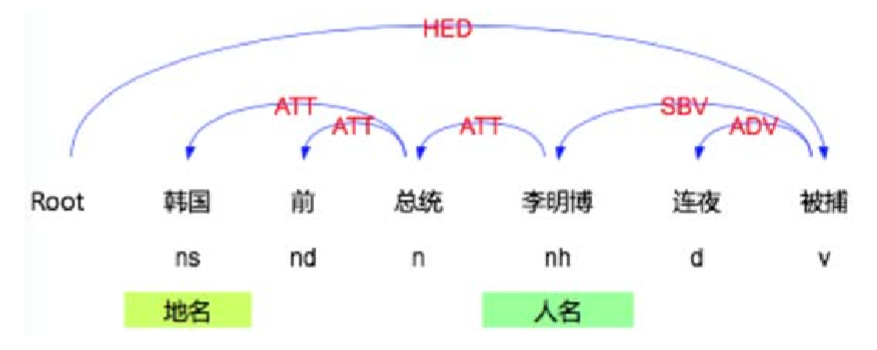
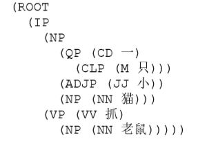

**词法、分词、词法分析**

# 1. 词法分析
1. 词法分析包括**分词、词性标注、命名实体识别和词义消歧**。其中命名实体识别是识别句子中的人名、地点、时间、产品名称和机构名称等命名实体，每个命名实体都是由一个或多个词语构成。词义消歧是根据句子上下文语境来判断某个词语的真实意思

## 1.1. 文本分词
1. 中文文本分词主要分为基于词典的分词方法、基于统计的分词方法和基于规则的分词方法
2. 基于词典的分词方法
    + 最大匹配法、最小分词方法:最大匹配法有前项和后项组成，看最长一个词是几个词组成，然后选取最长的词的长度的词，然后如果未在词库中，那么我们减小一位进行计算。
        + 对词库要求高
        + 反向分词匹配法分词的准确率高于正向最大匹配法
    + 简单，分词效率高，但难以适应开放的大规模文本的分词处理
3. 基于统计的分词
    + 实用性好
    + 不需要很大的词库，概率必须比较多才可以
4. 基于规则的分词
    + 较难，还在试验阶段
5. 常用的中文分词系统(常用的中文分词系统)
    + SCWS‐简单中文分词系统
    + IK Analyzer
    + ICCTCLAS
    + **结巴分词**
    + **斯坦福分词**
    + HanLP分词
    + **哈工大分词器**
    + THULAC
6. 英语分词3S步骤:
    1. 根据空格拆分单词（Split）
        + 英文是可以用空格进行分割的
    2. 去除停用词（Stop word）
        + 连词、副词、语气词删除去
    3. 提取词干（Stemming）
        + 将分词、过去分词、动名词等形式去除掉

### 1.1.1. 分词算法
1. N-gram

## 1.2. 无语料字典的分词方法
1. 信息熵(p):反映知道一个事件的结果后平均会给你带来多大的信息量。
2. p越小，则含有的信息越多
```py
# -*- coding=utf-8 -*-
import math
"""
    计算每个字和词的出现频率
    输入： words 字符串内容
      num 需要截取的最长字串
    输出： split_words 分割好的所有子串的数据，以字典形式返回
      split_words 说明
      {"字串" : [ 出现次数,出现概率,凝固程度,凝固程度*出现次数,自由程度,前缀集合,后缀集合] .....}
"""
def find_words(words,num=6):
    split_words={}
    lens=len(words)
    for i in range(0,lens):
        for j in range(1,num+1):
            if i+j < lens -num-2:
                if words[i:i+j] in split_words:
                    split_words[words[i:i+j]][0]+=1
                    split_words[words[i:i+j]][1]=float(split_words[words[i:i+j]][0])/float(lens)
                    split_words[words[i:i+j]][6].append(words[i-1])
                    split_words[words[i:i+j]][7].append(words[i+j])
                else:
                    split_words[words[i:i+j]]=[1,1/float(lens),words[i:i+j],1,1,0,[words[i-1]],[words[i+j]]]
        if(i%10000==0):
            print "完成 :" + str(float(i)/float(len(words))*100) + " %"
    return split_words
"""
    计算凝聚程度
    输入：words_dic 已经拆分好的字符串字典
    输出：填充好凝聚程度的字典
"""
def find_nh(words_dic):
    for key in words_dic.keys():
        if(len(key)>1):
            #左凝聚程度
            left_p=words_dic[key][1]/(words_dic[key[:1]][1]*words_dic[key[1:]][1])
            #右凝聚程度
            right_p=words_dic[key][1]/(words_dic[key[:-1]][1]*words_dic[key[:-1]][1])
            if(left_p<right_p):
                words_dic[key][3]=left_p
            else:
                words_dic[key][3]=right_p
"""
    计算自由程度
    输入： word_dic 字典文件
    返回：word_dic 添加自由程度以后的字典
"""
def calc_free(word_dic):
    for key in word_dic.keys():
        front_free=0
        end_free=0
        for front in word_dic[key][6]:
            if front in word_dic:
                front_free-=math.log(word_dic[front][1])*word_dic[front][1]
        for end in word_dic[key][7]:
            if end in word_dic:
                end_free-=math.log(word_dic[end][1])*word_dic[end][1]
        if(front_free < end_free):
            word_dic[key][5]=front_free
        else:
            word_dic[key][5]=end_free
    return word_dic
```
### 1.2.1. 自然语言处理-停用词
1. <a href = "https://blog.csdn.net/weixin_42152696/article/details/86082566">自然语言处理-停用词</a>

## 1.3. 命名实体识别
1. 命名实体识别(Named EntitiesRecognition, NER) 是自然语言处理的基础任务，目标是**识别人名、地名和组织机构名等命名实体**，一般包括**实体类、时间类和数字类**3大类，以及人名、地名、机构名、时间、日期、货币和百分比等7小类。由于这些命名实体数量不断增加，通常**无法通过词典的方法识别**，一般需要从词语形态或结构上进行分析传统命名实体识别算法是**基于统计**的方法，包括隐马尔可夫模型、最大熵(MaxmiumEntropy,ME)、支持向量机(SVM)、条件随机场(CRF)等
2. **基于统计**的方法对特征选取的要求较高，对**语料库**的依赖也比较大，需要从文本中选择对该项任务有影响的各种特征，而可用的大规模通用语料库又**比较少**
3. 目前中英文通用命名实体识别(人名、地名、机构名)的F1值都能达到90%以上。命名实体识别的主要难点是表达不规律、缺乏训练语料的开放域命名实体识别，如电影、歌曲名、网名等

## 1.4. 词义消歧
1. 词义消歧(WSD)是自然语言理解中核心的问题，在词义、句义、篇章含义层 次都会出现不同的上下文(Context) 下语义不同的现象。消歧就是根据上下 文来确定对象的真实语义
2. 词义消歧是信息检索、观点挖掘、文本理解和自然语言生成、推理等自然 语言处理的基础模块
3. 根据所使用的资源类型不同，可以将词义消歧方法分为以三类(转换为分类问题，根据上下文来进行推断)
    1. 基于词典的词义消歧
    2. 有监督词义消歧
    3. 无监督和半监督词义消歧

# 2. 句法分析
1. 句法分析(Parsing)是将输入句子从序列形式变成树状结构，从而可以捕捉到句子内部词语之间的**搭配**或者**修饰关系**。句法分析在**机器翻译、问答、文本挖掘、信息检索**等方面广泛应用。目前两种主流的句法分析方法是短语结构句法分析和依存结构句法体分析。其中后者已经成为研究句法分析的热点

## 2.1. 依存结构句法体分析
1. **依存句法**(Dependency Parsing, DP)认为句法结构本质上包含词和词之间的依存关系，依存关系是指词与词之间存在修饰关系。通过分析语言单位成分之间的依存关系揭示其句法结构，将输入的文本从序列形式转化为树状结构，从而刻画句子内部词语之间的句法关系
    + 内部的主语、副词、动词等词之间的关系



2. 目前主要是数据驱动的依存句法分析，通过对大规模语料进行训练得到模型。这种方式生成的模型比较容易跨领域和语言环境。比较常见的是**基于图**(graph‐based) 的分析方法和**基于转移**(transition‐based)的分析方法
    + 将词语之间制作成一个图

## 2.2. 短语结构语法分析
1. 短语结构句法分析的研究基于**上下文无关文法**（CFG），CFG主要是对**句子成分结构**进行建模。一个CFG由一系列规则组成，每个规则给出了语言中的符号**可被组织或排列**的方法，以及符号和单词构成的字典
2. CFG相关的一个操作就是语法解析（Parsing）。语法解析是指在给定词串的情况下，根据某种给定的形式文法分析并确定其语法结构的一种过程。例如“一只小猫抓老鼠”这句话，通过斯坦福大学的NLP开源框架Stanford CoreNLP来识别其语法结构。代码如下
```py
from stanfordcorenlp import StanfordCoreNLP 
nlp= StanfordCoreNLP(model_path,lang='zh',memory='8g')
sentence = '一只小猫抓老鼠'
pos_tag= nlp.pos_tag(sentence)
print("pos_tag:",pos_tag)
parse_result= nlp.parse(sentence)
print("parse:",parse_result)
```
3. 运行之后将结果打印输出，其中词性标记（pos_result）的结果：
    + [('一', 'CD'), ('只', 'M'), ('小', 'JJ'), ('猫', 'NN'), ('抓', 'VV'), ('老鼠', 'NN')]
    + 解析树的结果（parse_result）如下: