推荐系统的推荐学习
---

# 1. 达观数据个性化推荐系统

## 1.1. 智能推荐系统概述
1. 推荐系统经常被用于个性化推荐、相关推荐(关联推荐)和热门推荐(热点推荐)。
2. 推荐系统的目标是一种沉浸式的融入体验模式设计。
    1. 功能需要全面
    2. 效果在不同领域有差异
    3. 性能:性能在不同领域也有差异
3. 解决的问题:
    1. 信息过载
    2. 长尾问题:防止很多视频文章缺少曝光机会。

### 1.1.1. 个性化推荐
1. 个性化推荐系统建立用户与内容之间的桥梁，能够让用户找到自己感兴趣的东西，同时保证物品具有更多的曝光机会。

## 1.2. 常见推荐算法和应用场景

### 1.2.1. 热门推荐(排行榜)
1. 技术比较简单，使用SQL进行Ranking就行，缺乏个性化，同时加剧了"马太效应"
2. 需要人工运营

### 1.2.2. 引入item内容分析进行推荐
1. 引入对待推进物品(item)属性信息
    + profile:基本属性、类别、标签等
    + 文本分类、ontology、标签系统、音视频内容提取等
    + 依赖对item内容的分析深度。
2. 问题:难做到个性化推荐以及利用用户的反馈信息
3. 具体实现:
    1. 仅仅基于文本内容的推荐效果不佳
    2. 和NLP结合，进行文本聚类分析，包括本体、内容搭上不同的主题。

### 1.2.3. 协同过滤(基于用户的推荐算法)
1. 基于的是群体智慧。
2. 过程:首先找到与你兴趣相似的用户，基于相似用户喜欢什么给你进行推荐，同时考虑冷热不均的问题。

### 1.2.4. 协同过滤+内容分析+融合的推荐架构
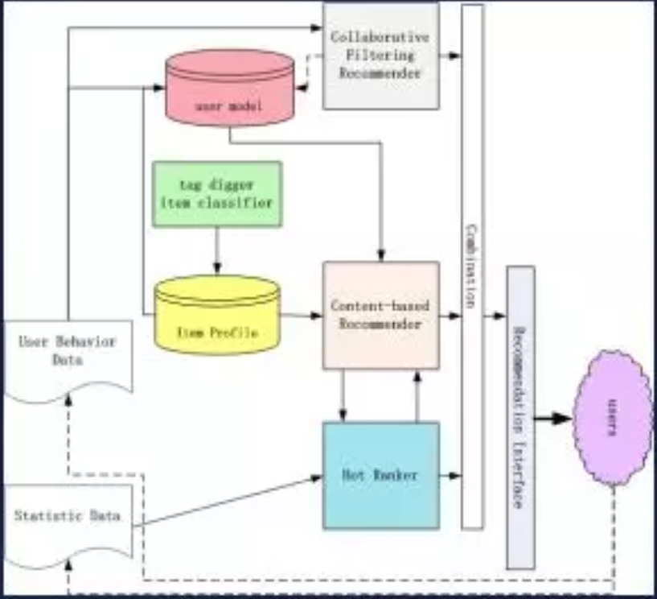

1. item-based CF:倾向于推荐同领域的更深入的结果，推荐精度比较高:
2. user-based CF:倾向于推荐内容更加宽泛而热门的内容，能实现跨领域、令人耳目一新的结果。
3. 结果融合:线性融合是常见方案，依次递补的方案
4. 实现过程:首先生成用户的行为矩阵，然后生成用户与item关系矩阵，然后计算用户与用户的相似度、item和item相似度，对个性化推荐结果进行预测

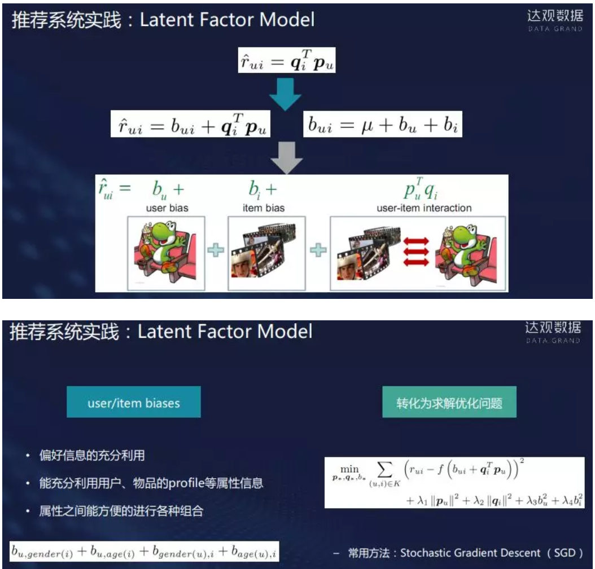

5. 可以考虑到年龄、性别等特征，做特征的交叉组合，进一步的提升效果，转化为一个最优化问题。

## 1.3. 开发推荐系统的难点分析
1. 用户兴趣随时间变化如何进行精确把握。
2. 用户兴趣的挖掘来自各种各样的数据，内容数据 、行为数据、关系数据，都对推荐结果有影响，需要分别建立算法模型来进行挖掘。
3. 如何综合运用不同方法的结果，进行右击的融合。
4. 如何做好基于各种算法的召回。
5. 冷启动问题:"马太效应"严重。

### 1.3.1. 推荐结果的单调性和重复性问题
1. "回声效应":推荐的内容越来越单调，只推荐用户曾经看过的类似内容，导致推荐的结果越来越单调乏味。
2. 大量优质内容无法找到需要的用户，成为沉没资源。
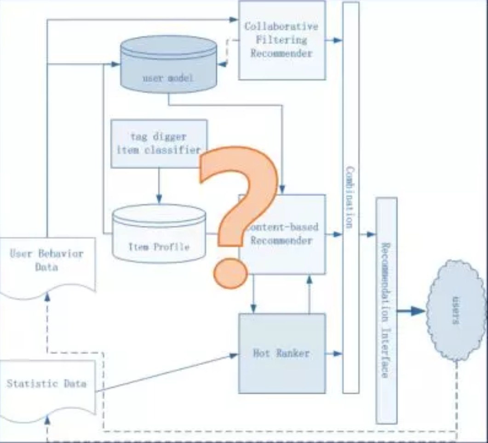

### 1.3.2. 实际应用时所面临的性能考验

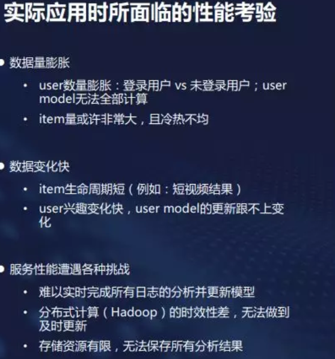

## 1.4. 达观推荐架构实践和效果优化

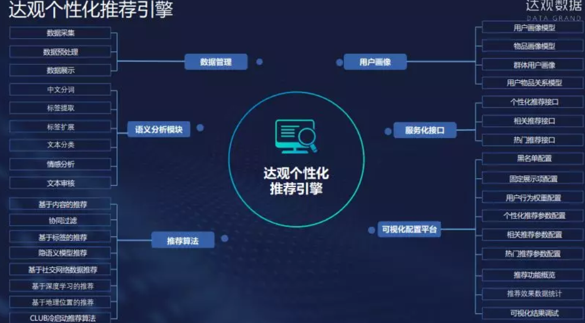

1. 目前个性化推荐引擎提供以下几种服务：
    1. 数据管理模块：包括数据采集、预处理；
    2. 语义分析：推荐系统很多与语义理解是分不开的，主要依赖于NLP基础组件的服务，如标签的提取、分类，还包括情感分析；
    3. 推荐算法：包括基于内容的、标签的、深度学习的，还有CLUB冷启动推荐算法；
    4. 用户画像：会有群体画像、个体画像，
    5. 服务化接口和可视化配置平台：对于大型客户而言他们有自己的产品人员、运营人员，使推荐平台不是一个黑盒子方式，提供一个配置让产品、运营参与进来干预推荐结果。

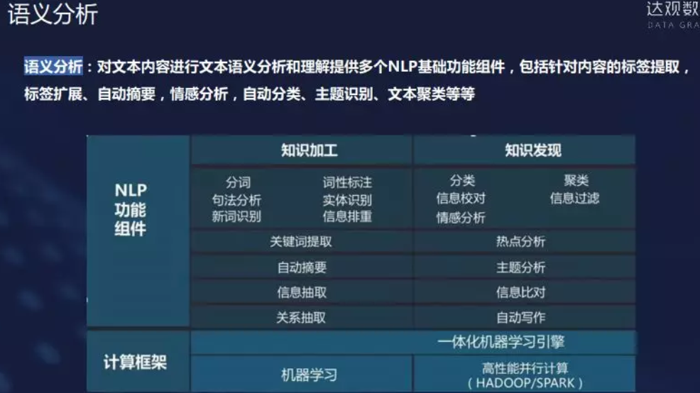
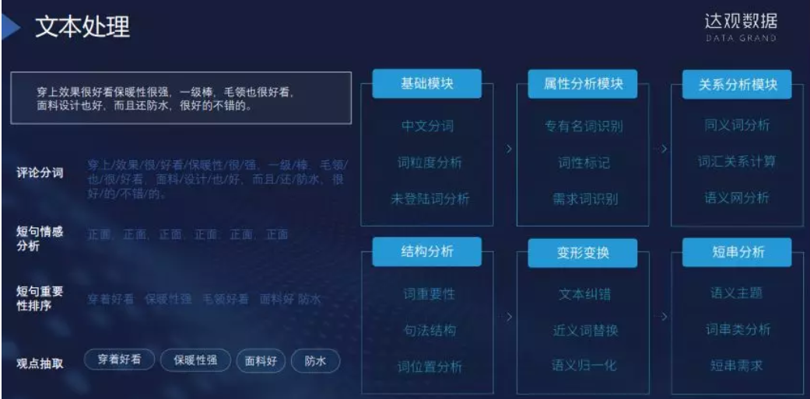
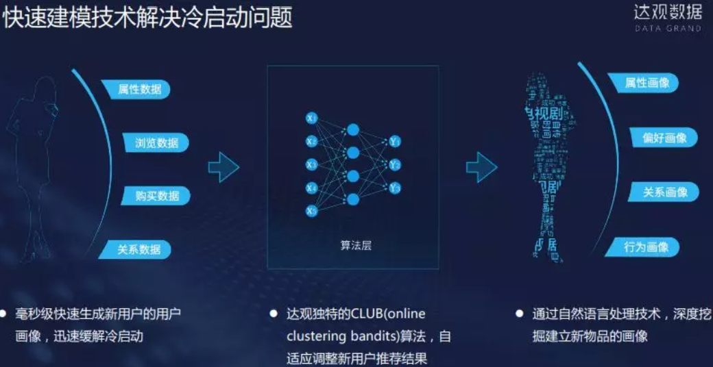
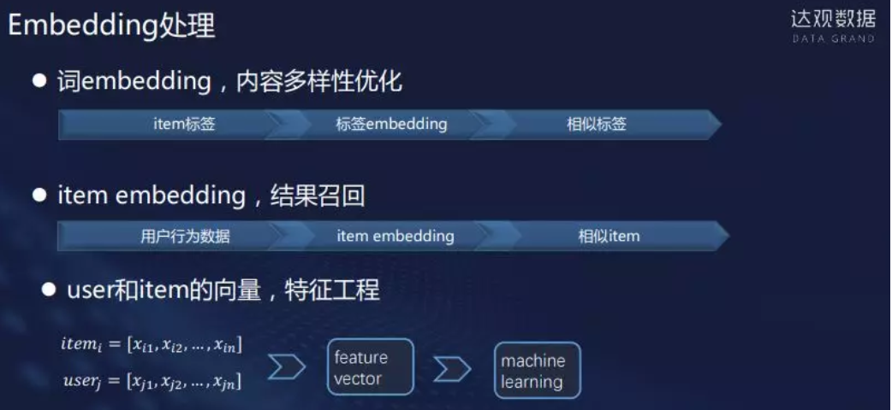

2. Embedding是为了保证内容多样性优化，过程召回
    + item embedding，我们使用word2Vec将用行为的历史数据做一个队列，形成标签扩展后得到相似的item

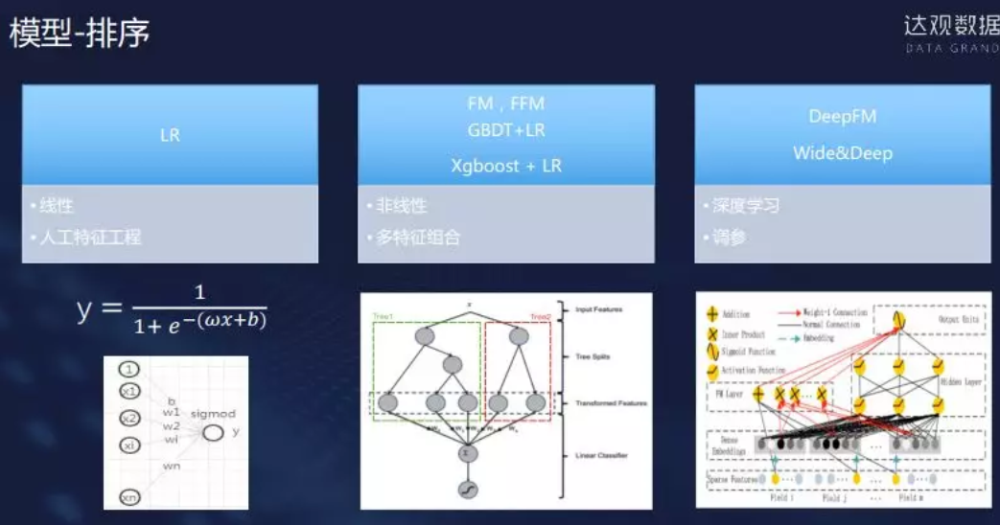

3. 在排序模型方面很多基于LR模型，现在很多都是基于深度学习来做，不同模型都有不同的应用场景，并不是单一使用一种场景。LR模型利用人工特征工程，相对于深度学习的优点是可以感知的，是可以debug的。LR模型对于特征处理是线性的，利用Xgboost+LR或者GBDT+LR由线性向非线性转化，能够做到多特征组合，对推荐效果也有不同程度的提升，目前还有利用**Wide&Deep**，可以从特征工程中解放出来，在特征选取方面不需要做很多工作，但是在调参方面工作量比较大。

## 1.5. 参考
<a href = "https://mp.weixin.qq.com/s/0a4Ne9lgx1rmnE1jXfH6zQ">达观数据个性化推荐系统简介</a>

# 2. 京东电商推荐系统实践

## 2.1. 简介

1. 推荐系统的框架，整个推荐系统可以分为两个部分:在线部分和离线部分。
    1. 在线部分:主要负责当前用户访问时，如何把结果拼接好，然后返回给用户，主要模块有召回、排序和对结果的调整
    2. 离线部分主要是对用户日志的数据分析，用于线上

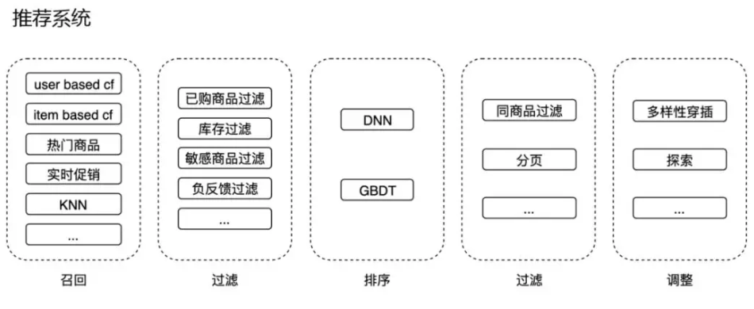

2. 召回：这里召回会有很多种方法，如协同过滤，热门商品、实时促销等和应用场景相关的召回，还有一些基于 KNN 的召回。
3. 过滤：召回之后，会进行过滤，主要是和应用场景相关，如已购商品过滤掉、没有库存的过滤掉，或者敏感的商品过滤掉等等这些逻辑。
4. 排序：排序目前主要用到的是 DNN 模型，某些流量比较小的地方会用到 GBDT。
5. 过滤：排序之后还会有些分页、同商品过滤等逻辑。

## 2.2. 排序模块

### 2.2.1. 模型结构
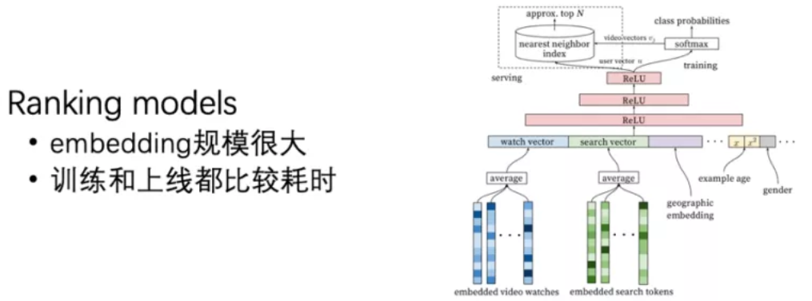

1. 深度学习 ranking 模型结构我们不作为重点讨论，这里列举了一种最经典的模型，它们都用到了很多 id 的 Embedding，然后这些 Embedding 规模都很大，这样训练和上线都比较耗时。因此，我们做了一些优化，比如做分布式的训练，并且会有一套 Pipeline 来完成模型的上线。另外，虽然模型很复杂，并且能带来很好的效果，但是特征工程还是必不可少的，很多指标的提升还是依赖于特征工程，当然也包括一些模型调整的工作。

### 2.2.2. 实践
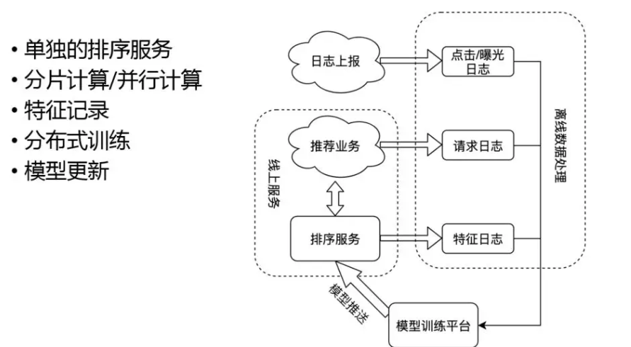

1. 首先最重要的部分是模型训练平台和排序服务，因为很多深度模型计算量要求很高，为了能达到比较快的效果，需要部署单独的排序服务。目前比较流行的是 TensorFlow serving，可以很快速的来上线一个深度模型，并充分利用对分片、单机并行，达到很高的计算效率。
2. 模型线上线下一致性问题对于模型效果非常重要，我们使用特征日志来实时记录特征，保证特征的一致性。这样离线处理的时候会把实时的用户反馈，和特征日志做一个结合生成训练样本，然后更新到模型训练平台上，平台更新之后在推送到线上，这样整个排序形成了一个闭环。

## 2.3. 实时更新
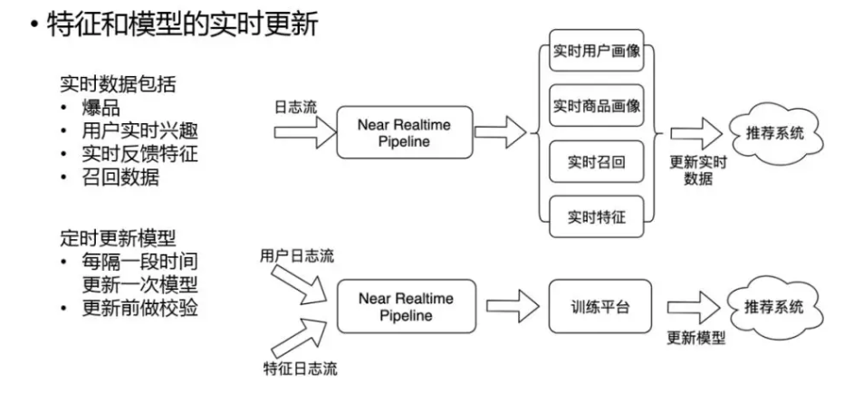

1. 特征和模型都需要进行实时的更新，抓住实时的用户画像来抓住实时用户兴趣的变化，抓住实时的画像。

### 2.3.1. 问题
1. 排序未必能解决所有的问题

2. 排序可以算是推荐系统中比较重要的一个环节，但是只有排序肯定是不够的，事实上，有一些问题是目前的排序框架无法解决的：
    1. 排序得到的结果非常相似，影响体验。
    2. 有多个优化目标，需要一个平衡(点击率、订单金额、用户交互时长等)。
    3. 计算能力有限，如果有无限的计算力，可以直接对全部候选集进行排序。

### 2.3.2. 多样性
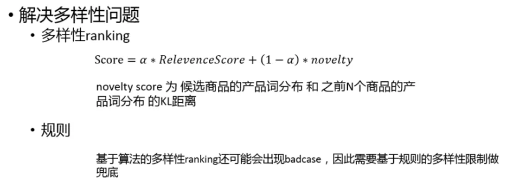

1. 模型输出的结果一般会非常相似，如果直接给用户看体验会比较差，因此我们要在模型中加入多样性的逻辑。
2. 解决方案:
    1. ranking:贪心算法，从第一个商品开始选，当选择第二个商品的时候，会重新计算候选集中的每个商品的score，然后重新进行推荐
        + 当然还可以计算KL距离来找到一个和已有商品最不想的商品。
    2. list wise ranking:

### 2.3.3. 多目标
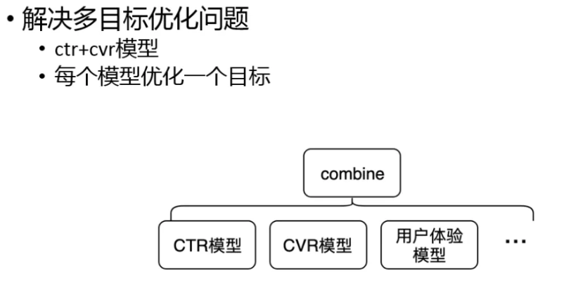

1. 针对多模型ranking，我们可以用某种方式把所有模型的结果combine。

### 2.3.4. 多轮排序
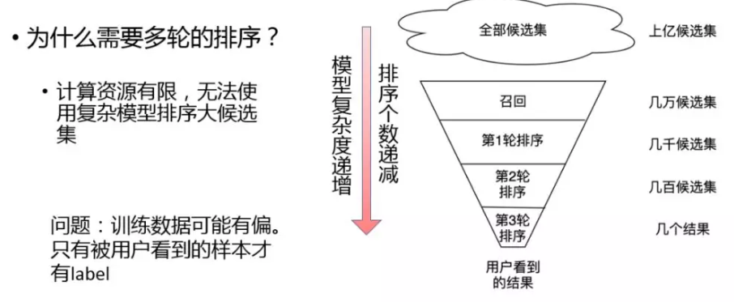

1. 多轮排序主要是因为计算资源的限制，无法使用复杂的模型进行大规模候选集排序，一层一层进行计算，逐渐降低排序难度。

## 2.4. 召回和首轮排序

### 2.4.1. 基于索引的首轮排序
1. 首轮召回
    1. 倒排索引:信息检索里常用的工具。
    2. 通过把doc的内容索引到doc id的方式，快速通过内容来查找doc

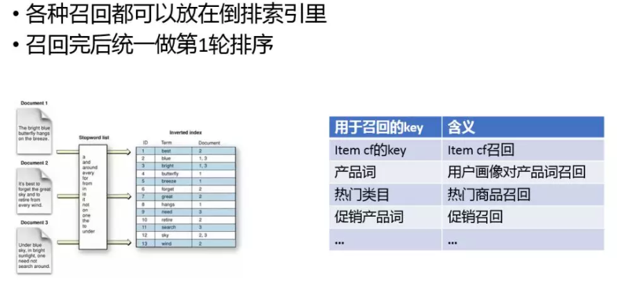
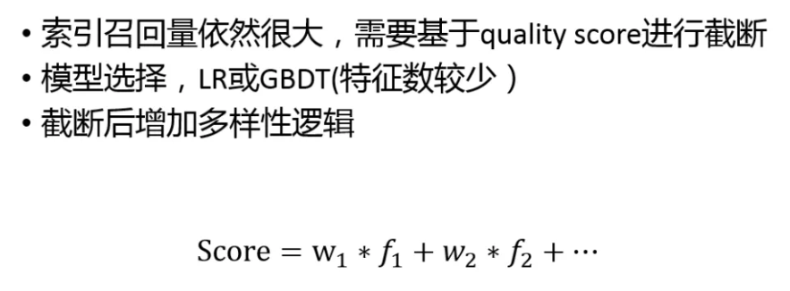

2. 索引召回量比较大，我们需要使用阶段逻辑，通过quality score进行阶段，保留质量好的doc，使用LR或者DBDT模型进行处理。

### 2.4.2. wand算法
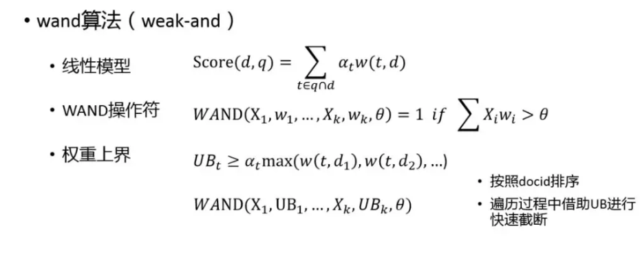

1. 基于 quality score 截断是一种 naive 的算法，这里我们讨论另一种业界也较常用的算法，wand。wand 其实是 weak and，它的重点是 wand 操作符。wand 操作符是一个布尔操作符，当 Xi wi 比 θ 大时，它的值是1，否则是0。之所以叫做 weak-and，是因为当 w 都取1，θ 取 K 时，wand 操作符就变成了 and，当 w 取1，θ 取1时，wand 操作符就变成了 or。可以看出 wand 是介于 and 和 or 之间的操作。对 Xi wi 求和的操作其实和我们线性模型很相似。通过 wand 操作符，我们可以定义一些上界，因为是倒排索引，可以给每个索引链赋予一个估计值，这样就可以拿到权重上界 UBt，这样通过和 wand 操作符对比，就可以快速的判断 UBt 是否满足条件，如果满足条件就可以快速的把一些 doc 扔掉，这样就可以快速的使用线性模型对全户做 ranking。可以看到，基于线性模型的分数做截断，比完全基于 quality score 截断的策略要稍微好一点。

2. 算法实现
    + 思路:快速通过upper bound做截断和跳转，可以掠夺大量的不符合条件的doc

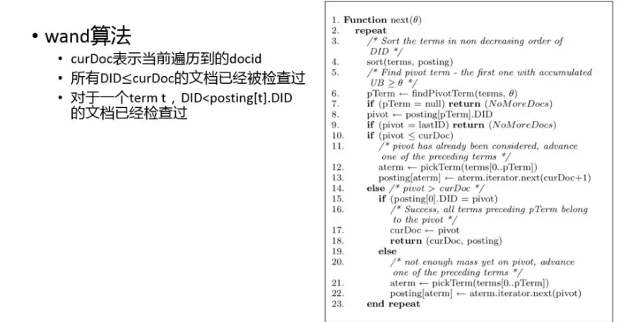

3. 比较适用于kv查找这种场景
    + 需要比较好的截断策略:比如relevence score阶段，排序使用GBDT

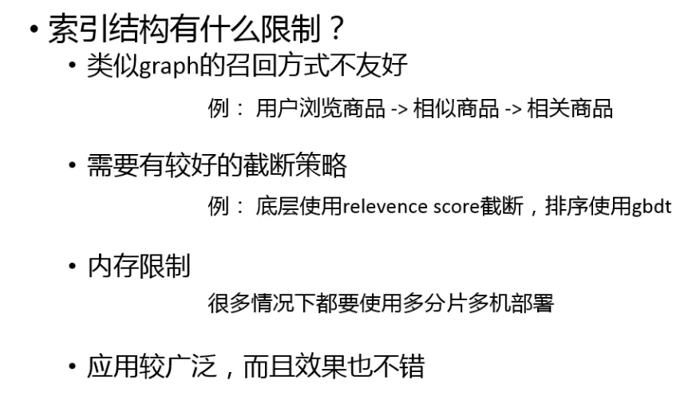

### 2.4.3. KNN
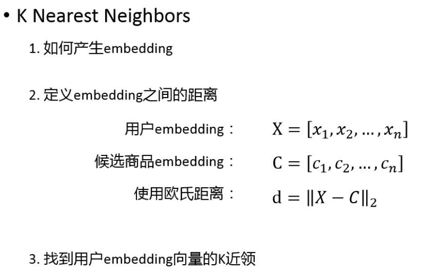

1. 首先把候选集转换为embedding(将用户兴趣转换为embedding，通过定义embedding至今距离计算公式，我们定义KNN召回问题。)

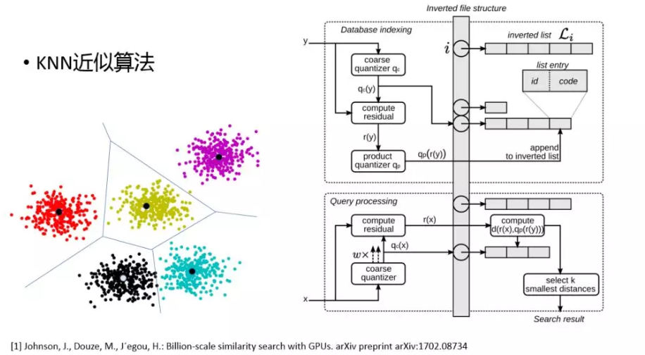

2. 找到k个候选集，我们全量计算距离速度过慢，所以我们使用一种近似算法
    + faiss使用的算法
3. 算法的核心:对全部候选集进行分块，每一块都有自己的质心。使用Lloyd算法将整个空间划分开，分块后，就需要对每一块构建索引，从而通过索引时下快速索引的功能。
4. 上图中使用了二次索引，图中上半部分是如何构建索引(这里的优化点是使用了二级索引)：首先拿到 y 候选集之后，做一个 quantizer 分类得到一个一级索引，把它放到索引表中，另外还得到残差 compute residual，可以对残差再进行一次 quantizer，得到一个二级索引，通过两级索引来加快检索的速度，同理，在真正的 quary 的时候，拿到的是用户的向量 x，先做一个 quantizer，得到 k 近邻的一级索引，然后查找 k 个一级索引，同时拿到 k 个二级索引，然后在二级索引中查找，然后这里还有很多加速的算法(这里就不展开了)，通过这样一种多层的查询方式来做到加速 K 近邻的算法。

## 2.5. 实验平台
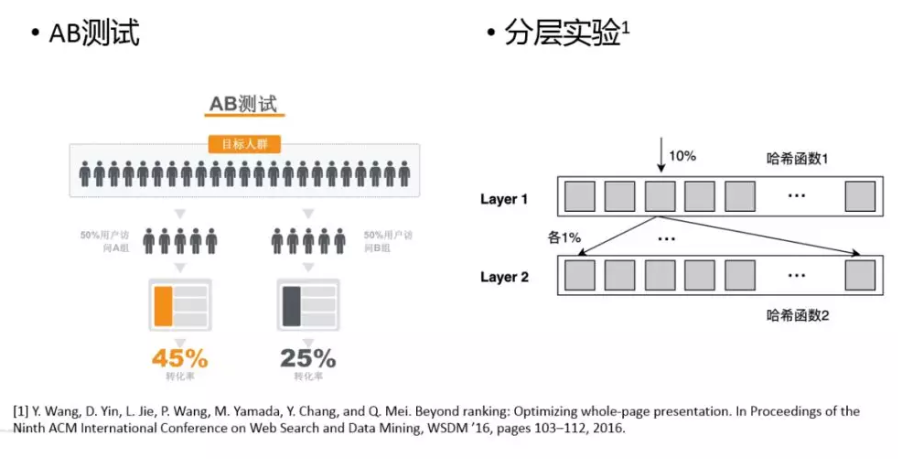

1. 目的:快速迭代特征和模型，对于实验进行分层
2. 分层实验的具体做法：召回->排序->后处理->业务，另外还有一部分对齐流量，用来做全量的验证。
分层的优点，可以用于做实验的流量多，适合快速迭代；缺点，需要严格控制层与层之间的关系，防止相互干扰。本次分享就到这里，谢谢大家。

## 2.6. 参考
<a herf = "https://mp.weixin.qq.com/s/vpANPrl86Ou2fBVHgLXtBQ">京东电商推荐系统实践 </a>

# 3. 阿里零售通智能导购推荐技术实践
1. 零售通是阿里巴巴B类事业群下对于线下零售店推出的解决方案

## 3.1. 业务背景
1. 零售通APP导购推荐主要包括大促会场、日常频道和猜你喜欢3大类场景。
2. 重点是猜你喜欢，以及提供精准流量分发入口。

## 3.2. B2b2c业务模式下，猜你喜欢具有如下业务特点和挑战
1. 小店主采购心智:根据不同的小店就采用个性化推荐。
2. 线下零售特点:各个小点覆盖的行业不同，采用的进货的方式不同

## 3.3. 技术实践

## 3.4. 参考
1. <a href = "https://mp.weixin.qq.com/s/gYpPCD-FT3A17NCKCPlCZw">阿里零售通职能导购推荐技术实践</a>