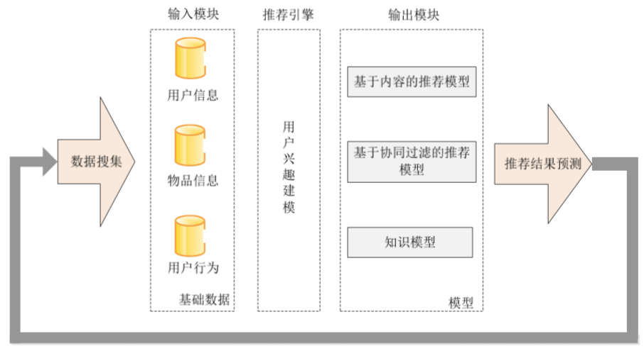
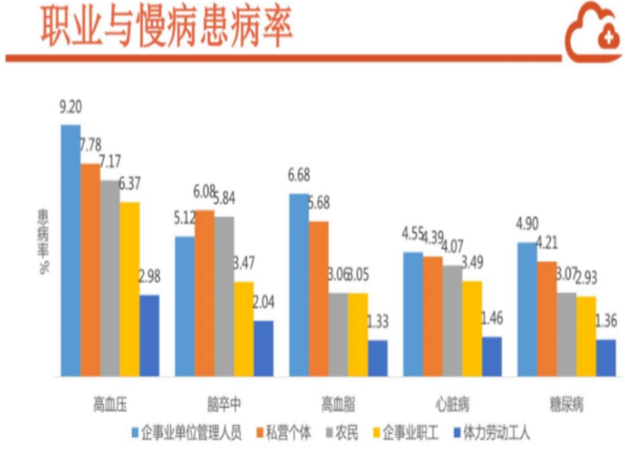
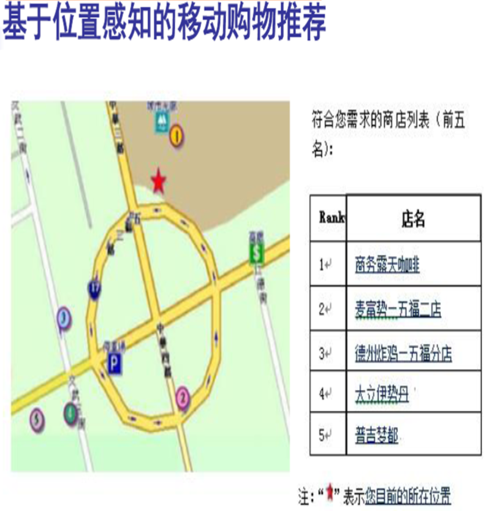
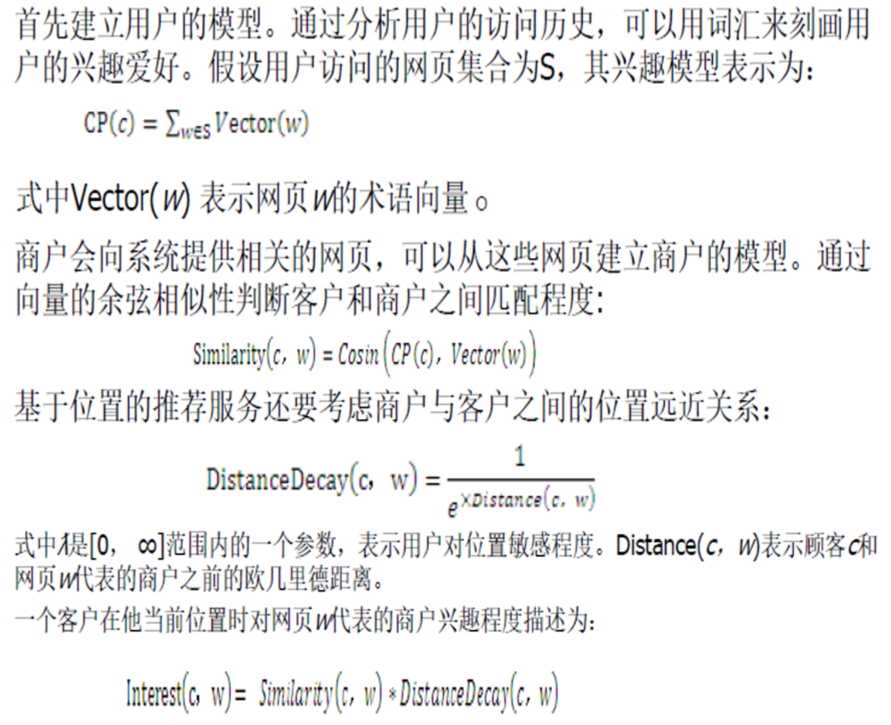
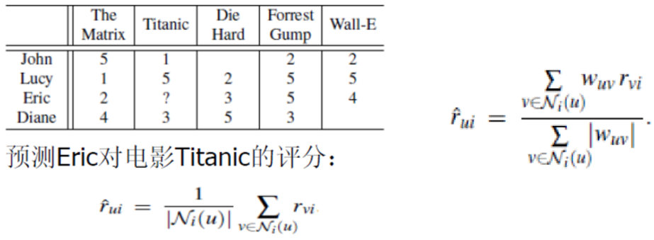
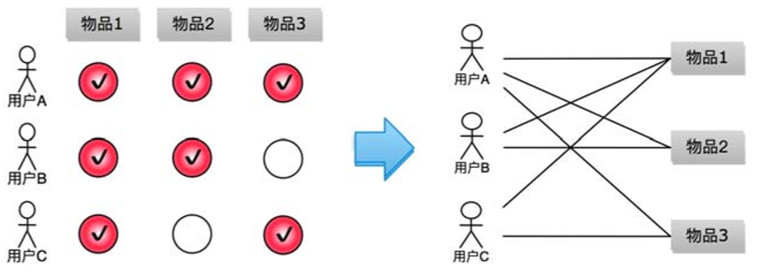
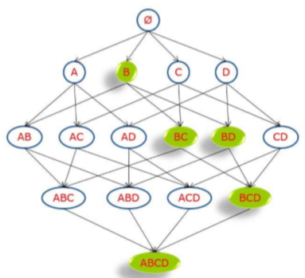

# 1. 推荐系统结构
1. 推荐系统应用较广，不同的业务场景用到的数据、算法和模型都不同。如果针对每个场景都从头开发，将会耗费较多时间和人力。推荐算法进行通用化设计，可以更好地将一类推荐算法复用到**不同的推荐场景**中，从而支持多种业务领域。

## 1.1. 推荐系统图解
1. 推荐系统有3个重要的模块，包括输入模块、推荐算法模块（推荐引擎）、推荐输出模块。推荐系统结构如下图所示。
    + 推荐引擎具有主动性。
    + 推荐之后进行反馈来确定推荐是否正确

2. 推荐系统首先通过分析用户行为数据，建立用户**偏好模型**。然后使用用户兴趣**匹配物品**的特征信息，再经过推荐算法进行**筛选过滤**，找到用户可能感兴趣的推荐对象，最后推荐给用户。上述过程经过训练和验证最终形成推荐模型，可用于在线或离线推荐。同时，推荐结果在用户端的响应也作为输入数据，用于模型的迭代优化。
    + 一个人的偏好是有时效性和约束的

# 2. 基于人口统计学的推荐
1. 基于**人口统计学**的推荐机制根据用户的人口统计学信息发现用户间的相关程度向用户推荐与之相似的用户感兴趣的物品。
2. 基于人口统计学信息对用户画像，根据画像计算用户间相似度，形成**用户群体**，按照用户群的喜好推荐给当前用户一些物品。
3. 这种方法的**好处**是没有“冷启动”问题。不依赖于物品本身的特征，所以不同物品领域都可以使用，具有领域独立性。
4. **问题**在于由于人口统计学信息未必准确，所以计算结果可信度较低，难以令人信服。

# 3. 基于内容的推荐
1. 基于内容推荐的原理是根据用户感兴趣的物品A，找到和A内容信息相近的物品B。
2. 提取用户偏好的**物品特征**是基于内容推荐算法的关键，基于内容的推荐过程是用户喜欢的物品和特征的描述，物品的特征有属性、描述等，图书的特征是一些文本内容，特征提取可能涉及**文本处理**相关技术，将文本内容转化为可计算的向量形式，实现对物品的特征建模，应用推荐算法进行内容推荐。
3. 除此之外，还有**相似度计算**。基于内容的推荐优点是简单有效，推荐结果直观，容易理解，不需要领域知识。不需要用户的历史行为数据，比如对物品的评价等。
4. 主要适用于老客户。

## 3.1. 推荐案例

1. 刚开始的时候，就像是一个搜索工具，简单地进行搜索。
2. 从各个网页等用户历史中我们分析提取特征。

# 4. 基于协同过滤的推荐算法
1. 基于用户行为数据设计的推荐算法，称为协同过滤算法。此方法主要根据用户的历史行为，寻找用户或物品的临近集合，以此计算用户对物品的偏好，包括基于领域、图、关联规则、知识的推荐算法，其中最广泛应用的是基于领域的方法，在实践中往往是上述几种方法的混合应用。
2. 适用和你相似的用户的情况来为你推荐。

## 4.1. 基于用户的协同过滤算法
1. 基于用户的协同过滤算法为用户推荐兴趣相似的其他用户喜欢的物品。
2. 算法的**关键**是计算两个用户的兴趣相似度。计算用户相似度的方法有3种：余弦相似性、皮尔森系数相关和修正的余弦相似性。算法步骤如下：
    1. 找到与目标用户兴趣相似的用户集合
    2. 找到这个集合中的用户喜欢的，且目标用户没有用过的物品，推荐给目标用户

### 4.1.1. 示例

1. 下表是基于用户协同推荐过程，可以看到用户A与用户C所喜欢的物品具有较多的交集，即两个用户具有相似性，那么用户C喜欢的物品很有可能用户A也会喜欢，而用户C喜欢物品D，则可以向用户A推荐物品D。

2. 计算用户兴趣相似度时，要避免热门物品自带<a href = "https://baike.baidu.com/item/马太效应/70100?fr=aladdin">马太效应</a>的影响，即大部分用户可能都对热门的物品表现出喜欢的状况，但是这些用户之间并非一类人，因为所谓的热门物品区分度较弱。

### 4.1.2. 缺点
1. 基于用户的协同过滤算法**缺点**是随着用户数目的增大，计算用户兴趣相似度越来越复杂，时间和空间复杂度与用户数接近于平方关系。所以一般采用**离线**方式推荐，当用户产生新行为时，不会立即进行计算，推荐结果不会立即变化。
2. 此外，这一算法是基于**隐式群体**的兴趣进行推荐，可解释性不强。这一算法适用于用户兴趣稳定且不明显的场景，即通过群体的兴趣来代表用户个体的兴趣，一旦群体的兴趣确立，就可以认为个体用户服从此兴趣，由此向其进行推荐，结果一般较准确。

## 4.2. 基于物品的协同过滤推荐
1. 基于物品的协同过滤算法是给用户推荐跟他喜欢的**物品相似**的物品，是基础的推荐算法，集成在各类电商平台的推荐系统中。
2. 与基于内容的推荐算法相比，是通过用户的行为计算物品之间的相似度，而基于内容的推荐算法计算的是物品内容特征的相似度。例如，物品A、B有很大的相似度是因为喜欢物品A的用户也都喜欢物品B。

# 5. 基于领域的推荐算法
1. 基于领域的推荐算法主要包括两种算法：基于用户的协同过滤算法和基于物品的协同过滤算法，基于物品的协同过滤与计算用户兴趣相似度一致，基于物品的协同推荐需要计算与用户偏好的物品相似的物品。

# 6. 基于隐语义模型算法
1. 隐语义模型最早出现在文本挖掘领域，用于找到文本的隐含语义。
2. **核心思想**是通过隐含特征关联用户兴趣和物品，通过矩阵分解建立用户和隐类之间的关系、物品和隐类之间的关系，最终得到用户对物品的偏好关系。即对于某个用户，首先得到他的兴趣分类，然后从分类中挑选出他可能喜欢的物品。
3. 隐语义模型使用算法自动得到物品和用户的分类权数。不仅准确度更高，可以得到可靠的权重，还减少了标记物品所需要的人力。

## 6.1. 隐语义模型过程
1. 首先通过隐语义分析给物品分类，并计算出物品属于每个类的权重；然后，确定用户对哪类物品感兴趣，以及感兴趣程度。对于一个给定的分类，选择那些属于这个类的物品推荐给用户，以及确定这些物品在一个类中的权重。
2. 推荐系统用户的行为分为**显性**反馈和**隐形**反馈，隐语义模型在显性反馈数据上解决评分预测问题达到了很好的精度。对于**隐形**反馈数据是指数据集**只有**正样本，即用户喜欢什么物品，没有用户不感兴趣的样本。 

3. 其中，k为隐类,pu,k为用户与隐类之间的关系,qi,k为物品i与隐类之间的关系，其值越高越能代表隐类k。两者**相乘**为该用户与该物品之间的权重 ，即**用户对物品的喜好程度**。

# 7. 基于图的模型
1. 用户行为很容易用**二分图**表示，因此很多图的算法都可以用到推荐系统中，其中物品作为图中节点，节点之间连线是用户行为中共同购买或浏览，物品之间的相似性可以通过计算图中节点之间的强度来实现。
2. 基于图的模型基本思想是将用户行为数据表示为**二分图**。每个二元祖（u，i）代表用户u对i曾产生操作，这样便可以将这个数据表示为二分图。下图是一个简单的用户物品二分图模型，方形节点表示物品，用户节点和方形节点之间的边代表用户对物品的行为。下图可以说明A对1、2、3曾有操作。

3. 共同边数越多，说明他们越相似。

## 7.1. PageRank算法
1. PageRank 通过网页之间的链接关系计算网页权重，权重高的网页特点是：链接向它的网页数量多、链向它的网页权重也高。PageRank 通过这样的连接关系，一轮轮迭代计算后得出各网页的权重。算法迭代的公式如下：

2.  上式中PR(pagei)是网页的访问概率，用来表示网页的重要度，d是用户继续访问网页的概率，d的值一般设为0.85，N是网页总数,M(pagei)表示指向网页的网页集合，L(pagei)表示网页指向别的网页的链接数量。从中可以看到某一网页pagei的重要性主要是所有指向它的网页来决定的。指向它的网页中重要性越高，且数量越多，网页pagei的重要性就越高。所以，也可以将这种思想应用到推荐系统中，用于用户与物品之间的相似度计算。
3. 对于推荐系统，需要计算的是物品节点相对于某一个用户节点u的相关性，PageRank算法能够为用户对所有物品进行排序。基于从不同点开始的概率不同，算法的执行过程如下：
    1. 假设要给用户u进行个性化推荐，从其对应的节点开始在用户物品二分图上进行随机游走。
    2. 又走到任何一个节点时，计算节点的访问概率，由其决定是否继续游走。

# 8. 基于关联规则的推荐
1. 关联规则是反映物品与其他物品之间的关联性，常用于实体商店或在线电商的推荐系统：通过对顾客的购买记录数据进行关联规则挖掘，发现顾客群体的购买习惯的内在共性。
2. 早期的关联分析主要用于零售行业的购物行为分析，所以也称之为**购物篮分析**。需要注意的是关联关系并不意味着存在因果关系。
3. 关联规则分析中的关键概念包括支持度、置信度、提升度。在关联分析算法中，常见的有Apriori和FP增长算法。
    + Apriori是启发式算法
4. 例如买过这本书的人也会买其他书等

## 8.1. 支持度
1. 支持度是指两件商品A和B在总销售笔数（N）中同时出现的概率，即A与B同时被购买的概率，计算公式如下：

2. 使用支持度的**目标**是找到在一次购物中一起被购买的两个商品，从而可以提高推荐的转换率。在使用支持度时需要结合业务特点确定一个最小值，只有高于此值的商品项集才能进行推荐，即关注出现频次高的商品组合，超过某一支持度最小值的项集称为**频繁项集**。

## 8.2. 置信度
1. 置信度是购买A商品后再购买B商品的条件概率，置信度大说明购买A的客户很大概率也会购买B。计算公式如下：

2. 例如，电商网站10月份订单中面包售出40万笔，一次购买面包牛奶的有30万笔，置信度75%，一次购买面包薯片的有10万笔，置信度25%，则发现用户购买面包后会向其推荐牛奶，或者使用组合搭配销售。

## 8.3. 提升度
1. 提升度用来判断规则是否有实际价值，描述的是对比不使用规则，使用规则可以提高多少。使用规则商品在购物车中出现的次数是否高于商品单独出现在购物车中的概率。大于1说明有效，小于1则无效。计算公式如下：

2. 例如，电商网站10月份有100万笔订单，购买面包30万笔，牛奶40万笔，同时购买两者的20万笔，面包、牛奶、面包和牛奶支持率依次为30%、40%、20%，所以提升度为1.667，大于1，所以牛奶面包规则是有提升效果的。

## 8.4. 关联规则提取过程
1. 关联规则提取过程是找出所有支持度>=最小支持度、置信度>=最小置信度的关联规则。
2. 可以通过穷举项集的所有组合方式找出所需要的规则，但是**时间复杂度较高**，难以接受。需要找到快速挖出满足条件的关联规则的方法。
3. 关联规则挖掘分两步进行：
    1. 首先生成频繁项集，即找出所有满足最小支持度的项集。
    2. 然后**生成规则**，在**频繁项集**的基础上生成满足最小置信度的规则，产生的规则称为**强规则**。关联规则挖掘所花费时间主要消耗在生成频繁项集上，利用频繁项集生成规则时间复杂度不高，关键在于优化频繁项集的生成。

### 8.4.1. Apriori算法
1. Apriori算法是最有影响力的基于关联规则频繁项集挖掘算法，算法分为两个步骤：
    1. 第一步是通过迭代检索出所有事务中的频繁项集，即支持度不低于用户设定的阈值的项集。
    2. 第二步利用频繁项集构造出满足用户最小置信度的规则。其中找出所有频繁项集是基于该算法的性质：
        1. 频繁项集的子集也是频繁项集
        2. 非频繁项集的超集一定是非频繁的
2. 具体的过程是先扫描所有订单记录，统计每个商品的频次和商品项集合，并计算每一个商品的支持度，将低于阈值的单项商品移除。如右图中B为非频繁项集，则将移除，基于Apriori的性质2，可以对B的分支进行剪枝，BC、BD、BCD、ABCD都被移除。然后对商品项集进行组合，形成二项商品集合，第二次扫描订单记录，计算每个二项商品集的支持度，将低于阈值的二项商品移除，依此类推，商品项集合无法继续进行组合为止，将所有频繁项集合进行集合连接，通过扫描订单记录剪枝，移除含非频繁项集的组合项，剩下的就是最小信任度的规则集合。
    + 

# 9. 基于知识的推荐
1. 基于知识的推荐主要应用于**知识型**的产品中，在某种程度是一种推理技术，基于效用知识实现对某一特定用户推荐特定项目，因此推荐结果具有较强的可解释性。
    + 知识一般是人工整理好的。
2. 在一些涉及知识级别的场景中，需要用到基于知识的推荐，推荐系统依据用户目前所处的知识级别，同时根据所有的知识级别进行分析，为用户推荐合适进阶的信息。综合用户知识和产品知识，通过推理什么产品能满足用户需求来产生推荐。
3. 这种推荐系统不依赖于**用户评分**等关于用户偏好的历史数据，故其**不存在冷启动**方面的问题，可以响应用户的即时需求，当用户偏好发生变化时不需要任何训练。

## 9.1. 基于知识的推荐案例
1. 学生面对海量习题带来的信息过载时，容易出现学习过程中针对性不强、效率不高等问题，此时可基于知识点层次图进行个性化习题推荐。
2. 首先，借鉴课程**知识点体系结构**的特点，构建表征知识点层次关系的权重图，用以有效反映知识点间的层次关系。然后，根据学生对知识点的掌握情况在知识点层次图的基础上进行个性化习题推荐。通过更新学生与知识点对应的失分率矩阵，获取学生掌握薄弱的知识点，以此实现习题推荐。

# 10. 基于实例的推荐
1. 根据层次关系图的构建方法，基于知识推荐可以划分为基于约束推荐和基于实例推荐。
2. 早期的基于实例的推荐采用的是基于**查询**的方法，由用户**指定需求**，通过目录检索或搜索发现**目标物品**，用户对当前浏览的物品进行评价，然后基于其评价的结果进行导航，这是基于实例推荐系统的关键。评价的基本思想是用户以当前物品为满足的目标来指明他们的要求，推荐的过程就是商品筛选过滤的过程。

# 11. 基于约束的推荐
1. 基于约束的推荐系统强调推荐时的约束规则，基于约束的推荐是利用预先定义的**推荐知识库**显示地定义约束，把推荐任务看作是解决一个约束满足问题的过程，满足约束的候选项就推荐给用户。
2. 基于约束的推荐方法通常被用来为那些**不经常被购买**的产品领域构建推荐系统，而且产品非常复杂，很多顾客不能详细地了解其所有的技术特征，特别是在专业设备、金融服务或更复杂的产品等领域，其中基于约束的推荐系统一般会涉及用户属性、产品属性、过滤条件、物品约束条件、合取查询。

# 12. 基于标签的推荐
1. 标签是一种可以用来描述信息的关键词，可以作为物品的元信息来描述物品的特征，也可以用于**标识用户的喜好**。
2. 基于标签的推荐算法是通过统计每个用户最常用的标签，统计时往往计算**权重值**对标签进行排序，不是简单的使用出现次数，可加入时间因子等。对于每个标签，统计打过这个标签次数最多的物品列表，这样对于一个用户，就可以依据其常用标签找到对应的热门物品推荐给他。
3. 可以是让用户自己提供标签，也可以是通过机器学习的方法为用户贴上标签。

## 12.1. 标签生成算法优化
1. 用户浏览热门标签对应的内容不能代表用户个性化的兴趣，需要应用标签权重来实现**标签排序和选择**，对于时间久的标签需要降低权值，最新的标签更能说明用户兴趣所在。
2. 一般情况下可以结合标签的出现次数和最后标记时间，假设标签i出现的次数为n，上一次访问此标签的时间为s秒，可以通过公式W=n/s来计算i对应的权重值。
3. 对于新用户或新物品，**标签数量可能过少**，需要对标签进行扩展，找到**相似**的标签；此外，还可以通过构建语料库对标签之间的**共现次数进行统计**，得到标签之间的概率相关性，构建标签**相似性矩阵**，或者通过第三方知识库构建**向量空间模型**，可快速对用户兴趣标签进行扩展。

## 12.2. 标签清理
1. 普通用户给物品所打的标签往往随意性较大，标签质量不稳定，可以结合信息熵对用户生成标签**进行验证**，判断用户生成**标签的稳定程度**，有针对性地过滤掉噪声标签；
    + 可以让用户自己来决定这个标签是否合适，而与之相对地我们应该通过推荐给用户相应的物品等待反馈来决定。
2. 此外，由于不同用户生成的同一意义的标签可能会有多个，需要对标签进行**相似度计算**，**清理掉同义词**，使标签更加集中，有利于优化推荐结果；
3. 在使用LDA等主题提取算法时，由于部分算法是依据词频等因素提取主题关键词，容易提取到一些无意义的词汇，需要将无义词通过停用词来进行删除，方便做出推荐解释。此外，在中文主题提取中涉及中文分词，分词模块质量会影响生成的标签质量。
4. 要注意标签的时效性和标签的误导

# 13. 基于用户的协同过滤算法
1. 以用户为主题的算法，更加强调的是社会性的属性
    + 算法更加强调和你有相似爱好的其他的用户的物品进行推荐

## 13.1. 相似性计算
1. Jaccard算法:交集除以并集
2. 余弦相似性算法
3. 其他算法:欧式距离算法等

## 13.2. 算法过程
1. 找到与目标用户最相邻的K个用户
    1. 将目标用户和数据库中的所有用户进行比较，找到与目标用户最相邻的K个用户
    2. 要计算和你有交集的用户:物品到用户的反查表，用来找到和你相关的用户，然后计算相似度
    3. 根据用户计算商品的相似度:根据不同的用户的包含商品计算出相应的总相似度，然后按照排序进行推荐

## 13.3. 参考过程
1. <a href = "https://blog.csdn.net/ygrx/article/details/15501679">[推荐算法]基于用户的协同过滤算法</a>