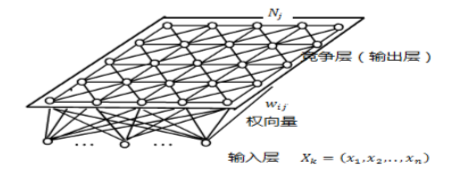
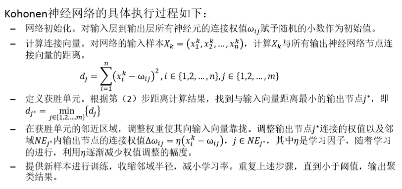

**基于模型的聚类**
1. 基于神经网络模型的聚类
2. 基于概率模型的聚类

# 1. Kohonen神经网络聚类

1. 在Kohonen神经网络的运行过程中，匹配竞争胜出的神经元及其邻近的神经元与相应输入层神经元之间的权向量朝着样本输入（特征）向量方向更新，如此经过多次迭代，这些权向量就可以对样本进行**自动聚类**，完成自组织学习(映射)过程。
2. 输入层和竞争层(输出层)之间是直接连接的。

## 1.1. 具体执行过程

1. 输入层和竞争层的权重都是随机赋值的。
    + 竞争层和输入层是全连接的。
2. 一定数量的样本是确定，对于一个样本把n个属性输入到输入层，进行比较计算。
3. 分别和权重层的向量计算距离，可以算出一个最小的竞争层的节点。
    + 然后这个样本就会被划分到这个竞争层的簇中
    + 同时你还要把竞争层节点到输入层节点之间的权重向权向量调整
4. 之后重复输入
    + 每次修正获胜节点和输入节点的权重，和获胜的权重向量更小的方向调整。

## 1.2. 特点以及应用情况
1. 到底是聚类成几组不确定，可以尝试Kohonen
2. 使用Kohonen,往往会出现聚类过多，也就是需要二次聚类。

## 1.3. 如何二次聚类
1. 计算聚类中心的距离，将距离比较近的合并成一簇
