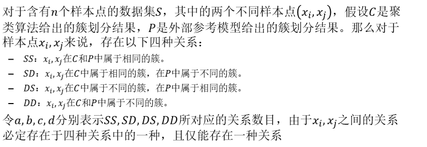
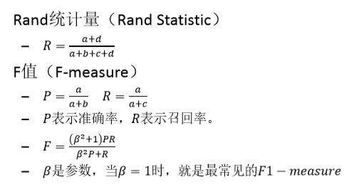

**聚类分析的度量**

# 1. 什么是聚类分析的度量
1. 聚类分析的**度量指标**用于对聚类结果进行评判，分为内部指标和外部指标两大类
    1. **外部指标**指用事先指定的聚类模型作为参考来评判聚类结果的好坏
    2. **内部指标**是指不借助任何外部参考，只用参与聚类的样本评判聚类结果好坏
2. 聚类的目标是得到**较高的簇内相似度**和**较低的簇间相似度**，使得簇间的距离尽可能大，簇内样本与簇中心的距离尽可能小
3. 聚类得到的簇可以用**聚类中心、簇大小、簇密度和簇描述**等来表示
    1. 聚类中心是一个簇中所有样本点的均值(质心),概括了这一类样本的共性，最有代表性。
    2. 簇大小表示簇中所含样本的数量。
    3. 簇密度表示簇中样本点的紧密程度。和二维还是三维有关
    4. 簇描述是簇中样本的业务特征。

# 2. 描述的属性

## 2.1. 外部指标

1. 外部参考模型来作为标准进行评估
2. 如果想要使用，我们不能纯粹根据用户的数据，因为簇描述也不一定比较有意义。

### 2.1.1. 一些具体的外部指标

1. 存在一些聚类的约束。

## 2.2. 内部指标

1. 样本尽量都表示成数值型的，也就是表示成向量。

### 2.2.1. 欧式距离
1. 欧式距离（Euclidean Distance）是计算欧式空间中两点之间的距离，是容易理解的距离计算方法，其计算公式如下：

### 2.2.2. 曼哈顿距离
1. 曼哈顿距离（Manhattan Distance）也称城市街区距离，欧式距离表明了空间中两点间的直线距离，但是在城市中，两个地点之间的实际距离是要沿着道路行驶的距离，而不能计算直接穿过大楼的直线距离，曼哈顿距离就用于度量这样的实际行驶距离

### 2.2.3. 切比雪夫距离
1. 切比雪夫距离（ChebyshevDistance）是向量空间中的一种度量，将空间坐标中两个点的距离定义为其各坐标数值差绝对值的大值。切比雪夫距离在国际象棋棋盘中，表示国王从一个格子移动到此外一个格子所走的步数

### 2.2.4. 明可夫斯基距离
1. 明可夫斯基距离（MinkowskiDistance）是欧式空间的一种测度，是一组距离的定义，被看作是欧式距离和曼哈顿距离的一种推广

2. 其中是一个可变的参数，根据p取值的不同，明可夫斯基距离可以表示一类距离。当p=1时，明可夫斯基距离就变成了曼哈顿距离;当p=2时，明 可夫斯基距离就变成了欧式距离；当p→∞时，明可夫斯基距离就变成了切比雪夫距离
3. 这个距离是比较常用的一个距离

# 3. 度量聚类性能的内部指标
1. 根据空间中点的距离度量。

## 3.1. 紧密度
1. 紧密度（Compactness）是每个簇中的样本点到**聚类中心**的平均距离。对于有n个样本点的簇C来说，该簇的紧密度为,其中的wc是簇c的聚类中心。
    + 保证类更加凝聚。
2. 对于聚类结果，需要使用所有簇紧密度的平均值来衡量聚类结果的好坏，假设总共有k个簇：,紧密度的值越小，表示簇内样本点的距离越近，即簇内样本的相似度越高。

## 3.2. 分隔度
1. 分隔度（Seperation）是各簇的聚类中心ci、cj两两之间的平均距离，其计算公式如下：，分隔度的值越大，表示各聚类中心相互之间的距离越远，即簇间相似度越低
2. 保证两个组之间的分隔度更低，更加接近。

## 3.3. 戴维森堡丁指数
1. 戴维森堡丁指数（Davies‐BouldinIndex，DBI）衡量任意两个簇的簇内距离之和与簇间距离之比，求大值。首先定义簇中n个m维样本点之间的平均距离avg

2. 根据两个簇内样本间的平均距离，可以得出戴维森堡丁指数的计算公式如下，其中ci、cj表示簇Ci、Cj的聚类中心。

3. DBI的值越小，表示簇内样本之间的距离越小，同时簇间距离越大，即簇内相似度高，簇间相似度低，说明聚类结果越好。

## 3.4. 邓恩指数
1. 邓恩指数（Dunn Validity Index，DVI）是计算任意两个簇的样本点的短距离与任意簇中样本点的大距离之商。假设聚类结果中有个簇，其计算公式如下:

2. DVI的值越大，表示簇间样本距离越远，簇内样本距离越近，即簇间相似度低，簇内相似度高，聚类结果越好。
    + 更多的是倾向于相对的比例。